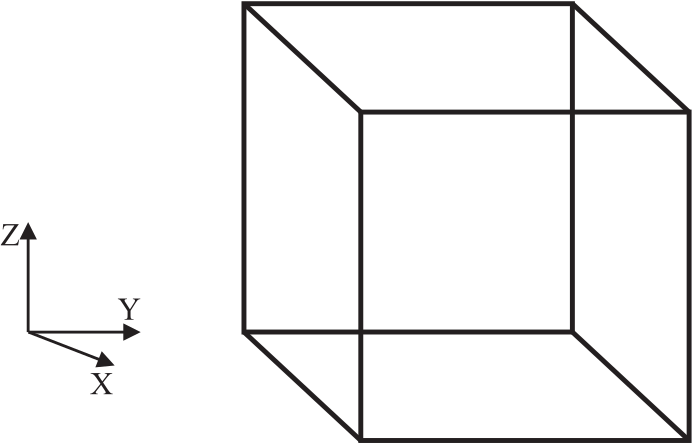
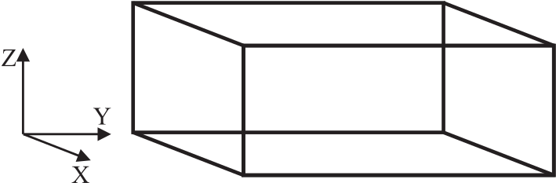
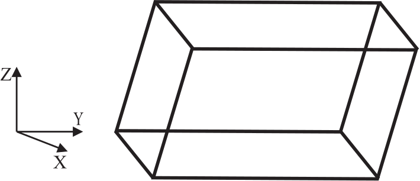

.. _boundary-conditions:

Appendix B: DL_POLY_4 Boundary Conditions 
+++++++++++++++++++++++++++++++++++++++++

Introduction
============

.. index:: single: boundary conditions

DL_POLY_4 is designed to accommodate a number of different periodic
boundary conditions, which are defined by the shape and size of the
simulation cell. Briefly, these are as follows (which also indicates the
IMCON flag defining the simulation cell type in the CONFIG file - see
Section \ :ref:`config-file`):

#. None e.g. isolated polymer in space (``imcon`` :math:`=0`)
#. Cubic periodic boundaries (``imcon`` :math:`=1`)
#. Orthorhombic periodic boundaries (``imcon`` :math:`=2`)
#. Parallelepiped periodic boundaries (``imcon`` :math:`=3`)
#. Slab (X,Y periodic; Z non-periodic) (``imcon`` :math:`=6`)

We shall now look at each of these in more detail. Note that in all
cases the cell vectors and the positions of the atoms in the cell are to
be specified in Angstroms (Å).

No periodic boundary (:math:`\texttt{imcon}~=~0`)
=================================================

Simulations requiring no periodic boundaries are best suited to *in
vacuuo* simulations, such as the conformational study of an isolated
polymer molecule. This boundary condition is not recommended for studies
in a solvent, since evaporation is likely to be a problem.

Note this boundary condition have to be used with caution. DL_POLY_4 is
not naturally suited to carry out efficient calculations on systems with
great fluctuation of the local density in space, as is the case for
clusters in vacuum. The parallelisation and domain decomposition is
therefore limited to eight domains (maximum of two in each direction in
space).

This boundary condition should not used with the SPM Ewald summation
method.

Cubic periodic boundaries (:math:`\texttt{imcon}~=~1`)
======================================================

   The cubic MD cell

The cubic MD cell is perhaps the most commonly used in simulation and
has the advantage of great simplicity. In DL_POLY_4 the cell is defined
with the principle axes passing through the centres of the faces. Thus
for a cube with sidelength D, the cell vectors appearing in the CONFIG
file should be: (D,0,0); (0,D,0); (0,0,D). Note the origin of the atomic
coordinates is the centre of the cell.

Orthorhombic periodic boundaries (:math:`\texttt{imcon}~=~2`)
=============================================================

   The orthorhomic MD cell

The orthorhombic cell is also a common periodic boundary, which closely
resembles the cubic cell in use. In DL_POLY_4 the cell is defined with
principle axes passing through the centres of the faces. For an
orthorhombic cell with sidelengths D (in X-direction), E (in
Y-direction) and F (in Z-direction), the cell vectors appearing in the
CONFIG file should be: (D,0,0); (0,E,0); (0,0,F). Note the origin of the
atomic coordinates is the centre of the cell.

Parallelepiped periodic boundaries (:math:`\texttt{imcon}~=~3`)
===============================================================

   The parallelepiped MD cell

The parallelepiped (e.g. monoclinic or triclinic) cell is generally used
in simulations of crystalline materials, where its shape and dimension
is commensurate with the unit cell of the crystal. Thus for a unit cell
specified by three principal vectors :math:`\underline{a}`, :math:`\underline{b}`,
:math:`\underline{c}`, the MD cell is defined in the DL_POLY_4 CONFIG file by
the vectors (L\ :math:`a_{1}`,L\ :math:`a_{2}`,L\ :math:`a_{3}`),
(M\ :math:`b_{1}`,M\ :math:`b_{2}`,M\ :math:`b_{3}`),
(N\ :math:`c_{1}`,N\ :math:`c_{2}`,N\ :math:`c_{3}`), in which L,M,N are
integers, reflecting the multiplication of the unit cell in each
principal direction. Note that the atomic coordinate origin is the
centre of the MD cell.

Slab boundary conditions (:math:`\texttt{imcon}~=~6`)
=====================================================

Slab boundaries are periodic in the X- and Y-directions, but not in the
Z-direction. They are particularly useful for simulating surfaces. The
periodic cell in the XY plane can be any parallelogram. The origin of
the X,Y atomic coordinates lies on an axis perpendicular to the centre
of the parallelogram. The origin of the Z coordinate is where the user
specifies it. However, it is recommended that it is in the middle of the
slab. Domain decomposition division across Z axis is limited to
:math:`2`.

If the XY parallelogram is defined by vectors :math:`\underline{A}` and
:math:`\underline{B}`, the vectors required in the CONFIG file are:
(A\ :math:`_{1}`,A\ :math:`_{2}`,0), (B\ :math:`_{1}`,B\ :math:`_{2}`,0),
(0,0,D), where D is any real number (including zero). If D is nonzero,
it will be used by DL_POLY to help determine a ‘working volume’ for the
system. This is needed to help calculate RDFs etc. (The working value of
D is in fact taken as one of: 3\ :math:`\times`\ cutoff; or
2\ :math:`\times`\ max abs(Z coordinate)+cutoff; or the user specified
D, whichever is the larger.)

The surface in a system with charges can also be modelled with if
periodicity is allowed in the Z-direction. In this case slabs of ions
well-separated by vacuum zones in the Z-direction can be handled with
``imcon`` = 1, 2 or 3.
