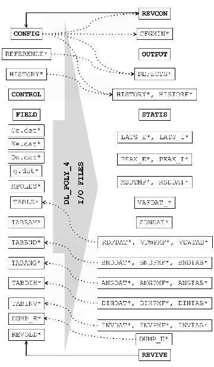

.. _input-files:

The INPUT Files
===============

    DL_POLY_4 input (left) and output (right) files. **Note**: files
    marked with an asterisk are non-mandatory.

DL_POLY_4 may require many input files. However, only CONTROL, CONFIG
and FIELD are mandatory. The MPOLES and TAB\* are complimentary to FIELD
and are only required when opted within. HISTORY is required when an old
trajectory is opted for re-play in CONTROL. REFERENCE is optionally
required when defect detection is switched on in CONTROL. REVOLD is
required only when the job represents a continuation of a previous job.
In the following sections we describe the form and content of these
files.

It is worth noting that historically DL_POLY used hard-coded names for
different I/O files as shown in Figure :numref:`(%s)<input-files_fig>`. Upon
instructions in the CONTROL many I/O file name can be overridden with
specific, user-defined filenames (see ). Even the CONTROL file can be
named differently but in this case the alternative name **must be passed
as a command line argument** to the DL_POLY_4 executable (usually named
**DLPOLY.Z**). Thus the DL_POLY_4 engine can be efficiently embedded and
utilised within external frameworks for user-definable work-flows.

.. _control-file:

The CONTROL File
----------------

The CONTROL file is read by the subroutine ``read_new_control`` and
defines the control variables for running a DL_POLY_4 job. Keywords are
character strings that appear as the first entry on a data record (or
line) and which invoke a particular operation or provide numerical
parameters. Keywords can appear in any order in the CONTROL file and
some of the directives are mandatory (for example the timestep directive
that defines the timestep), others are optional.

This way of constructing the file is very convenient, but it has
inherent dangers. It is, for example, quite easy to specify
contradictory directives, or invoke :index:`algorithm`\ s that do not work
together. By large DL_POLY_4 tries to sort out these difficulties and
print helpful error messages, but it does not claim to be fully
foolproof. It is important to think carefully about a simulation
beforehand and ensure that DL_POLY_4 is being asked to do something that
is physically reasonable. It should also be remembered that the present
capabilities the package may not allow the simulation required and it
may be necessary for you yourself to add new features.

An example CONTROL file appears below. The directives and keywords
appearing are described in the following section.

::  

  title DL_POLY_4 CONTROL DIRECTIVES

  # I/O REDIRECT
  io_file_output my-dl_poly-run
  io_file_field FIELD-dl_field.out
  io_file_config CONFIG-CDS-generated
  io_file_history new-trajectory
  io_file_revive REVIVE-2ps-run
  io_file_revcon REVCON-100k-output
  io_file_revold REVIVE-1ps-run

  # SYSTEM REPLICATION & IMPACT OPTION
  nfold [ 10 10 10 ]
  impact_part_index 1
  impact_time  2000.0 steps
  impact_energy  7.5 ke.V
  impact_direction [  1.0  2.0  3.0 ]

  # DENSITY VARIATION ARRAY BOOST
  density_variance  10.0 %

  # INDEX AND VERIFICATION BYPASS AND NO TOPOLOGY REPORTING
  ignore_config_indices ON
  strict_checks OFF
  print_topology_info OFF

  # INTERACTIONS BYPASS
  vdw_method OFF
  coul_method OFF

  # APPLY MIXING TO ALLOWED & AVAILABLE VDW CROSS INTERACTIONS
  vdw_mix_method Lorentz-Berthelot

  # DIRECT CALCULATION OF VDW/METAL INTERACTIONS INSTEAD OF
  # EVALUATION BY SPLINING OVER TABULATED VALUES IN MEMORY
  vdw_method direct
  metal_direct ON

  # FORCE-SHIFT VDW INTERACTIONS SO THAT ENERGY AND FORCE
  # CONTRIBUTIONS FALL SMOOTHLY TO ZERO WHEN APPROACHING R_CUT
  vdw_force_shift ON

  # RANDOM NUMBER GENERATOR SEEDING
  random_seed [  100  200  300 ]

  # RESTART OPTIONS
  restart noscale
  data_dump_frequency  1000 steps

  # SYSTEM TARGET TEMPERATURE AND PRESSURE
  pressure_hydrostatic  0.001 katm
  temperature  300.0 K

  # SYSTEM CUTOFFS AND ELECTROSTATICS
  vdw_cutoff  8.0 ang
  padding  0.35 ang
  cutoff  10.0 ang
  subcelling_threshold_density   50.0 %
  coul_extended_exclusion ON
  coul_dielectric_constant 1.0
  coul_method ewald
  ewald_precision 1e-05

  # RELAXED SHELL MODEL TOLERANCE
  rlx_tol  1.0

  # CONSTRANTS ITERATION LENGTH and TOLERANCE
  shake_max_iter 250
  shake_tolerance  1e-05 ang

  # INTEGRATION FLAVOUR, ENSEMBLE AND PSEUDO THERMOSTAT
  ensemble nst
  ensemble_method berendsen
  ensemble_thermostat_coupling  0.5 ps
  ensemble_barostat_coupling  1.5 ps
  pseudo_thermostat_method langevin
  pseudo_thermostat_width  2.0 ang
  pseudo_thermostat_temperature  150.0 K

  # INTEGRATION TIMESTEP
  timestep  0.001 ps
  timestep_variable ON
  timestep_variable_min_dist  0.03 ang
  timestep_variable_max_dist  0.1 ang
  timestep_variable_max_delta  0.005 ps

  # SIMULATION & EQUILIBRATION LENGTH
  time_run  10000.0 steps
  time_equilibration  1000.0 steps

  # EQUILIBRATION DIRECTIVES
  reset_temperature_interval  1.0 steps
  equilibration_force_cap  500.0 k_B.temp/ang
  rescale_frequency  5.0 steps
  regauss_frequency 3.0 steps
  minimisation_criterion energy
  minimisation_tolerance  0.001 internal_e
  minimisation_frequency  20.0 steps
  minimisation_step_length  1e-05 ang

  # STATISTICS
  record_equilibration ON
  stack_size  50.0 steps
  stats_frequency  10.0 steps

  # OUTPUT
  print_frequency  20.0 steps

  # HISTORY
  traj_calculate ON
  traj_start  20.0 steps
  traj_interval  30.0 steps
  traj_key pos

  # DEFECTS TRAJECTORY - DEFECTS
  defects_calculate ON
  defects_start  40.0 steps
  defects_interval  15.0 steps
  defects_distance  0.75 ang

  # DISPLACEMENTS TRAJECTORY - RSDDAT
  displacements_calculate ON
  displacements_start  70.0 steps
  displacements_interval  10.0 steps
  displacements_distance  0.25 ang

  # MSDTMP
  msd_calculate ON
  msd_start  1000.0 steps
  msd_frequency  100.0 steps

  # INTRAMOLECULAR PDF ANALYSIS BY TYPE IF PRESENT
  analyse_bonds ON
  analyse_frequency_bonds 100 steps
  analyse_num_bins_bonds 250

  analyse_angles ON
  analyse_frequency_angles 100 steps
  analyse_num_bins_angles 360

  analyse_dihedrals ON
  analyse_frequency_dihedrals 100 steps
  analyse_num_bins_dihedrals 720

  analyse_inversions ON
  analyse_frequency_inversions 100 steps
  analyse_num_bins_inversions 360

  analyse_all ON
  analyse_frequency 100 steps
  analyse_num_bins 1000
  analyse_max_dist 5.0 ang

  # RDF & Z-DENSITY
  rdf_print ON
  rdf_calculate ON
  rdf_frequency  7.0 steps
  rdf_binsize 0.05
  zden_print ON
  zden_calculate ON
  zden_frequency  7.0 steps
  zden_binsize 0.05

  # EMPIRICAL VALENCE BOND (EVB) DIRECTIVE
  evb 2

  # EXECUTION TIME
  time_job  1000.0 s
  time_close  10.0 s

The CONTROL File Format
~~~~~~~~~~~~~~~~~~~~~~~

The file is free-formatted and not case-sensitive. Every line is treated
as a command sentence (record). Commented records (beginning with a # or
!) and blank lines are not processed and may be added to aid legibility
(see example above). Records must be limited in length to 200
characters. Records are read in as up to three words “keyword value
unit”. A word must not exceed 256 characters in length.

Additional annotation must be rendered as a comment.

The first keyword (i.e. not comment) in the CONTROL file is must be
title and a suiltable title.

.. _control_options:

The CONTROL File Directives
~~~~~~~~~~~~~~~~~~~~~~~~~~~

**Note** that in some cases additional keywords, shown in brackets
“(...)”, may also be supplied in the directives, or directives may be
used in a long form. However, it is strongly recommended that the user
uses only the **bold** part of these directives.

The of directives available is as follows:

.. include:: paramsTable.rst

Further Comments on the CONTROL File
~~~~~~~~~~~~~~~~~~~~~~~~~~~~~~~~~~~~

#. All keywords in new-style control files must be unique, double
   specification will result in an error. This is to protect users from
   unexpected behaviour.

#. The following parameters are **mandatory**:

   #. ensemble

   #. ensemble_method

   #. cutoff

   #. timestep

#. Some directives are optional. If not specified DL_POLY_4 may give
   default values if necessary. (defaults are specified above in the
   list of directives) However fail-safe DL_POLY_4 is, ensure parameters
   are appropriate for the system of interest and defaults should only
   be used after it is known that they are valid.

#. The **time_run** and **time_equilibration** directives have a default
   of zero. If not used or used with their default values a "dry run" is
   performed. This includes force generation and system dump (REVCON and
   REVIVE) and, depending on the rest of the options, may include;
   velocity generation, force capping, application of the CGM minimiser,
   application of the pseudo thermostat, and dumps of HISTORY, DEFECTS,
   RDFDAT, ZDNDAT and MSDTMP. **Note** that, since no actual dynamics is
   to be performed, the **temperature** and **pressure** directives do
   not play any role and are therefore not necessary.

#. If the CGM minimiser, **minimise_frequency**, is specified with zero
   frequency, it is only applied at timestep zero if
   :math:`\textbf{time\_equilibration}~\ge~\textbf{time\_run}` (i.e.
   optimise structure at start only!). In this way it can be used as a
   configuration optimiser at the beginning of the equilibration period
   or when a "dry run" (**time_run** :math:`= 0`) is performed (i.e.
   equilibrate without any actual dynamics!). **Note** that the default
   CGM search algorithm stepping uses a step that is proportional to the
   square of the instantaneous value of the **timestep** and thus its
   usage in may lead to algorithm’s instability and failure in the cases
   when optimisation is applied before any dynamics occurs in a model
   system in an unphysical state (i.e. much away from equilibrium)
   and/or with an ill/badly defined forcefield for the state. Hence,
   special care (specifying the optional CGM stepping for example)
   should be taken when the option is used, especially in a "dry run"
   mode with a timestep value too large for the model system state.

#. The **timestep_variable** option requires the user to specify an
   initial guess for a reasonable timestep for the system. The
   simulation is unlikely to retain this as the operational timestep
   however, as the latter may change in response to the dynamics of the
   system. The option is used in conjunction with the default values of
   **timestep_variable_max_dist** (:math:`0.10` Å) and
   **timestep_variable_min_dist** (:math:`0.03` Å), which can also be
   optionally altered if used as directives (note the rule that
   **timestep_variable_max_dist**
   :math:`>~2.5` **timestep_variable_min_dist** applies). Also, an
   additional **timestep_variable_max_delta** (in ps) control can be
   applied. These serve as control values in the variable timestep
   algorithm, which calculates the greatest distance a particle has
   travelled in any timestep during the simulation. If the maximum
   distance is exceeded, the timestep variable is halved and the step
   repeated. If the greatest move is less than the minimum allowed, the
   timestep variable is doubled and the step repeated provided it does
   not exceed the user specified **timestep_variable_max_delta**. If it
   does then it scales to **timestep_variable_max_delta** and the step
   is repeated. In this way the integration timestep self-adjusts in
   response to the dynamics of the system. **Note** that this option is
   abandoned when used in conjunction with DPD thermostats
   (**ensemble_method dpd**), since it cannot be applied efficiently and
   furthermore it is not well defined in a DPD sense either.

#. The starting options for a simulation are governed by the keyword
   **restart**. If this is **not** specified in the control file, the
   simulation will start as new. When specified, it will continue a
   previous simulation (**restart**) provided all needed restart files
   are in place and not corrupted. If they are not in place or are found
   corrupted, it will start a new simulation without initial temperature
   scaling of the previous configuration (**restart noscale**).

#. The **ensemble nst** keyword is also used in the N\ :math:`\sigma`\ T
   ensembles extension to NP\ :math:`_{n}`\ AT and
   NP\ :math:`_{n}\gamma`\ T ones. **Note** that these semi-isotropic
   ensembles are only correct for infinite interfaces placed
   perpendicularly to the z axis! This means that the interface is
   homogeneous (unbroken) and continuous in the (x,y) plane of the MD
   cell, which assumes that that two of the cell vectors have a cross
   product only in the z direction. (For example, if the MD box is
   defined by its lattice vectors
   :math:`(\underline{a},\underline{b},\underline{c})` then
   :math:`\underline{a} \times \underline{b} = \pm (0,0,1)`.) It is the
   users’ responsibility to ensure this holds for their model system.

#. The **reset_temperature_interval** directive, enables a "zero
   temperature" optimisation. In this case a crude energy minimiser is
   used to help the system relax before each integration of the
   equations of motion. The function of the minimiser can be summarised
   as

   .. math::

      \underline{v}_{i} \leftarrow \left\{ \begin{array} {l@{\quad:\quad}l}
      0 & \underline{v}_{i} \cdot \underline{f}_{i} < 0 \\
      \underline{f}_{i} \; \frac{\underline{v}_{i}~\cdot~\underline{f}_{i}}
      {\underline{f}_{i}~\cdot~\underline{f}_{i}} & \underline{v}_{i} \cdot
      \underline{f}_{i} \ge 0
      \end{array} \right.

   for systems with free particles only, where :math:`\underline{v}_{i}`
   and :math:`\underline{f}_{i}` are the force and velocity of particle
   :math:`i`. The algorithm is extended in the case of RBs by including

   .. math::

      \begin{aligned}
      \underline{V}_{j} \leftarrow \left\{ \begin{array} {l@{\quad:\quad}l}
      0 & \underline{V}_{j} \cdot \underline{F}_{j} < 0 \\
      \underline{F}_{j} \; \frac{\underline{V}_{j}~\cdot~\underline{F}_{j}}
      {\underline{F}_{j}~\cdot~\underline{F}_{j}} & \underline{V}_{j} \cdot
      \underline{F}_{j} \ge 0
      \end{array} \right. \\ \nonumber
      \underline{\omega}_{j} \leftarrow \left\{ \begin{array} {l@{\quad:\quad}l}
      0 & \underline{\omega}_{j} \cdot \underline{\tau}_{j} < 0 \\
      \underline{\tau}_{j} \; \frac{\underline{\omega}_{j}~\cdot~\underline{\tau}_{j}}
      {\underline{\tau}_{j}~\cdot~\underline{\tau}_{j}} & \underline{\omega}_{j} \cdot
      \underline{\tau}_{j} \ge 0
      \end{array} \right.~~,\end{aligned}

   where :math:`\underline{V}_{j}` and :math:`\underline{F}_{j}` are the
   velocity and force of the RB’s centre of mass, and
   :math:`\underline{\omega}_{j}` and :math:`\underline{\tau}_{j}` are
   the angular velocity and torque of RB :math:`j`. Measures are taken
   to conserve the MD cell momentum and the thermostat’s instantaneous
   kinetic energy.

   This must not be thought of as a true energy minimization method.
   **Note** that this optimisation is only applied when the simulation
   runs in equilibration mode.

   The algorithm is developed in the DL_POLY_4 routine
   ``zero_k_optimise``.

#. The **impact** directives will not be activated if the particle index
   is beyond the one of the last particle. The option will fail in a
   controlled manner at application time if the particle is found to be
   in a frozen state or the shell of an ion or part of a rigid body.
   During application the center of mass momentum is re-zeroed to
   prevent any drifts. The user must take care to have the
   impactinitiated after any possible equilibration. Otherwise, the
   system will be thermostatted and the impact energy dissipated during
   the equilibration.

#. The **pseudo_thermostat** directives are intended to be used in
   highly non-equilibrium simulations when users are primarily
   interested in the structural changes in the core of the simulated
   system as the the MD cell boundaries of the system are coupled to a
   thermal bath.

   The thermal bath can be used with several types of temperature
   scaling algorithms

   #. Langevin (stochastic thermostat),

   #. Gauss

   #. Direct (direct thermostat).

   The user is also required to specify the width of the pseudo
   thermostat, **pseudo_thermostat_width**, which must be larger than
   2 Å  and less than or equal to a quarter of minimum width of the MD
   cell. The thermostat is an pseudo_thermostat_width thick buffer layer
   attached on the inside at the MD cell boundaries.

   The temperature of the bath is specified by the user,
   **pseudo_thermostat_temperature**, which must be larger than 1
   Kelvin.

   -  **langevin**

      The stochasticity of the Langevin thermostat emulates an infinite
      environment around the MD cell, providing a means for “natural”
      heat exchange between the MD system and the heath bath thus aiding
      possible heat build up in the system. In this way the
      instantaneous temperature of the system is driven naturally
      towards the bath temperature. Every particle within the thermostat
      buffer layer is coupled to a viscous background and a stochastic
      heat bath, such that

      .. math::

         \begin{aligned}
         {d \underline{r}_{i}(t) \over d t} =& \underline{v}_{i}(t) \nonumber \\
         {d \underline{v}_{i}(t) \over d t} =& {{\underline{f}_{i}(t)+\underline{R}_{i}(t)}
         \over m_{i}} - \chi (t) \; \underline{v}_{i}(t)~~,\end{aligned}

      where :math:`\chi (t)` is the friction parameter from the dynamics
      in the the MD cell and :math:`R(t)` is stochastic force with zero
      mean that satisfies the fluctuation-dissipation theorem:

      .. math::

         \left< R^{\alpha}_{i}(t)~R^{\beta}_{j}(t^\prime) \right> =
         2~\chi(t)~m_{i}~k_{B}T~\delta_{ij}~\delta_{\alpha
         \beta}~\delta(t-t^\prime)~~,

      where superscripts denote Cartesian indices, subscripts particle
      indices, :math:`k_{B}` is the Boltzmann constant, :math:`T` the
      bath temperature and :math:`m_{i}` the particle’s mass. The
      algorithm is implemented in routine ``pseudo`` and has two stages:

      -  Generate random forces on all particles within the thermostat.
         Here, care must be exercised to prevent introduction of
         non-zero net force when the random forces are added to the
         system force field.

      -  Rescale the kinetic energy of the thermostat bath so that
         particles within have Gaussian distributed kinetic energy with
         respect to the target temperature and determine the (Gaussian
         constraint) friction within the thermostat:

         .. math::

            \chi(t) = Max \left( 0, \frac
            {\sum_{i} [\vec{f}_{i}(t) + \vec{R}_{i}(t)] \cdot \vec{v}_{i}(t)}
            {\sum_{i} m_{i}~\vec{v}_{i}^{2}(t)} \right)~~.

         Care must be exercised to prevent introduction of non-zero net
         momentum. (Users are reminded to use for target temperature the
         temperature at which the original system was equilibrated in
         order to avoid simulation instabilities.)

      The effect of this algorithm is to relax the buffer region of the
      system on a local scale and to effectively dissipate the
      incomingexcess kinetic energy from the rest of the system, thus
      emulating an infinite-like environment surrounding the MD cell.
      The thermostat width matters as the more violent the events on the
      inside of the MD cell, the bigger width may be needed in order to
      ensure safe dissipation of the excess kinetic energy.

   -  **Gaussian**

      -  Rescale the kinetic energy of the thermostat bath so that
         particles within have Gaussian distributed kinetic energy with
         respect to the target temperature.

   -  **direct**

      The Direct thermostat is the simplest possible model allowing for
      heat exchange between the MD system and the heath bath. All (mass,
      non-frozen) particles within the bath have their kinetic energy
      scaled to :math:`1.5~k_{B}T~` at the end of each time step during
      the simulation. Care is exercised to prevent introduction of
      non-zero net momentum when scaling velocities. (Users are reminded
      to use for target temperature the temperature at which the
      original system was equilibrated in order to avoid simulation
      instabilities.) Due to the “unphysical” nature of this temperature
      control the thermostat width does not matter to the same extent as
      in the case of the Langevin thermostat.

   **Note** that embedding a thermostat in the MD cell walls is bound to
   produce **wrong ensemble averages**, and instantaneous pressure and
   stress build-ups at the thermostat boundary. Therefore, ensembles
   lose their meaning as such and so does the conserved quantity for
   true ensembles.

   The algorithms are developed in the DL_POLY_4 routine ``pseudo_vv``.

#. The **defects_calculate** option will trigger reading of REFERENCE
   (see Section :ref:`reference-file`), which defines a reference
   MD cell with particles’ positions defining the crystalline lattice
   sites. If REFERENCE is not found the simulation will either:

   -  halt if the simulation has been restarted, i.e. is a continuation
      of an old one - the **restart** option is used in CONTROL and the
      REVOLD (see Section :ref:`revold-file`) file has been
      provided.

   -  recover using CONFIG (see Section :ref:`config-file`) if it
      is a new simulation run, i.e **restart** option is not used in
      CONTROL or REVOLD has not been provided.

   The actual defect detection is based on comparison of the simulated
   MD cell to the reference MD cell based on a user defined
   site-interstitial cutoff, :math:`R_{def}`,

   .. math:: {\rm Min}\left[0.3,r_{\rm cut}/3\right]~Å~\le~R_{def}~\le~{\rm Min}\left[1.2,r_{\rm cut}/2\right]~Å \nonumber

   with a default value of
   :math:`{\rm Min}\left[0.75,r_{\rm cut}/3\right]` Å. (If the supplied
   value exceeds the limits the simulation execution will halt). If a
   particle, :math:`p`, is located in the vicinity of a site, :math:`s`,
   defined by a sphere with its centre at this site and a radius,
   :math:`R_{def}`, then the particle is a *first hand* claimee of
   :math:`s`, and the site is not vacant. Otherwise, the site is
   presumed vacant and the particle is presumed a general interstitial.
   If a site, :math:`s`, is claimed and another particle,
   :math:`p\prime`, is located within the sphere around it, then
   :math:`p\prime` becomes an interstitial associated with :math:`s`.
   After all particles and all sites are considered, it is clear which
   sites are vacancies. Finally, for every claimed site, distances
   between the site and its *first hand* claimee and interstitials are
   compared and the particle with the shortest one becomes the *real*
   claimee. If a *first hand* claimee of :math:`s` is not the *real*
   claimee it becomes an interstitial associated with :math:`s`. At this
   stage it is clear which particles are interstitials. The sum of
   interstitials and vacancies gives the total number of defects in the
   simulated MD cell.

   Frozen particles and particles detected to be shells of polarisable
   ions are not considered in the defect detection.

   **Note** that the algorithm cannot be applied safely if
   :math:`R_{def}` is larger than half the shortest interatomic distance
   within the reference MD cell since a particle may; (i) claim more
   than one site, (ii) be an interstitial associated with more than one
   site, or both (i) and (ii). On the other hand, low values of
   :math:`R_{def}` are likely to lead to slight overestimation of
   defects.

   If the simulation and reference MD cell have the same number of atoms
   then the total number of interstitials is always equal to the total
   number of defects.

#. The **displacements_calculate** option will trigger dump of atom
   displacements based on a qualifying cutoff in a trajectory like
   manner. Displacements of atoms from their original position at the
   end of equilibration (the start of statistics), :math:`t~=0~`, is
   carried out at each timestep.

#. The tolerance and stepping for relaxed shell model **rlx_tol**, is a
   last resort option to aid shell relaxation of systems with very
   energetic and/or rough potential surface. Users are advised to use it
   with caution, should there really need be, as the use of high values
   for the tolerance (default of 1) may result in physically incorrect
   dynamics and small stepping (default :math:`Max(k_{core-shell})/2`)
   to expensive force evaluations.

#. The choice of reaction field electrostatics (directive **coul_method
   reaction_field**) relies on the specification of the relative
   dielectric constant external to the cavity. This is specified by the
   **coul_dielectric_constant** directive.

#. DL_POLY_4 uses two different potential cutoffs. These are as follows:

   #. :math:`r_{\rm cut}` - the universal cutoff set by **cutoff**. It
      applies to the real space part of the electrostatics calculations
      and to the van der Waals :index:`potentials<potential;van der Waals>` if no other cutoff is applied.

   #. :math:`r_{\rm vdw}` - the user-specified cutoff for the van der
      Waals potentials set by **vdw_cutoff**. If not specified its value
      defaults to :math:`r_{\rm cut}`.

#. Constraint algorithms in , SHAKE/RATTLE (see
   Section :ref:`shake-rattle`), use default iteration
   precision of 10\ :math:`^{-6}` and limit of iteration cycles of 250.
   Users may experience that during optimisation of a new built system
   containing constraints simulation may fail prematurely since a
   constraint algorithm failed to converge. In such cases directives
   **shake_max_iter** (to increase) and **shake_tolerance** (to
   decrease) may be used to decrease the strain in the system and
   stablise the simulation numerics until equilibration is achieved.

#. DL_POLY_4’s DD strategy assumes that the local (per domain/node or link cell)
   density of various system entities (i.e. atoms, bonds, angles, etc.)
   does not vary much during a simulation and some limits for these are
   assumed empirically. This may not the case in extremely
   non-equilibrium simulations, where the assumed limits are prone to be
   exceeded or in some specific systems where these do not hold from the
   start. A way to tackle such circumstances and avoid simulations crash
   (by controlled termination) is to use the **density_variance**
   :math:`f` option. In the ``set_bounds`` subroutine DL_POLY_4 makes
   assumptions at the beginning of the simulation and corrects the
   lengths of bonded-like interaction lists arrays
   (``mxshl, mxcons, mxrgd, mxteth, mxbond, mxangl, mxdihd, mxinv``) as
   well as the lengths of link-cell (``mxlist``) and domain
   (``mxatms, mxatdm``) lists arrays when the option is activated with
   :math:`f > 0`. Greater values of :math:`f` will correspond to
   allocation bigger global arrays and larger memory consumption by
   DL_POLY_4 during the simulation. **Note** that this option may demand
   more memory than available on the computer architecture. In such
   cases DL_POLY_4 will terminate with an array allocation failure
   message.

#. As a default, DL_POLY_4 does not store statistical data during the
   equilibration period. If the directive **record_equilibration** is
   used, equilibration data will be incorporated into the overall
   statistics.

#. The **vaf_calculate** directive switches on velocity autocorrelation
   function (VAF) calculations for individual atomic species in
   DL_POLY_4 after equilibration or immediately at start if the
   directive **record_equilibration** is used. It controls how often VAF
   profiles are started what the size of each profile (in timesteps).
   Overlapping profiles are possible and require more memory to store
   them (and initial velocities) while they are being calculated. By
   default DL_POLY_4 will report time-averaged VAF profiles. This can be
   overridden using the **vaf_averaging** directive, which will instead
   report individual ‘instantaneous’ VAF profiles.

#. The **no vom** option will trigger a default bypass of the ``getvom``
   routine which will return zero and thus no COM removal will happen.
   **Note that this will lead to COM momentum accumulation for many
   though not all ensembles!**. Such accumulation will propagate to the
   generation of flow in the MD cell and ultimately suppress the thermal
   motion of the particles in the system, leading to the so called
   "frozen ice cube effect"! It is worth nothing that this option must
   be turned on for the correct application of stochastic dynamics via
   the langevin temperature control (NVT Langevin)! If the option is not
   applied then the dynamics will lead to peculiar thermalisation of
   different atomic species to mass- and system size-dependent
   temperatures.

#. The **padding** option will add extra distance, :math:`r_{\rm pad}`,
   if larger than :math:`f \ge {\rm Min}[0.05,0.5\%.r_{\rm cut}]` Å, to
   the major cutoff, :math:`r_{\rm cut}`, to construct a larger
   link-cell width, :math:`r_{\rm lnk}=r_{\rm cut}+r_{\rm pad}`, which
   will trigger a construction of a larger Verlet neighbour list (VNL)
   while at the same time facilitate its conditional update, rather at
   every timestpe. The VNL conditaional update is check at the end of
   each tiemstep and triggered only when the most travelled particle has
   moved a distance larger than :math:`r_{\rm pad}/2`. It is worth
   noting that padding is at expense of extra memory but if used wisely
   it could improve time to solution from 10% to 100% depending on
   force-field complexity. If it is too large or too small (that is why
   the :math:`f \ge {\rm Min}[0.05,0.5\%.r_{\rm cut}]` Å limit) it will
   lead to performace degradation. It is recomended that
   :math:`r_{\rm pad}` is set up at a value of
   :math:`\approx 1 \div 5\%` of the cutoff, :math:`r_{\rm cut}`, as
   long as the major link-cell algorithm uses a link-cell decomposition
   that not worse than :math:`4 \otimes 4 \otimes 4` per domain. For
   such setups, in practice, one may expect average compute speedups
   [1]_ of the order of :math:`10 \div 30\%` for force-fields involving
   the Ewald summation methodology and :math:`60 \div 100\%` for
   force-fields without electrostatics evaluations involving the Ewald
   summation methodology.

#. The **subcelling_threshold_density** option will set the threshold
   density of particles per link cell below which subcelling (decreasing
   link-cell size) stops. The default is 50 although experimenting with
   values between 10 and 100 may provide sufficient information about a
   performance sweetspot. The comparison condition is carried out on the
   average density per sub-link cell of each domain. Thus subcelling
   takes into account only the per domain density variation. Obviously,
   the subcelling threshhold is limited to 1 particle per cell for the
   sake of safety and sanity reasons.

#. The **coul_extended_exclusion** option will make sure that for all
   *conventional* (no distance restraints) intra-molecular interactions
   (bonds, angles, digedrals, inversions) as well as for CB and RB units
   any intra-core-shell interactions fall within the list of excluded
   interactions. This is not a default behaviour. The option is also
   triggered by the **polarisation** directvies.

#. The various **ttm** options all have the effect of switching on the
   two-temperature :index:`model<Two-Temperature Model>` 
   (TTM), which assumes the use of the
   inhomogeneous Langevin NVT ensemble. It is not possible to specify
   any other ensemble for TTM-based systems, so the inhomogeneous
   Langevin NVT ensemble will always be used in this case, with default
   values for the friction terms and cut-off velocity if these are not
   specified. No implementation of the inhomogeneous Langevin ensemble
   currently exists for rigid bodies. To model metallic systems, the
   thermal conductivity must be specified either as infinitely large, a
   constant value, a linear function of electronic temperature (based on
   the Drude model) or as a tabulated function of temperature, while
   non-metallic systems require a constant thermal diffusivity. Any
   energy deposition is applied after equilibration. An additional
   restart file, DUMP_E, consisting of electronic temperatures for each
   electronic temperature cell (CET), is produced along with REVCON and
   REVIVE when TTM is switched on.

Users are advised to study the example CONTROL files appearing in the
*data* sub-directory to see how different files are constructed.

.. _config-file:

The CONFIG File
---------------

The CONFIG file contains the dimensions of the unit cell, the key for
periodic boundary conditions and the atomic labels, coordinates,
velocities and forces. This file is read by the subroutine
``read_config`` (optionally by ``scan_config``) in the ``set_bounds``
routine. The first few records of a typical CONFIG file are shown below:

::

   IceI structure 6x6x6 unit cells with proton disorder
            2         3               276
     26.988000000000000   0.000000000000000   0.000000000000000
    -13.494000000000000  23.372293600000000   0.000000000000000
      0.000000000000000   0.000000000000000  44.028000000000000
         OW         1
       -2.505228382        -1.484234330        -7.274585343
       0.5446573999        -1.872177437       -0.7702718106
        3515.939287         13070.74357         4432.030587
         HW         2
       -1.622622646        -1.972916834        -7.340573742
        1.507099154        -1.577400769         4.328786484
        7455.527553        -4806.880540        -1255.814536
         HW         3
       -3.258494716        -2.125627191        -7.491549620
        2.413871957        -4.336956694         2.951142896
       -7896.278327        -8318.045939        -2379.766752
         OW         4
       0.9720599243E-01    -2.503798635        -3.732081894
        1.787340483        -1.021777575        0.5473436377
        9226.455153         9445.662860         5365.202509

   etc.

The CONFIG File Format
~~~~~~~~~~~~~~~~~~~~~~

The file is free-formatted and case sensitive for the atom species
names. Every line is treated as a command sentence (record). However,
line records are limited to 72 characters in length. Records are read in
words, as a word must not exceed 40 characters in length. Words are
recognised as such by separation by one or more space characters. The
first record in the CONFIG file is a header (up to 72 characters long)
to aid identification of the file. Blank and commented lines are not
allowed.

Definitions of Variables in the CONFIG File
~~~~~~~~~~~~~~~~~~~~~~~~~~~~~~~~~~~~~~~~~~~

.. parsed-literal:: 
 
  **record 1**
  ``header``      a72       title line

  **record 2**
  ``levcfg``      integer   CONFIG file key. See Table :numref:`(%s)<levcfg_table>` for permitted values
  ``imcon``       integer   Periodic boundary key. See Table :numref:`(%s)<imcon_table>` for permitted values
  ``megatm``      integer   Optinal, total number of particles (crystalographic entities)

  **record 3** omitted if ``imcon`` = 0
  ``cell(1)``     real      x component of the :math:`a` cell vector in Å
  ``cell(2)``     real      y component of the :math:`a` cell vector in Å
  ``cell(3)``     real      z component of the :math:`a` cell vector in Å

  **record 4** omitted if ``imcon`` = 0
  ``cell(4)``     real      x component of the :math:`b` cell vector in Å
  ``cell(5)``     real      y component of the :math:`b` cell vector in Å
  ``cell(6)``     real      z component of the :math:`b` cell vector in Å

  **record 5** omitted if ``imcon`` = 0
  ``cell(7)``     real      x component of the :math:`c` cell vector in Å
  ``cell(8)``     real      y component of the :math:`c` cell vector in Å
  ``cell(9)``     real      z component of the :math:`c` cell vector in Å

**Note** that **record 2** may contain more information apart from the
mandatory as listed above. If the file has been produced by DL_POLY_4
then it also contains other items intended to help possible parallel I/O
reading. Also, it is worth mentioning that the periodic boundary
conditions (PBC), as specified in Table :numref:`(%s)<imcon_table>` and
described in detail in
:ref:`Appendix B<boundary-conditions>`, refer
generally to a **triclinic type of super-cell**, for which there are
**no symmetry assumptions! Records 3, 4 and 5** contain the Cartesian
components of the super-cell’s lattice vectors in Å. DL_POLY_4 can only
tract triclinic type of super-cells as the only types of super-cell
shapes that are commensurate with the domain decomposition (DD)
parallelisation strategy of it. However, this is not a restriction for
the replicated data (RD) parallelisation that adopts and thus it can
also accept truncated octahedral and rhombic dodecahedral periodic
boundaries.

Subsequent records consists of blocks of between 2 and 4 records
depending on the value of the ``levcfg`` variable. Each block refers to
one atom. The atoms **do not** need to be listed sequentially in order
of increasing index. Within each block the data are as follows:

.. parsed-literal::
  
  **record i**
  ``atmnam``   a8       atom name
  ``index``    integer  atom index
  
  **record ii**
  ``xxx``      real     x coordinate in Å
  ``yyy``      real     y coordinate in Å
  ``zzz``      real     z coordinate in Å
  
  **record iii** included only if ``levcfg`` :math:`>0`
  ``vxx``      real     x component of velocity in Å/picosecond
  ``vyy``      real     y component of velocity in Å/picosecond
  ``vzz``      real     x component of velocity in Å/picosecond
  
  **record iv** included only if ``levcfg`` :math:`>1`
  ``fxx``      real     x component of force in Å\ :math:`\cdot`\ Dalton/picosecond\ :math:`^{2}`
  ``fyy``      real     y component of force in Å\ :math:`\cdot`\ Dalton/picosecond\ :math:`^{2}`
  ``fzz``      real     z component of force in Å\ :math:`\cdot`\ Dalton/picosecond\ :math:`^{2}`

**Note** that on **record i** only the atom name is strictly mandatory,
any other items are not read by DL_POLY_CLASSIC but may be added to aid alternative uses
of the file, for example alike DL_POLY :index:`GUI`
:cite:`smith-gui`, DL_POLY_CLASSIC assume that the atoms’ indices are in a
sequentially ascending order starting form 1. However, needs the index
or the **no ind**\ ex option needs to be specified in the CONTROL file!
It is worth mentioning that DL_POLY_4 (as well as DL_POLY_CLASSIC) assumes that the
origin of Cartesian system with respect to which the particle positions
are specified is the middle of MD cell. Also, as both the cell vectors
and the particles’ positions are specified in Å, there is a **fine
connection** between them! This would not be the case if the particles’
positions were kept in reduced space with fractional coordinates. Last
but not least, it is worth pointing out that composite entities, such as
velocities and forces, have their units expressed as composites of the
default DL_POLY units as shown in Section \ `[units] <#units>`__.

.. _levcfg_table:
.. table:: CONFIG File Key (record 2)

   ========== ===================================================
   ``levcfg``
   ========== ===================================================
   0          coordinates included in file
   1          coordinates and velocities included in file
   2          coordinates, velocities and forces included in file
   ========== ===================================================

.. _imcon_table:
.. table:: Periodic Boundary Key (record 2)

   ========= =============================================================
   ``imcon``
   ========= =============================================================
   0         no periodic boundaries
   1         cubic boundary :index:`conditions<boundary conditions;cubic>`
   2         orthorhombic boundary conditions
   3         parallelepiped boundary conditions
   6         x-y parallelogram boundary conditions with
   \         no periodicity in the z direction
   ========= =============================================================

Further Comments on the CONFIG File
~~~~~~~~~~~~~~~~~~~~~~~~~~~~~~~~~~~

The CONFIG file has the same format as the output file REVCON
(Section :ref:`revcon-file`). When restarting from a
previous run of DL_POLY_4 (i.e. using the **restart**, **restart
noscale** or restart scale directives in the CONTROL file - above), the
CONFIG file must be replaced by the REVCON file, which is renamed as the
CONFIG file. The copy macro in the *execute* sub-directory of DL_POLY_4
does this for you.

The CONFIG file has the same format as the optional output file CFGMIN,
which is only produced when the **minimise** (**optimise**) option has
been used during an equilibration simulation or a "dry run".

.. _field-file:

The FIELD File
--------------

The FIELD file contains the force field information defining the nature
of the molecular forces. This information explicitly includes the (site)
topology of the system which sequence **must** be matched (implicitly)
in the crystallographic description of the system in the CONFIG file.
The FIELD file is read by the subroutine ``read_field``. (It is also
read by the subroutine scan_field in the ``set_bounds`` routine.)
Excerpts from a force field file are shown below. The example is the
antibiotic Valinomycin in a cluster of 146 water molecules:

::

   Valinomycin Molecule with 146 SPC Waters
   UNITS kcal

   MOLECULES    2
   Valinomycin
   NUMMOLS 1
   ATOMS 168
       O        16.0000     -0.4160         1
       OS       16.0000     -0.4550         1
       "          "           "        "
       "          "           "        "
       HC        1.0080      0.0580         1
       C        12.0100      0.4770         1
   BONDS 78
   harm   31   19 674.000     1.44900
   harm   33   31 620.000     1.52600
       "    "    "    "         "
       "    "    "    "         "
   harm  168   19 980.000     1.33500
   harm  168  162 634.000     1.52200
   CONSTRAINTS 90
      20   19    1.000017
      22   21    1.000032
       "    "     "
       "    "     "
     166  164    1.000087
     167  164    0.999968
   ANGLES 312
   harm   43    2   44  200.00      116.40
   harm   69    5   70  200.00      116.40
     "    "    "    "     "           "
     "    "    "    "     "           "
   harm   18  168  162  160.00      120.40
   harm   19  168  162  140.00      116.60
   DIHEDRALS 371
   harm    1   43    2   44  2.3000      180.00
   harm   31   43    2   44  2.3000      180.00
     "    "    "    "    "     "           "
     "    "    "    "    "     "           "
   cos   149   17  161   16  10.500      180.00
   cos   162   19  168   18  10.500      180.00
   FINISH
   SPC Water
   NUMMOLS 146
   ATOMS  3
       OW       16.0000     -0.8200
       HW        1.0080      0.4100
       HW        1.0080      0.4100
   CONSTRAINTS  3
       1    2    1.0000
       1    3    1.0000
       2    3    1.63299
   FINISH
   VDW   45
   C       C         lj   0.12000      3.2963
   C       CT        lj   0.08485      3.2518
   "       "         "     "            "
   "       "         "     "            "
   "       "         "     "            "
   OW      OS        lj   0.15100      3.0451
   OS      OS        lj   0.15000      2.9400
   CLOSE

The FIELD File Format
~~~~~~~~~~~~~~~~~~~~~

The file is free-formatted and not case-sensitive (except for the site
names). Every line is treated as a command sentence (record). Commented
records (beginning with a #) and blank lines are not processed and may
be added to aid legibility (see example above). Records must be limited
in length to 200 characters. Records are read in words, as a word must
not exceed 40 characters in length. Words are recognised as such by
separation by one or more space characters. The contents of the file are
variable and are defined by the use of **directives**. Additional
information is associated with the directives.

Definitions of Variables in the FIELD File
~~~~~~~~~~~~~~~~~~~~~~~~~~~~~~~~~~~~~~~~~~

The file divides into three sections: general information, molecular
descriptions, and :index:`non-bonded<potential;non-bonded>` interaction descriptions, appearing in that
order in the file.

General information
~~~~~~~~~~~~~~~~~~~

The first viable record in the FIELD file is the title. The second is
the **units** directive. Both of these are mandatory.

.. parsed-literal::

  **record 1**
  header      a200    field file header
  
  **record 2**
  **units**       a40     Unit of energy used for input and output

The energy :index:`units<units;energy>` on the **units** directive are described by additional
keywords:

a.
   **eV**, for electron-Volts

b.
   **kcal**/mol, for k-calories per mol

c.
   **kJ**/mol, for k-Joules per mol

d.
   **K**\ elvin/Boltzmann, for Kelvin per Boltzmann

e.
   **internal**, for DL_POLY internal units (10 Joules per mol).

If no units keyword is entered, DL_POLY internal units are assumed for
both input and output. The **units** directive only affects the input
and output interfaces, all internal calculations are handled using
DL_POLY units. System input and output energies are read in **units per
MD cell**.

**Note** that all energy bearing potential parameters are read in terms
of the specified energy units. If such a parameter depends on an angle
then the dependence is read in terms of radians although the following
angle in the parameter sequence is read in terms of degrees. As to any
rule, there is an exception - the electrostatic bond potential has no
energy bearing parameter!

A third optional record can then be supplied before any molecular
description:

.. parsed-literal:: 

  **record 3**
  **mult**\ ipolar order :math:`n`  a50, integer    Electrostatics
  evaluation to order :math:`n` poles

This will later trigger the parsing of the MPOLES file (see
Section :ref:`mpoles-file`) which supplies the multipolar momenta
values of the molecular sites specified in FIELD. Sites with specified
pole orders, :math:`m`, smaller than the one required, :math:`n`, will
have their :math:`m+1` to :math:`n` order poles’ momenta zeroed.
Similarly, if sites have momenta of poles of higher order than the one
required, :math:`n`, these will not be processed by .

.. note::
  
  although algorithms in DL_POLY_4 could in principle handle any
  high pole order summation, in practice, however, DL_POLY_4 will abort if
  the order is higher than hexadecapole (order 4)! For more information on
  this functionality refer to Section :ref:`mpoles`.

Molecular details
~~~~~~~~~~~~~~~~~

It is important for the user to understand that there is an
organisational correspondence between the FIELD file and the CONFIG file
described above. It is required that the order of specification of
molecular types and their atomic constituents in the FIELD file follows
the order of indices in which they appear in the CONFIG file. Failure to
adhere to this common sequence will be detected by DL_POLY_4 and result
in premature termination of the job. It is therefore essential to work
from the CONFIG file when constructing the FIELD file. It is not as
difficult as it sounds!

The entry of the molecular details begins with the mandatory directive:

::
  
  molecules n

where *n* is an integer specifying the number of different *types* of
molecule appearing in the FIELD file. Once this directive has been
encountered, DL_POLY_4 enters the molecular description environment in
which only molecular description keywords and data are valid.

Immediately following the **molecules** directive, are the records
defining individual molecules:

#.  *name-of-molecule*
    which can be any character string up to 200 characters in length.
    (**Note**: this is not a directive, just a simple character
    string.)

#.  **nummols n**
    where *n* is the number of times a molecule of this type appears in
    the simulated system. The molecular data then follow in subsequent
    records:

#.  **atoms n**
    where *n* indicates the number of atoms in this type of molecule. A
    number of records follow, each giving details of the atoms in the
    molecule i.e. site names, masses and charges. Each record carries
    the entries:

    .. parsed-literal:: 

      ``sitnam``  a8      atomic site name
      ``weight``  real    atomic site mass (in Daltons)
      ``chge``    real    atomic site charge (in protons)
      ``nrept``   integer repeat counter
      ``ifrz``    integer ‘frozen’ atom (if ``ifrz`` > 0`)

   The integer ``nrept`` need not be specified if the atom/site is not
   frozen (in which case a value of 1 is assumed.) A number greater than
   1 specified here indicates that the next (``nrept``-1) entries in the
   CONFIG file are ascribed the atomic characteristics given in the
   current record. The sum of the repeat numbers for all atoms in a
   molecule should equal the number specified by the **atoms**
   directive.

#.  **shell n**
    where *n* is the number of core-shell units. Each of the subsequent
    *n* records contains:

    .. parsed-literal::  

      index 1 (*i*)     integer   site index of core
      index 2 (*j*)     integer   site index of shell
      k_2             real      force constant of core-shell spring
      k_4             real      quartic (anharmonic) force constant of spring

    The spring potential is

    .. math:: U(r)=\frac{1}{2}k_{2} r_{ij}^{2}+\frac{1}{4!}k_{4} r_{ij}^{4}~~,

    with the force constant :math:`k_{2}` entered in units of
    ``engunit``\ :math:`\times`\ Å\ :math:`^{-2}` and :math:`k_{4}` in
    ``engunit`` Å:math:`^{-4}`, where usually :math:`k_{2} >> k_{4}`. The
    ``engunit`` is the energy unit specified in the **units** directive.

    **Note** that the atomic site indices referred to above are indices
    arising from numbering each atom in the molecule from 1 to the number
    specified in the **atoms** directive for this molecule. This same
    numbering scheme should be used for all descriptions of this
    molecule, including the **constraints**, **pmf**, **rigid**,
    **teth**, **bonds**, **angles**, **dihedrals** and **inversions**
    entries described below. DL_POLY_4 will itself construct the global
    indices for all atoms in the systems.

    **Note** that DL_POLY_4 determines which shell model to use by
    scanning shells’ weights provided the FIELD file (see
    Section :ref:`shell-models`). If all shells have
    zero weight the DL_POLY_4 will choose the relaxed shell model. If no
    shell has zero weight then DL_POLY_4 will choose the dynamical one.
    In case when some shells are massless and some are not DL_POLY_4 will
    terminate execution controllably and provide information about the
    error and possible possible choices of action in the OUTPUT file (see
    Section :ref:`output-files`). Shell models’ extensions
    are dealt according to the user specifications in the FIELD files.

    This directive (and associated data records) need not be specified if
    the molecule contains no core-shell units.

#.  **constraints n**
    where *n* is the number of constraint bonds in the molecule. Each
    of the following *n* records contains:

    .. parsed-literal:: 

      index 1     integer   first atomic site index
      index 2     integer   second atomic site index
      bondlength  real      constraint :index:`bond<constraints;bond>` length

   This directive (and associated data records) need not be specified if
   the molecule contains no constraint :index:`bond<constraints;bond>`\ s. See the note on the atomic
   indices appearing under the **shell** directive above.

#.  **pmf b**
    where *b* is the potential of mean force bondlength (Å). There
    follows the definitions of two PMF units:

    #.  **pmf unit n1**
        where *n1* is the number of sites in the first unit. The
        subsequent *n1* records provide the site indices and weighting.
        Each record contains:

        .. parsed-literal:: 

          index     integer   atomic site index
          weight    real      site weighting

    #.  **pmf unit n2**
        where *n2* is the number of sites in the second unit. The
        subsequent *n2* records provide the site indices and weighting.
        Each record contains:

        .. parsed-literal:: 

          index     integer     atomic site index
          weight    real        site weighting

    This directive (and associated data records) need not be specified if
    no :index:`PMF<constraints;PMF>` constraints are present. See the note on the atomic indices
    appearing under the **shell** directive.

    **Note** that if a site weighting is not supplied DL_POLY_4 will
    assume it is zero. However, DL_POLY_4 detects that all sites in a PMF
    unit have zero weighting then the PMF unit sites will be assigned the
    masses of the original atomic sites.

    The PMF bondlength applies to the distance between the centres of the
    two PMF units. The centre, :math:`\vec{R}_{i}`, of each unit is given
    by

    .. math:: \underline{R}_{i}~=~\frac{\sum_{j=1}^{n_{i}} w_{j}~\vec{r}_{j}}{\sum_{j=1}^{n_{j}} w_{j}}~~,

    where :math:`r_{j}` is a site position and :math:`w_{j}` the site
    weighting.

    **Note** that the PMF constraint is intramolecular. To define a
    constraint between two molecules, the molecules must be described as
    part of the same DL_POLY_4 “molecule”. DL_POLY_4 allows only one type
    of PMF constraint per system. The value of nummols for this molecule
    determines the number of PMF constraint in the system.

    **Note** that in DL_POLY_4 PMF constraints are handeled in every
    available ensemble.

#.  **rigid n**
    where *n* is the number of basic rigid units in the molecule. It is
    followed by at least *n* records, each specifying the sites in a
    rigid unit:

    .. parsed-literal::
      
      m         integer     number of sites in rigid unit
      site 1    integer     first site atomic index
      site 2    integer     second site atomic index
      site 3    integer     third site atomic index
      
      *etc.*
      site m integer m’th site atomic index

    Up to 15 sites can be specified on the first record. Additional
    records can be used if necessary. Up to 16 sites are specified per
    record thereafter.

    This directive (and associated data records) need not be specified if
    the molecule contains no rigid units. See the note on the atomic
    indices appearing under the **shell** directive above.

#.  **teth n**
    where *n* is the number of tethered atoms in the molecule. It is
    followed *n* records specifying the tehered sites in the molecule:

    .. parsed-literal:: 

      tether key      a4        potential key, see Table :numref:`(%s)<tether-table>`
      index 1 (*i*)     integer   atomic site index
      variable 1      real      potential parameter, see Table :numref:`(%s)<tether-table>`
      variable 2      real      potential parameter, see Table :numref:`(%s)<tether-table>`

    The meaning of these variables is given in Table
    :numref:`(%s)<tether-table>`.

    This directive (and associated data records) need not be specified if
    the molecule contains no flexible chemical bonds. See the note on the
    atomic indices appearing under the **shell** directive above.

  .. list-table::
    :header-rows: 1
    :name: tether-table

    * - Key 
      - Potential Type 
      - Variables 
      - Functional Form
    * - **harm** 
      - Harmonic 
      - :math:`k`
      - :math:`U(r) = \frac{1}{2}~k~(r_{i}-r_{i}^{t=0})^{2}`
    * - **rhrm** 
      - Restraint 
      - :math:`k`, :math:`r_{c}` 
      - :math:`U(r) = \frac{1}{2}~k~(r_{i}-r_{i}^{t=0})^{2}` : :math:`|r_{i}-r_{i}^{t=0}| \le r_{c}` :math:`U(r) = \frac{1}{2}~k~r_{c}^{2}+k~r_{c}(|r_{i}-r_{i}^{t=0}|-r_{c})~:~|r_{i}-r_{i}^{t=0}|>r_{c}` 
    * - **quar** 
      - Quartic 
      - :math:`k`, :math:`k'`, :math:`k''`
      - :math:`U(r) = \frac{k}{2}~(r_{i}-r_{i}^{t=0})^{2}+\frac{k'}{3}~(r_{i}-r_{i}^{t=0})^{3}` :math:`+\frac{k''}{4}~(r_{i}-r_{i}^{t=0})^{4}`

#.  **bonds n**
    where *n* is the number of flexible chemical bonds in the molecule.
    Each of the subsequent *n* records contains:

    .. parsed-literal::

      Bond key      a4        potential key, see Table :numref:`(%s)<bond-table>`
      index 1 (*i*)   integer   first atomic site index in bond 
      index 2 (*j*)   integer   second atomic site index in bond 
      variable 1    real      potential parameter, see Table :numref:`(%s)<bond-table>` 
      variable 2    real      potential parameter, see Table :numref:`(%s)<bond-table>`
      variable 3    real      potential parameter, see Table :numref:`(%s)<bond-table>`
      variable 4    real      potential parameter, see Table :numref:`(%s)<bond-table>`

    The meaning of these variables is given in
    Table :numref:`(%s)<bond-table>`.

    This directive (and associated data records) need not be specified if
    the molecule contains no flexible chemical bonds. See the note on the
    atomic indices appearing under the **shell** directive above.

    .. list-table:: Bond Potentials 
      :header-rows: 1
      :name: bond-table
       

      * - Key 
        - Potential Type 
        - Variables 
        - Functional Form 
      * - **tab-tab** 
        - Tabulation 
        - 
        - See tabulated potential Sections :ref:`bond-potentials` and :ref:`intra-tables` in TABBND file.
      * - **harm-hrm** 
        - Harmonic 
        - :math:`k`, :math:`r_{0}`
        - :math:`U(r) = \frac{1}{2}~k~(r_{ij}-r_{0})^{2}`
      * - **mors-mrs** 
        - Morse 
        - :math:`E_{0}`, :math:`r_{0}`, :math:`k`
        - :math:`U(r) = E_{0}~[\{1-\exp(-k~(r_{ij}-r_{0}))\}^{2}-1]`
      * - **12-6 - 126** 
        - 12-6
        - :math:`A`, :math:`B` 
        - :math:`U(r) = \left (\frac{A}{r_{ij}^{12}}\right)-\left(\frac{B}{r_{ij}^{6}}\right)`
      * - **lj** 
        - Lennard-Jones 
        - :math:`\epsilon`, :math:`\sigma` 
        - :math:`U(r) = 4 \epsilon \left[ \left( \frac{\sigma}{r_{ij}} \right)^{12} - \left( \frac{\sigma}{r_{ij}}\right)^{6} \right]`
      * - **rhrm-rhm** 
        - Restraint 
        - :math:`k`, :math:`r_{0}`, :math:`r_{c}` 
        - :math:`U(r) = \frac{1}{2}~k~(r_{ij}-r_{0})^{2}~:~|r_{ij}-r_{0}| \le r_{c}`  :math:`U(r) = \frac{1}{2}~k~r_{c}^{2}+k~r_{c}(|r_{ij}-r_{0}|-r_{c})~:~|r_{ij}-r_{0}|>r_{c}`
      * -  **quar-qur** 
        - Quartic 
        - :math:`k`, :math:`r_{0}`, :math:`k'`
        - :math:`U(r) = \frac{k}{2}~(r_{ij}-r_{0})^{2}+\frac{k'}{3}~(r_{ij}-r_{0})^{3}`  :math:`+\frac{k''}{4}~(r_{ij}-r_{0})^{4}`
      * - **buck-bck** 
        - Buckingham 
        - :math:`A`, :math:`\rho`, :math:`C`
        - :math:`U(r) = A~\exp\left(-\frac{r_{ij}}{\rho}\right)-\frac{C}{r_{ij}^{6}}`
      * - **coul-cul**
        - Coulomb 
        - :math:`k`
        - :math:`U(r) = k \cdot U^{Electrostatics}(r_{ij}) \; \left(= \frac{k}{4\pi\epsilon_{0}\epsilon}\frac{q_{i}q_{j}}{r_{ij}}\right)`
      * - **fene-fne** 
        - Shifted :math:`^{*}` FENE :cite:warner-72a,bird-77a,grest-86a`
        - :math:`k`, :math:`R_{o}`, :math:`\Delta`
        - :math:`U(r) = -0.5~k~R_{o}~ln\left[1-\left(\frac{r_{ij}-\Delta}{R_{o}^{2}}\right)^{2}\right]~:~r_{ij} < R_{o} + \Delta`  :math:`U(r) = \infty~:~r_{ij} \ge R_{o} + \Delta` 
      * - **mmst-mst** 
        - MM3 bond stretch :cite:allinger-89a` 
        - :math:`k`, :math:`r_{o}`
        - :math:`U(r) = k~\delta^{2}\left[1-2.55~\delta+(7/12)~2.55^{2}~\delta^{2}\right]~;~\delta~ = r-r_{o}`

    :math:`^{*}` Note: :math:`\Delta` defaults to zero if
    :math:`|\Delta| > 0.5~R_{o}` or if it is not specified in the FIELD
    file.

    **Note:** Bond :index:`potentials<potential;bond>` with a dash (-) as the first character of
    the keyword, do not contribute to the excluded atoms list (see
    Section :ref:`force-field`). In this case DL_POLY_4
    will also calculate the :index:`non-bonded<potential;non-bonded>` pair potentials between the
    described atoms, unless these are deactivated by another potential
    specification. 

#.  **angles n**
    where *n* is the number of :index:`valence<potential;valence angle>` angle bonds in the molecule.
    Each of the *n* records following contains:

    .. parsed-literal::

      Angle key     a4        potential key, see Table :numref:`(%s)<angle-table>`
      index 1 (*i*)   integer   first atomic site index 
      index 2 (*j*)   integer   second atomic site index (central site)
      index 3 (*k*)   integer   third atomic site index 
      variable 1    real      potential parameter, see Table :numref:`(%s)<angle-table>` 
      variable 2    real      potential parameter, see Table :numref:`(%s)<angle-table>` 
      variable 3    real      potential parameter, see Table :numref:`(%s)<angle-table>` 
      variable 4    real      potential parameter, see Table :numref:`(%s)<angle-table>`

    The meaning of these variables is given in Table
    :numref:`(%s)<angle-table>`.

    This directive (and associated data records) need not be specified if
    the molecule contains no angular terms. See the note on the atomic
    indices appearing under the **shell** directive above.

    .. list-table:: Bond Angle Potentials
      :header-rows: 1 
      :name: angle-table

      * - Key 
        - Potential Type 
        - Variables 
        - Functional Form 
      * - **tab-tab**
        - Tabulation 
        - 
        - see tabulated potential Sections :ref:`angle-potentials` and :ref:`intra-tables` in TABANG file
      * - **harm-hrm**
        - Harmonic 
        - :math:`k`
        - :math:`\theta_{0}`                                       :math:`U(\theta) = {k \over 2}~(\theta - \theta_{0})^{2}`
      * - **quar-qur**
        - Quartic 
        - :math:`k`, :math:`\theta_{0}`, :math:`k'`, :math:`k''` 
        - :math:`U(\theta) = {k \over 2}~(\theta - \theta_{0})^{2} + {k'\over 3}(\theta - \theta_{0})^{3} + {k''\over 4}(\theta - \theta_{0})^{4}` 
      * - **thrm-thm** 
        - Truncated harmonic 
        - :math:`k`, :math:`\theta_{0}`, :math:`\rho`
        - :math:`U(\theta) = {k \over 2}~(\theta - \theta_{0})^{2} \exp[-(r_{ij}^{8} + r_{ik}^{8})/\rho^{8}]`
      * - **shrm-shm** 
        - Screened harmonic
        - :math:`k`, :math:`\theta_{0}`, :math:`\rho_{1}`,   :math:`\rho_{2}`
        - :math:`U(\theta) = {k \over 2}~(\theta - \theta_{0})^{2}\exp[-(r_{ij}/\rho_{1} + r_{ik}/\rho_{2})]`
      * - **bvs1-bv1** 
        - Screened Vessal :cite:`vessal-94a` 
        - :math:`k`, :math:`\theta_{0}`, :math:`\rho_{1}`, :math:`\rho_{2}`
        - :math:`U(\theta) = {k \over 8(\theta_{0}-\pi)^{2}} \left\{ \left[ (\theta_{0} - \pi)^{2} -(\theta-\pi)^{2}\right]^{2}\right\} \times`  :math:`\exp[-(r_{ij}/\rho_{1} + r_{ik}/\rho_{2})]` 
      * - **bvs2-bv2** 
        - Truncated Vessal :cite:`smith-95a`
        - :math:`k`, :math:`\theta_{0}`, :math:`a`, :math:`\rho`
        - :math:`U(\theta) = k~(\theta-\theta_{0})^{2}~\big[ \theta^a (\theta+\theta_{0}-2\pi)^{2}`   :math:`+ {a \over 2} \pi^{a-1} (\theta_{0}-\pi)^{3}\big] \exp[-(r_{ij}^{8} + r_{ik}^{8})/\rho^{8}]`
      * - **hcos-hcs** 
        - Harmonic Cosine 
        - :math:`k`, :math:`\theta_{0}`
        - :math:`U(\theta) = {k \over 2}~(\cos(\theta) - \cos(\theta_{0}))^{2}` 
      * - **cos-cos** 
        - Cosine 
        - :math:`A`, :math:`\delta`, :math:`m`
        - :math:`U(\theta) = A~[1+\cos(m~\theta-\delta)]` 
      * - **mmsb-msb** 
        - MM3 stretch-bend :cite:`allinger-89a` 
        - :math:`A`, :math:`\theta_{0}`, :math:`r_{ij}^{o}`, :math:`r_{jk}^{o}`
        - :math:`U(\theta) = A~(\theta-\theta_{0})~(r_{ij} - r_{ij}^{o})~(r_{ik} - r_{ik}^{o})`
      * - **stst-sts** 
        - Compass stretch-stretch :cite:`sun-98a` 
        -  :math:`A`, :math:`r_{ij}^{o}`, :math:`r_{jk}^{o}`
        - :math:`U(\theta) = A~(r_{ij} - r_{ij}^{o})~(r_{ik} - r_{ik}^{o})`
      * - **stbe-stb** 
        - Compass stretch-bend :cite:`sun-98a` 
        - :math:`A`, :math:`\theta_{0}`, :math:`r_{ij}^{o}`
        - :math:`U(\theta) = A~(\theta-\theta_{0})~(r_{ij} - r_{ij}^{o})`
      * - **cmps-cmp** 
        - Compass all terms :cite:`sun-98a` 
        - :math:`A`, :math:`B`, :math:`C`, :math:`\theta_{0}`, :math:`r_{ij}^{o}`, :math:`r_{jk}^{o}`
        - :math:`U(\theta) = A~(r_{ij} - r_{ij}^{o})~(r_{ik} - r_{ik}^{o}) + (\theta-\theta_{0}) \times`  :math:`[B~(r_{ij} - r_{ij}^{o})+C~(r_{ik} - r_{ik}^{o})]`
      * - **mmbd-mbd** 
        - MM3 angle bend :cite:`allinger-89a` 
        - :math:`k`, :math:`\theta_{0}`
        - :math:`U(\theta) = k~\Delta^{2}[1 - 1.4 \cdot 10^{-2}\Delta + 5.6 \cdot 10^{-5}\Delta^{2}` :math:`- 7.0 \cdot 10^{-7}\Delta^{3}+2.2 \cdot 10^{-8}\Delta^{4})]~;~\Delta = \theta-\theta_{0}`
      * - **kky-kky** 
        - KKY :cite:`ponder-10a` 
        - :math:`f_{k}`, :math:`\theta_{0}`, :math:`g_{r}`, :math:`r_{o}`
        - :math:`U(\theta) = 2~f_{k}~\sqrt{K_{ij} \cdot K_{ik}}~\sin^{2}\left[(\theta-\theta_{0})\right];`  :math:`K_{ij} = 1/\left[\exp\left[g_{r}(r_{ij}-r_{o})\right]+1\right]`

    :math:`\theta` is the :math:`i`-:math:`j`-:math:`k` angle.

    **Note:** :index:`valence<potential;valence angle>` angle potentials with a dash (-) as the first
    character of the keyword, do not contribute to the *excluded atoms
    list* (see Section :ref:`force-field`). In this case
    DL_POLY_4 will calculate the :index:`non-bonded<potential;non-bonded>` pair potentials between the
    described atoms. 

#.  **dihedrals n**
    where *n* is the number of dihedral interactions present in the
    molecule. Each of the following *n* records contains:

    .. parsed-literal::

      Dihedral key    a4        potential key, see Table :numref:`(%s)<dihedral-table>`
      index 1 (*i*)     integer   first atomic site index
      index 2 (*j*)     integer   second atomic site index (central site)
      index 3 (*k*)     integer   third atomic site index 
      index 4 (*l*)     integer   fourth atomic site index
      variable 1      real      first potential parameter, see  Table :numref:`(%s)<dihedral-table>` 
      variable 2      real      second potential parameter, see  Table :numref:`(%s)<dihedral-table>` 
      variable 3      real      third potential parameter, see  Table :numref:`(%s)<dihedral-table>`
      variable 4      real      1-4 electrostatic interaction scale factor
      variable 5      real      1-4 :index:`van<potential;van der Waals>` der Waals interaction scale factor
      variable 6      real      fourth potential parameter, see Table :numref:`(%s)<dihedral-table>`
      variable 7      real      fifth potential parameter, see Table :numref:`(%s)<dihedral-table>` 

    The meaning of the variables 1-3,6-7 is given in Table
    :numref:`(%s)<dihedral-table>`. The variables 4 and 5 specify
    the scaling factor for the 1-4 electrostatic and van der Waals
    non-bonded interactions respectively.

    This directive (and associated data records) need not be specified if
    the molecule contains no :index:`dihedral<potential;dihedral>` angle terms. See the note on the
    atomic indices appearing under the **shell** directive above.

    .. list-table:: Dihedral Potentials 
        :header-rows: 1 
        :name: dihedral-table

        * - Key 
          - Potential Type 
          - Variables 
          - Functional Form :math:`^\ddagger`
        * - **tab** 
          - Tabulation 
          - 
          - see tabulated potential Sections :ref:`dihedral-potentials`, :ref:`improper-dihedral-potentials` and :ref:`intra-tables`  in TABDIH file
        * - **cos** 
          - Cosine 
          - :math:`A`, :math:`\delta`, :math:`m`
          - :math:`U(\phi) = A~\left[ 1 + \cos(m\phi - \delta) \right]`
        * - **harm** 
          - Harmonic 
          - :math:`k`, :math:`\phi_{0}`
          - :math:`U(\phi) = {k \over 2}~(\phi - \phi_{0})^{2}`
        * - **hcos** 
          - Harmonic cosine 
          - :math:`k`, :math:`\phi_{0}`
          - :math:`U(\phi) = {k \over 2}~(\cos(\phi) - \cos(\phi_{0}))^{2}`
        * - **cos3** 
          - Triple cosine 
          - :math:`A_{1}`, :math:`A_{2}`, :math:`A_{3}`
          - :math:`U(\phi) = {1 \over 2}~\{ A_{1}~(1+\cos(\phi))~+` :math:`A_{2}~(1-\cos(2\phi))~+` :math:`A_{3}~(1+\cos(3\phi)) \}`
        * - **ryck** 
          - Ryckaert-Bellemans :cite:`ryckaert-75a` 
          - :math:`A` 
          - :math:`U(\phi) = A~\{a+b~\cos(\phi)+c~\cos^{2}(\phi)~+`  :math:`d~\cos^{3}(\phi)+e~\cos^{4}(\phi)+f~\cos^{5}(\phi) \}` 
        * - **rbf** 
          - Fluorinated Ryckaert-Bellemans :cite:`schmidt-96a`
          - :math:`A` 
          - :math:`U(\phi) = A~\{ a+b~\cos(\phi)+c~\cos^{2}(\phi)~+` :math:`d~\cos^{3}(\phi)+e~\cos^{4}(\phi)+f~\cos^{5}(\phi))~+` :math:`g~\exp(-h(\phi-\pi)^{2})) \}`
        * - **opls** 
          - OPLS torsion 
          - :math:`A_{0}`, :math:`A_{1}`, :math:`A_{2}`, :math:`A_{3}`, :math:`\phi_{0}` 
          - :math:`U(\phi) = A_{0} + \frac{1}{2}~\{ A_{1}~(1+\cos(\phi-\phi_{0}))~+` :math:`A_{2}~(1-\cos(2(\phi-\phi_{0})))~+` :math:`A_{3}~(1+\cos(3(\phi-\phi_{0}))) \}`

    :math:`^\ddagger` :math:`\phi` is the :math:`i`-:math:`j`-:math:`k`-:math:`l` dihedral
    angle. 

#.  **inversions n**
    where *n* is the number of inversion interactions present in the
    molecule. Each of the following *n* records contains:

    .. parsed-literal::

      Inversion key     a4        potential key, see Table :numref:`(%s)<inversion-table>`
      index 1 (*i*)       integer   first atomic site index (central site) 
      index 2 (*j*)       integer   second atomic site index 
      index 3 (*k*)       integer   third atomic site index 
      index 4 (*l*)       integer   fourth atomic site index
      variable 1        real      potential parameter, see Table :numref:`(%s)<inversion-table>` 
      variable 2        real      potential parameter, see Table :numref:`(%s)<inversion-table>` 
      variable 3        real      potential parameter, see Table :numref:`(%s)<inversion-table>`

    The meaning of the variables 1-2 is given in Table
    :numref:`(%s)<inversion-table>`.

    This directive (and associated data records) need not be specified if
    the molecule contains no inversion angle terms. See the note on the
    atomic indices appearing under the **shell** directive above.

    .. list-table:: Inversion Angle Potentials
        :header-rows: 1 
        :name: inversion-table

        * - Key 
          - Potential Type 
          - Variables 
          - Functional Form :math:`^\ddagger`
        * - **tab** 
          - Tabulation 
          - 
          - see tabulated potential Sections :ref:`inversion-potentials` and :ref:`intra-tables` in TABINV file
        * - **harm** 
          - Harmonic 
          - :math:`k`, :math:`\phi_{0}` 
          - :math:`U(\phi) = {k \over 2}~(\phi - \phi_{0})^{2}` 
        * - **hcos** 
          - Harmonic cosine 
          - :math:`k`, :math:`\phi_{0}`
          - :math:`U(\phi)={k \over 2}~(\cos(\phi) - \cos(\phi_{0}))^{2}`
        * - **plan** 
          - Planar 
          - :math:`A` 
          - :math:`U(\phi) = A~[1 - \cos(\phi)]`
        * - **xpln** 
          - Extended planar 
          - :math:`k`, :math:`m`, :math:`\phi_{0}`
          - :math:`U(\phi) = {k \over 2}~[ 1 - \cos(m~\phi - \phi_{0}) ]`
        * - **calc** 
          - Calcite `[calcite] <#calcite>`__
          - :math:`A`, :math:`B` 
          - :math:`U(u)= Au^{2}+Bu^{4}` 

    :math:`^\ddagger` :math:`\phi` is the :math:`i`-:math:`j`-:math:`k`-:math:`l` inversion
    :index:`angle<potential;inversion>`. 

    **Note** that the calcite potential is not dependent on an angle
    :math:`\phi`, but on a *displacement* :math:`u`. See
    Section :ref:`calcite` for details.

#.  **finish**
    This directive is entered to signal to DL_POLY_4 that the entry of
    the details of a molecule has been completed.

    The entries for a second molecule may now be entered, beginning with
    the *name-of-molecule* record and ending with the **finish**
    directive.

    The cycle is repeated until all the types of molecules indicated by
    the **molecules** directive have been entered.

The user is recommended to look at the example FIELD files in the data
directory to see how typical FIELD files are constructed.

.. _non-bonded_sec:

Non-bonded Interactions
~~~~~~~~~~~~~~~~~~~~~~~

.. index::
  single: potential;non-bonded 
  single: potential; van der Waals 
  single: potential;metal 
  single: potential;Tersoff 
  single: potentail;four-body 

Non-bonded interactions are identified by atom types as opposed to
specific atomic indices. The following different types of non-bonded
potentials are available in ; **vdw** - van der Waals pair, **metal** -
metal, **tersoff** - Tersoff, **tbp** - three-body and **fbp** -
four-body. Each of these types is specified by a specific **keyword** as
described bellow.

When DL_POLY_4 is cross-compiled with an OpenKIM functionality (see
Section :ref:`kim`), it is possible to specify a complete model
of inter-molecular interactions, by calling the OpenKIM model name
provided it available in your local KIM library. Two **keyword**\ s are
employed when using OpenKIM IMs, one to select the IM and perform
necessary initialisation (**kim_init**), and the other
(**kim_interactions**) to define a mapping between atom types in
DL_POLY_4 to the available species in the OpenKIM IM.

#.  **kim_init model_name**
    where the *model_name* is the OpenKIM model identifier, it uses the
    information retrieved from the OpenKIM repository to initialise and
    activate OpenKIM IMs for use in the .

#.  **kim_interactions site_names**
    where *site_names* defines a list of unique atomic names. It
    defines a mapping between atom types in DL_POLY_4 to the available
    species in the OpenKIM IM. For example, consider an OpenKIM IM that
    supports Si and C species. If the DL_POLY_4 simulation has four
    atoms, where the first three are Si, and the fourth is C, the
    *kim_interactions* would be used as:

    :: 
      
      kim_interactions Si C

    The Si and C arguments map the DL_POLY_4 atom types to the Si and C
    species as defined within KIM PM.

    In addition to the usual DL_POLY_4 error messages, the KIM library
    itself may generate errors, which should be printed to the screen. In
    this case, it is also useful to check the *kim.log* file for
    additional error information. The file *kim.log* should be generated
    in the same directory where DL_POLY_4 is running.

    **Note** that although a KIM model fully describes a model system, it
    is still possible to specify further, complementing intra- and
    inter-molecular interactions in the FIELD! This is a viable option
    only when the model system is extended beyond what the specific KIM
    model is intended to describe.

    By default, all the species in the DL_POLY_4 system should match to
    the available species in the OpenKIM IM.

    **Note** that there is an **experimental feature**, implemented in
    the , where one can use a KIM IM in a hybrid style. In this case, one
    can create a system where part of species are interacting using a KIM
    IM (e.g., a machine learning model in KIM), and the rest of the
    species are interacting with the internal DL_POLY_4 intra- and
    inter-molecular interactions provided in the FIELD. While this new
    feature provides great flexibility, it is not fully compliant with
    the KIM API interface standard. Thus using this feature some of the
    KIM IMs might fail with the error message *unexpected species code
    detected* or *unknown species detected*.

#.  **vdw n**
    where *n* is the number of pair potentials to be entered. It is
    followed by *n* records, each specifying a particular pair
    potential in the following manner:

    .. parsed-literal::

      key         a4        potential key, see Table :numref:`(%s)<vdw-table>` 
      atmnam 1      a8        first atom type 
      atmnam 2      a8        second atom type 
      variable 1    real      potential parameter, see Table :numref:`(%s)<vdw-table>`
      variable 2    real      potential parameter, see Table :numref:`(%s)<vdw-table>`
      variable 3    real      potential parameter, see Table :numref:`(%s)<vdw-table>`
      variable 4    real      potential parameter, see Table :numref:`(%s)<vdw-table>`
      variable 5    real      potential parameter, see Table :numref:`(%s)<vdw-table>`
      variable 6    real      potential parameter, see Table :numref:`(%s)<vdw-table>`
      variable 7    real      potential parameter, see Table :numref:`(%s)<vdw-table>`

    The variables pertaining to each potential are described in Table
    :numref:`(%s)<vdw-table>`.

    **Note** that any pair potential not specified in the FIELD file,
    will be assumed to be zero.

    .. list-table:: Pair Potentials
        :header-rows: 1 
        :name: vdw-table

        * - Key 
          - Potential Type 
          - Variables 
          - Functional Form 
        * - **tab** 
          - Tabulation 
          - 
          - see tabulated potential Sections :ref:`vdw` and :ref:`intra-tables` in TABLE file
        * - **12-6** 
          - 12-6 
          - :math:`A`, :math:`B`
          - :math:`U(r) = \left( \frac{A}{r^{12}} \right) - \left( \frac{B}{r^{6}} \right)` 
        * - **lj** 
          - Lennard-Jones 
          - :math:`\epsilon`, :math:`\sigma`
          - :math:`U(r) = 4 \epsilon \left[ \left( \frac{\sigma}{r} \right)^{12} - \left( \frac{\sigma}{r}\right)^{6} \right]`
        * - **ljc** 
          - LJ cohesive :cite:`barrat-99a`
          - :math:`\epsilon`,:math:`\sigma`, :math:`c`
          - :math:`U(r) = 4 \epsilon \left[ \left( \frac{\sigma}{r} \right)^{12} - c~\left( \frac{\sigma}{r}\right)^{6} \right]`
        * - **ljf** 
          - LJ Frenkel :cite:`wang2019` 
          - :math:`\epsilon`, :math:`\sigma`, :math:`r_c`
          - see Eq. `[eq:ljf] <#eq:ljf>`__
        * - **nm** 
          - n-m :cite:`mie-03a,clarke-86a`
          - :math:`E_{o}`, :math:`n`, :math:`m`, :math:`r_{0}`
          - :math:`U(r) = \frac{E_{o}}{(n-m)} \left[ m \left( \frac{r_{o}}{r} \right)^{n}-n \left( \frac{r_{o}}{r} \right)^{m} \right]`
        * - **buck** 
          - Buckingham 
          - :math:`A`, :math:`\rho`, :math:`C`
          - :math:`U(r) = A~\exp \left( -\frac{r}{\rho} \right) - \frac{C}{r^{6}}`
        * - **bhm** 
          - Born-Huggins-Meyer
          - :math:`A`, :math:`B`, :math:`\sigma`, :math:`C`, :math:`D`
          - :math:`U(r)=A~\exp[B(\sigma-r)]-\frac{C}{r^{6}}-\frac{D}{r^{8}}`
        * - **hbnd** 
          - 12-10 H-bond  
          - :math:`A`, :math:`B`
          - :math:`U(r) = \left( \frac{A}{r^{12}} \right) - \left( \frac{B}{r^{10}} \right)`
        * - **snm** 
          - Shifted force\ :math:`^{\dagger}` n-m :cite:`mie-03a,clarke-86a`
          - :math:`E_{o}`, :math:`n`, :math:`m`, :math:`r_{0}`
          - :math:`U(r) = \frac{\alpha E_{o}}{(n-m)}\times` :math:`r_{c}`\ :math:`^{\ddagger}`                                                                 :math:`\left[ m\beta^{n} \left\{ \left( \frac{r_{o}}{r} \right)^{n} - \left( \frac{1}{\gamma} \right)^{n} \right\} - n\beta^{m} \left\{\left( \frac{r_{o}}{r} \right)^{m} - \left( \frac{1}{\gamma}\right)^{m}\right\} \right]`  :math:`+ \frac{nm\alpha E_{o}}{(n-m)} \left( \frac{r-\gamma r_{o}}{\gamma r_{o}} \right) \left\{ \left( \frac{\beta}{\gamma}\right)^{n} - \left( \frac{\beta}{\gamma} \right)^{m} \right\}`
        * - **mors** 
          - Morse 
          - :math:`E_{0}`, :math:`r_{0}`, :math:`k`
          - :math:`U(r) = E_{0}[\{1-\exp(-k(r-r_{0}))\}^{2}-1]`
        * - **wca** 
          - Shifted\ :math:`^{*}` :cite:`weeks-71a` Weeks-Chandler-Andersen
          - :math:`\epsilon`, :math:`\sigma^{\ddagger}`, :math:`\Delta`
          - :math:`U(r) = 4 \epsilon \left[ \left( \frac{\sigma}{r-\Delta} \right)^{12} - \left( \frac{\sigma}{r-\Delta}\right)^{6} \right] + \epsilon : r_{ij} < 2^{1 \over 6}~\sigma + \Delta` :math:`U(r) = 0 : r_{ij} \ge 2^{1 \over 6}~\sigma + \Delta`
        * - **dpd** 
          - Standard DPD :cite:`groot-97a` (Groot-Warren) :math:`^{\dagger}`
          - :math:`A`, :math:`r_{c}`,
          - :math:`U(r) = \frac{A}{2}~r_{c}~\left(1-\frac{r}{r_{c}}\right)^{2}~:~r < r_{c}` :math:`U(r) = 0~:~r \ge r_{c}`
        * - **ndpd** 
          - :math:`n`\ DPD :cite:`sokhan-23a`
          - :math:`A`, :math:`b`, :math:`n`, :math:`r_{c}$$^{\ddagger}`
          - :math:`U(r) = \frac{Ab}{n+1}~r_{c}~\left(1-\frac{r}{r_{c}}\right)^{n+1}-\frac{A}{2}~r_{c}~~\left(1-\frac{r}{r_{c}}\right)^{2}~:~r < r_{c}` :math:`U(r) = 0~~~~~~~~~~~~~~~~~~~:~r \ge r_{c}`
        * - **14-7** 
          - 14-7 buffered AMOEBA FF :cite:`ponder-10a`
          - :math:`\epsilon`, :math:`r_{o}`
          - :math:`U(r) = \epsilon\left(\frac{1.07}{{(r_{ij}/r_{o})+0.07}^{\vphantom{7}}}\right)^{7}\left(\frac{1.12}{{(r_{ij}/r_{o})^{7}+0.12}^{\vphantom{7}}}-2\right)`
        * - **mstw** 
          - Morse modified
          - :math:`E_{0}`, :math:`r_{0}`, :math:`k`, :math:`c`
          - :math:`U(r) = E_{0}\{\left[1-\exp\left(-k\left(r-r_{0}\right)\right)\right]^{2}-1\}+ \frac{c}{r^{12}}`
        * - **ryd** 
          - Rydberg 
          - :math:`a`, :math:`b`, :math:`\rho`
          - :math:`U(r) = (a+br)\exp\left(-r/\rho\right)`
        * - **zbl** 
          - ZBL 
          - :math:`Z_{1}`, :math:`Z_{2}`
          - :math:`U(r) = \frac{Z_{1}~Z_{2}~e^{2}}{4\pi\varepsilon_0\varepsilon_r}\sum_{i=1}^{4}b_{i} \exp\left(-c_{i}r/a\right)`
        * - **zbls** 
          - ZBL mixed with Morse 
          - :math:`Z_{1}`, :math:`Z_{2}`, :math:`r_{m}`, :math:`\xi`, :math:`E_{0}`, :math:`r_{0}`, :math:`k`
          - :math:`U(r) = f\left(r\right)U_{ZBL}\left(r\right)~~+~~`  :math:`~~~~~~~~+~~\left(1-f\left(r\right)\right)U_{morse}\left(r\right)`
        * - **zblb** 
          - ZBL mixed with Buckingham
          - :math:`Z_{1}`, :math:`Z_{2}`, :math:`r_{m}`, :math:`\xi`, :math:`A`,  :math:`\rho`, :math:`C`
          - :math:`U(r) = f\left(r\right)U_{ZBL}\left(r\right)~~+~~` :math:`~~~~~+~~\left(1-f\left(r\right)\right)U_{buckingham}\left(r\right)`
        * - **mlj**
          - Lennard-Jones tapered with MDF 
          - :math:`\epsilon`,  :math:`\sigma`,   :math:`r_i`
          - :math:`U(r) = 4 \epsilon \left[ \left( \frac{\sigma}{r} \right)^{12} - \left( \frac{\sigma}{r}\right)^{6} \right]f(r)`
        * - **mbuc** 
          - Buckingham tapered with MDF 
          - :math:`A`, :math:`\rho`, :math:`C`, :math:`r_i`
          - :math:`U(r) = \left[A~\exp \left( -\frac{r}{\rho} \right) - \frac{C}{r^{6}}\right]f(r)`
        * - **m126** 
          - 12-6 Lennard-Jones tapered with MDF 
          - :math:`A`, :math:`B`, :math:`r_i`
          - :math:`U(r) = \left( \frac{A}{r^{12}} - \frac{B}{r^{6}} \right)f(r)`

    :math:`^{\dagger}` Note: in this formula the terms :math:`\alpha`,
    :math:`\beta` and :math:`\gamma` are compound expressions involving
    the variables :math:`E_{o},n,m,r_{0}` and :math:`r_{c}`. See
    Section :ref:`vdw` for further details.

    :math:`^{\ddagger}` Note: All local potential cutoffs, :math:`r_{c}`,
    default to the general van der Waals cutoff, ``rvdw``, or the general
    domain decomposition cutoff, ``rcut``, if unspecified or set to zero
    in the FIELD file! Similarly, if the specified value of ``rvdw``
    (and/or ``rcut``) in CONTROL is found shorter than any of
    :math:`r_{c}` (including the WCA equivalent
    :math:`2^{1 \over 6}~\sigma + \Delta`) values specified in FIELD then
    ``rvdw`` (and/or ``rcut``) will be reset by DL_POLY_4 to the largest
    of all values!

    :math:`^{*}` Note: :math:`\Delta` defaults to zero if
    :math:`|\Delta| > 0.5~\sigma` or it is not specified in the FIELD
    file. 

#.  **metal n**
    where *n* is the number of metal potentials to be entered. It is
    followed by *n* records, each specifying a particular metal
    potential in the following manner:

    .. parsed-literal::
      
      atmnam 1      a8      first atom type
      atmnam 2      a8      second atom type
      key           a4      potential key, see Table :numref:`(%s)<metal-table>`
      variable 1    real    potential parameter, see Table :numref:`(%s)<metal-table>`
      variable 2    real    potential parameter, see Table :numref:`(%s)<metal-table>`
      variable 3    real    potential parameter, see Table :numref:`(%s)<metal-table>`
      variable 4    real    potential parameter, see Table :numref:`(%s)<metal-table>`
      variable 5    real    potential parameter, see Table :numref:`(%s)<metal-table>`
      variable 6    real    potential parameter, see Table :numref:`(%s)<metal-table>`
      variable 7    real    potential parameter, see Table :numref:`(%s)<metal-table>`
      variable 8    real    potential parameter, see Table :numref:`(%s)<metal-table>`
      variable 9    real    potential parameter, see Table :numref:`(%s)<metal-table>`

    The variables pertaining to each potential are described in Table
    :numref:`(%s)<metal-table>`.

    .. list-table:: Metal Potential
        :header-rows: 1
        :name: metal-table 

        * - Key 
          - Potential Type 
          - Variables 
          - Functional Form 
        * - **eam** 
          - EAM 
          - 
          - tabulated potential in TABEAM 
        * - **eeam** 
          - EEAM 
          - 
          - tabulated potential in TABEAM 
        * - **2bea** 
          - 2BEAM 
          - 
          - tabulated potential in TABEAM 
        * - **2bee** 
          - 2BEEAM 
          - 
          - tabulated potential in TABEAM 
        * - **fnsc** 
          - Finnis-Sinclair 
          - :math:`c_{0}`, :math:`c_{1}`, :math:`c_{2}`, :math:`c`, :math:`A`, :math:`d`, :math:`\beta`
          - :math:`U_{i}(r) = {1 \over 2} \sum\limits_{j \ne i} (r_{ij}-c)^{2} (c_{0}+c_{1}r_{ij}+c_{2}r_{ij}^{2}) - A \sqrt{\rho_{i}}~;` :math:`\rho_{i} = \sum\limits_{j\ne i} \left[(r_{ij}-d)^{2} + \beta \frac{(r_{ij}-d)^{3}}{d}\right]` 
        * - **exfs** 
          - Extended Finnis-Sinclair
          - :math:`c_{0}`, :math:`c_{1}`, :math:`c_{2}`, :math:`c_{3}`, :math:`c_{4}`, :math:`c`, :math:`A`, :math:`d`, :math:`B`
          - :math:`U_{i}(r) = {1 \over 2} \sum\limits_{j \ne i} (r_{ij}-c)^{2} (c_{0}+c_{1}r_{ij}+c_{2}r_{ij}^{2}+c_{3}r_{ij}^{3}+c_{4}r_{ij}^{4})` :math:`- A \sqrt{\rho_{i}}~~~;~~~\rho_{i} = \sum\limits_{j\ne i} \left[(r_{ij}-d)^{2} + B^{2} (r_{ij}-d)^{4}\right]`
        * - **stch** 
          - Sutton-Chen
          - :math:`\epsilon`,  :math:`a`, :math:`n`, :math:`m`, :math:`c`
          - :math:`U_{i}(r) = \epsilon \left[ {1 \over 2} \sum\limits_{j \ne i} \left(\frac{a}{r_{ij}} \right)^{n} - c \sqrt{\rho_{i}} \right]~;~\rho_{i} = \sum\limits_{j\ne i} \left(\frac{a}{r_{ij}}\right)^{m}`
        * - **gupt** 
          - Gupta 
          - :math:`A`, :math:`r_{0}`, :math:`p`, :math:`B`, :math:`q_{ij}`
          - :math:`U_{i}(r) = \sum\limits_{j \ne i} A \exp \left(-p \frac{r_{ij}-r_{0}}{r_{0}}\right) - B \sqrt{\rho_{i}}~;` :math:`\rho_{i} = \sum\limits_{j\ne i} \exp \left(-2 q_{ij} \frac{r_{ij}-r_{0}}{r_{0}}\right)` 
        * - **mbpc** 
          - MBPC\ :math:`^{\dagger}`
          - :math:`\epsilon`, :math:`a`, :math:`m`, :math:`\alpha`, :math:`r_{\rm o}`
          - :math:`U_{i}(r) = -\epsilon \sqrt{\rho_{i}}~;~\rho_{i} = \sum\limits_{j\ne i} \left(\frac{a}{r_{ij}^{m}}\right) \frac{1}{2}\left[1+{\rm erf}\left(\alpha(r_{ij}-r_{\rm o})\right)\right]`

    :math:`^{\dagger}`\ **Note** that the parameters :math:`\alpha` and
    :math:`r_{\rm o}` must be the same for all defined potentials of this
    type. DL_POLY_4 will set :math:`\alpha={\rm Max}(0,\alpha_{pq})` and
    :math:`r_{\rm o}={\rm Max}(0,r_{{\rm o}\_pq})` for all defined
    interactions of this type between species :math:`p` and :math:`q`. If
    after this any is left undefined, i.e. zero, the undefined entities
    will be set to their defaults: :math:`\alpha=20` and
    :math:`r_{\rm o}={\rm Min}(1.5,0.2~r_{\rm cut})`. 

#.  **rdf n**
    where *n* is the number of RDF pairs to be entered. It is followed
    by *n* records, each specifying a particular RDF pair in the
    following manner:

    .. parsed-literal::

      atmnam 1    a8    first atom type
      atmnam 2    a8    second atom type

    By default in and DL_POLY_4 every **vdw** and **met** potential
    specifies an RDF pair. If the control option **rdf f** is specified
    in the CONTROL file then all pairs defined in **vdw** and/or **met**
    potentials sections will also have their RDF calculated. The user has
    two choices to enable the calculation of RDFs in systems with force
    fields that do not have **vdw** and/or **met** potentials: (i) to
    define fictitious potentials with zero contributions or (ii) to use
    **rdf n** option - which not only provides a neater way for
    specification of RDF pairs but also better memory efficiency since
    DL_POLY_4 will not allocate (additional) potential arrays for
    fictitious interactions that will not be used. (This option is not
    available in .)

    **Note** that **rdf** and **vdw/met** are not complementary - i.e. if
    the former is used in FIELD none of the pairs defined by the latter
    will be considered for RDF calculations.

    The selected RDFs are calculated in the ``rdf_collect``,
    ``rdf_excl_collect``, ``rdf_frzn_collect`` and ``rdf_compute`` by
    collecting distance information from all two-body pairs as
    encountered in the Verlet neighbour list created in the
    ``link_cell_pairs`` routine within the ``two_body_forces`` routine.
    In the construction of the Verlet neighbour list, pairs of particles
    (part of the exclusion list) are excluded. The exclusion list
    contains particles that are part of:

    -  core-shell units

    -  bond constraints

    -  chemical bonds, that are NOT distance restraints

    -  valence angles, that are NOT distance restraints

    -  dihedrals

    -  inversions

    -  frozen particles

    RDF pairs containing type(s) of particles that fall in this list will
    be polluted. However, there are many ways to overcome such effects.

#.  **tersoff n**
    where *n* is the number of specified Tersoff potentials. There are
    two types of Tersoff potential forms that cannot be mixed (used
    simultaneously). They are shorthanded as **ters** and **kihs**
    atomkeys.

    - **ters** atomkey expects :math:`2n` records specifying :math:`n`
      particular Tersoff single atom type parameter sets and
      :math:`n(n+1)/2` records specifying cross atom type parameter sets
      in the following manner:

      .. parsed-literal:: 
        
        **potential 1 : record 1**
        atmnam        a8      atom type
        key           a4      potential key, see Table :numref:`(%s)<tersoff-table>`
        variable 1    real    potential parameter, see Table :numref:`(%s)<tersoff-table>`
        variable 2    real    potential parameter, see Table :numref:`(%s)<tersoff-table>`
        variable 3    real    potential parameter, see Table :numref:`(%s)<tersoff-table>`
        variable 4    real    potential parameter, see Table :numref:`(%s)<tersoff-table>`
        variable 5    real    cutoff range for this potential (Å)
        **potential 1 : record 2**
        variable 6    real    potential parameter, see Table :numref:`(%s)<tersoff-table>`
        variable 7    real    potential parameter, see Table :numref:`(%s)<tersoff-table>`
        variable 8    real    potential parameter, see Table :numref:`(%s)<tersoff-table>`
        variable 9    real    potential parameter, see Table :numref:`(%s)<tersoff-table>`
        variable 10   real    potential parameter, see Table :numref:`(%s)<tersoff-table>`
        variable 11   real    potential parameter, see Table :numref:`(%s)<tersoff-table>`
            ...       ...       ...
            ...       ...       ...
        **potential n : record 2n-1**
            ...       ...       ...
        **potential n : record 2n**
            ...       ...       ...
        **cross term 1 : record 2n+1**
        atmnam 1      a8      first atom type
        atmnam 2      a8      second atom type
        variable a    real    potential parameter, see Table :numref:`(%s)<tersoff-table>`
        variable b    real    potential parameter, see Table :numref:`(%s)<tersoff-table>`
        variable c    real    potential parameter, see Table :numref:`(%s)<tersoff-table>`
            ...       ...       ...
            ...       ...       ...
        **cross term n(n+1)/2 : record 2n+n(n+1)/2`**
            ...       ...       ...

    - **kihs** atomkey expects :math:`3n` records specifying :math:`n`
      particular Tersoff single atom type parameter sets in the
      following manner:

      .. parsed-literal::
        
        **potential 1 : record 1**
        atmnam        a8        atom type
        key           a4        potential key, see Table :numref:`(%s)<tersoff-table>`
        variable 1    real      potential parameter, see Table :numref:`(%s)<tersoff-table>`
        variable 2    real      potential parameter, see Table :numref:`(%s)<tersoff-table>`
        variable 3    real      potential parameter, see Table :numref:`(%s)<tersoff-table>`
        variable 4    real      potential parameter, see Table :numref:`(%s)<tersoff-table>`
        variable 5    real      cutoff range for this potential (Å)
        **potential 1 : record 2**
        variable 6    real      potential parameter, see Table :numref:`(%s)<tersoff-table>`
        variable 7    real      potential parameter, see Table :numref:`(%s)<tersoff-table>`
        variable 8    real      potential parameter, see Table :numref:`(%s)<tersoff-table>`
        variable 9    real      potential parameter, see Table :numref:`(%s)<tersoff-table>`
        variable 10   real      potential parameter, see Table :numref:`(%s)<tersoff-table>`
        variable 11   real      potential parameter, see Table :numref:`(%s)<tersoff-table>`
        **potential 1 : record 3**
        variable 12   real      potential parameter, see Table :numref:`(%s)<tersoff-table>`
        variable 13   real      potential parameter, see Table :numref:`(%s)<tersoff-table>`
        variable 14   real      potential parameter, see Table :numref:`(%s)<tersoff-table>`
        variable 15   real      potential parameter, see Table :numref:`(%s)<tersoff-table>`
        variable 16   real      potential parameter, see Table :numref:`(%s)<tersoff-table>`
            ...       ...         ...
            ...       ...         ...
        **potential n : record 2n-1**
            ...       ...         ...
        **potential n : record 2n**
            ...       ...         ...

    The variables pertaining to each potential are described in Table
    :numref:`(%s)<tersoff-table>`.

    Note that the fifth variable is the range at which the particular
    :index:`tersoff<potential;Tersoff>` potential is truncated. The distance is in Å.

    .. list-table:: Tersoff Potential
      :header-rows: 1
      :name: tersoff-table

      * - Key 
        - Potential Type 
        - Variables 
        - Functional Form 
      * - **ters** 
        - Tersoff 
        - :math:`A`, :math:`a`, :math:`B`, :math:`b`, :math:`R`
        - as shown in Section :ref:`tersoff`
      * - 
        - (single) 
        - :math:`S`, :math:`\beta`, :math:`\eta`, :math:`c`, :math:`d`, :math:`h`  
        - 
      * - 
        - (cross) 
        - :math:`\chi`, :math:`\omega`, :math:`\delta`
        - 
      * - **kihs** 
        - KIHS 
        - :math:`A`, :math:`a`, :math:`B`, :math:`b`, :math:`R`, :math:`S`, :math:`\eta`, :math:`\delta`, :math:`c_{1}`, :math:`c_{2}` :math:`c_{3}`, :math:`c_{4}`, :math:`c_{5}`, :math:`h`, :math:`\alpha`, :math:`\beta`
        - Section :ref:`tersoff`

#.  **tbp n**
    where *n* is the number of three-body potentials to be entered. It
    is followed by *n* records, each specifying a particular three-body
    potential in the following manner:

    .. parsed-literal::
    
      atmnam 1 (*i*)      a8      first atom type
      atmnam 2 (*j*)      a8      second (central) atom type
      atmnam 3 (*k*)      a8      third atom type
      key               a4      potential key, see Table :numref:`(%s)<tbp-table>`
      variable 1        real    potential parameter, see Table :numref:`(%s)<tbp-table>`
      variable 2        real    potential parameter, see Table :numref:`(%s)<tbp-table>`
      variable 3        real    potential parameter, see Table :numref:`(%s)<tbp-table>`
      variable 4        real    potential parameter, see Table :numref:`(%s)<tbp-table>`
      variable 5        real    cutoff range for this potential (Å)

    The variables pertaining to each potential are described in Table
    :numref:`(%s)<tbp-table>`.

    Note that the fifth variable is the range at which the :index:`three<potential;three-body>` body
    potential is truncated. The distance is in Å, measured from the
    central atom. Note that interactions defined with less than four
    potential parameters must provide zeros for the ones up to the cutoff
    one.

    .. list-table:: Three-body Potentials
        :header-rows: 1 
        :name: tbp-table

        * - Key 
          - Potential Type 
          - Variables 
          - Functional Form 
        * - **harm** 
          - Harmonic 
          - :math:`k`, :math:`\theta_{0}`
          - :math:`U(\theta) = {k \over 2}~(\theta - \theta_{0})^{2}`
        * - **thrm** 
          - Truncated harmonic 
          - :math:`k`, :math:`\theta_{0}`, :math:`\rho`
          - :math:`U(\theta) = {k \over 2}~(\theta - \theta_{0})^{2}~\exp[-(r_{ij}^{8} + r_{ik}^{8})/\rho^{8}]`
        * - **shrm** 
          - Screened harmonic 
          - :math:`k`, :math:`\theta_{0}`, :math:`\rho_{1}`, :math:`\rho_{2}`
          - :math:`U(\theta) = {k \over 2}~(\theta - \theta_{0})^{2}\exp[-(r_{ij}/\rho_{1} + r_{ik}/\rho_{2})]`
        * - **bvs1** 
          - Screened Vessal :cite:`vessal-94a`
          - :math:`k` :math:`\theta_{0}`,  :math:`\rho_{1}`,  :math:`\rho_{2}`
          - :math:`U(\theta) = {k \over 8(\theta_{0}-\pi)^{2}} \left\{ \left[ (\theta_{0} -\pi)^{2} -(\theta-\pi)^{2}\right]^{2}\right\} \times` :math:`\exp[-(r_{ij}/\rho_{1} + r_{ik}/\rho_{2})]`
        * - **bvs2**
          - Truncated Vessal :cite:`smith-95a`
          - :math:`k`, :math:`\theta_{0}`, :math:`a`, :math:`\rho`
          - :math:`U(\theta) = k~(\theta-\theta_{0})^{2}~\big[ \theta^a (\theta-\theta_{0})^{2} (\theta+\theta_{0}-2\pi){^{2}}` :math:`+ {a \over 2} \pi^{a-1}(\theta_{0}-\pi)^{3}\big]~\exp[-(r_{ij}^{8} + r_{ik}^{8})/\rho^{8}]`
        * - **hbnd** 
          - H-bond :cite:`mayo-90a`
          - :math:`D_{hb}`, :math:`R_{hb}`
          - :math:`U(\theta) = D_{hb}~\cos^{4}(\theta) \times` :math:`[5(R_{hb}/r_{jk})^{12} - 6(R_{hb}/r_{jk})^{10}]`
    

    :math:`\theta` is the :math:`i`-:math:`j`-:math:`k` angle. 

#.  **fbp n**
    where *n* is the number of four-body potentials to be entered. It
    is followed by *n* records, each specifying a particular four-body
    potential in the following manner:

    .. parsed-literal:: 
      
      atmnam 1 (*i*)    a8      first (central)
      atom type
      atmnam 2 (*j*)    a8      second atom type
      atmnam 3 (*k*)    a8      third atom type
      atmnam 4 (*l*)    a8      fourth atom type
      key             a4      potential key, see Table :numref:`(%s)<fbp-table>`
      variable 1      real    potential parameter, see Table :numref:`(%s)<fbp-table>`
      variable 2      real    potential parameter, see Table :numref:`(%s)<fbp-table>`
      variable 3      real    cutoff range for this potential (Å)

    The variables pertaining to each potential are described in Table
    :numref:`(%s)<fbp-table>`.

    Note that the third variable is the range at which the :index:`four-body<potential;four-body>`
    potential is truncated. The distance is in Å, measured from the
    central atom. Note that interactions idefined with less than two
    potential parameters must provide zeros for the ones up to the cutoff
    one.

    .. list-table:: Four-body Potentials 
        :header-rows: 1 
        :name: fbp-table

        * - Key 
          - Potential Type 
          - Variables 
          - Functional Form :math:`^\ddagger`
        * - **harm** 
          - Harmonic 
          - :math:`k`, :math:`\phi_{0}`
          - :math:`U(\phi) = {k \over 2}~(\phi - \phi_{0})^{2}`
        * - **hcos** 
          - Harmonic cosine 
          - :math:`k`, :math:`\phi_{0}`
          - :math:`U(\phi) = {k \over 2}~(\cos(\phi) - \cos(\phi_{0}))^{2}`
        * - **plan** 
          - Planar 
          - :math:`A`
          - :math:`U(\phi) = A~[1 - \cos(\phi)]`

    :math:`^\ddagger` :math:`\phi` is the :math:`i`-:math:`j`-:math:`k`-:math:`l` :index:`four-body<potential;four-body>`
    angle.

External Field
~~~~~~~~~~~~~~

The presence of an external field is flagged by the directive:
**extern**
The following line in the FIELD file must contain another directiveindicating what type of field is to be applied, followed by the field
parameters in the following manner:

.. parsed-literal:: 

  field key     a4      external field key, see Table :numref:`(%s)<external-field-table>`
  variable 1    real    potential parameter, see Table :numref:`(%s)<external-field-table>`
  variable 2    real    potential parameter, see Table :numref:`(%s)<external-field-table>`
  variable 3    real    potential parameter, see Table :numref:`(%s)<external-field-table>`
  variable 4    real    potential parameter, see Table :numref:`(%s)<external-field-table>`
  variable 5    real    potential parameter, see Table :numref:`(%s)<external-field-table>`
  variable 6    real    potential parameter, see Table :numref:`(%s)<external-field-table>`

The variables pertaining to each field potential are described in
Table :numref:`(%s)<external-field-table>`.

**Note:** only one type of field can be applied at a time.

.. list-table::
  :header-rows: 1 
  :name: external-field-table
  
  * - Key 
    - Potential Type 
    - Variables 
    - Functional Form 
  * - **elec** 
    - Electric Field 
    - :math:`E_{x}`, :math:`E_{y}`, :math:`E_{z}`
    - :math:`\underline{F} = q \; \underline{E}` 
  * - **oshr** 
    - Oscillating Shear 
    - :math:`A`, :math:`n`
    - :math:`\underline{F}_x = A \; \cos(2 n\pi \cdot z/L_{z})`
  * - **shrx**
    - Continuous Shear 
    - :math:`A`, :math:`z_{0}`
    - :math:`\underline{v}_x = \frac{A}{2} \frac{|z|}{z}~:~|z|~>~z_{0}`
  * - **grav** 
    - Gravitational Field 
    - :math:`G_{x}`, :math:`G_{y}`, :math:`G_{z}`
    - :math:`\underline{F} = m \; \underline{G}`
  * - **magn** 
    - Magnetic Field 
    - :math:`H_{x}`, :math:`H_{y}`, :math:`H_{z}`
    - :math:`\underline{F} = q \; (\underline{v} \times \underline{H})`
  * - **sphr** 
    - Containing Sphere 
    - :math:`A`, :math:`R_{0}`, :math:`n`, :math:`R_{\rm cut}`
    - :math:`\underline{F} = A \; (R_{0} - r)^{-n}~:~r > R_{\rm cut}`
  * - **zbnd** 
    - Repulsive Wall 
    - :math:`A`, :math:`z_{0}`, :math:`f=\pm 1`
    - :math:`\underline{F} = A \; (z_{0} - z) ~:~f \cdot z > f \cdot z_{0}`
  * - **xpis** 
    - X-Piston 
    - :math:`i_{gid}`, :math:`j_{gid}`, :math:`P_{k {\rm atm}}`
    - :math:`\underline{F}_{x} = \frac{P \cdot \underline{\textrm{Area}}(\perp\textrm{X-}dir)}{\left[\sum_{k=i}^{j}m_{k}\right] \textrm{/} m_{k}} : \forall~k=i,..,j`
  * - **zres** 
    - Molecule in HR Zone 
    - :math:`i_{gid}`, :math:`j_{gid}`, :math:`A`, :math:`z_{mn}`, :math:`z_{mx}`
    - :math:`\underline{F}_{z} = \left\{ \begin{array} {l@{~:~}l}A(z_{cm}-z_{mx}) & z_{cm} > z_{mx} \\A(z_{mn}-z_{cm}) & z_{cm} < z_{mn}\end{array} \right.`
  * - **zrs\ :math:`-`** 
    - HR Zone (push out) 
    - :math:`i_{gid}`, :math:`j_{gid}`, :math:`A`, :math:`z_{mn}`, :math:`z_{mx}`
    - :math:`\underline{F}_{z} = \left\{ \begin{array} {l@{~:~}l}A(z-z_{mx}) & z \ge \frac{z_{mx}+z_{mn}}{2} \\A(z_{mn}-z) & z < \frac{z_{mx}+z_{mn}}{2}\end{array} \right.`
  * - **zrs+** 
    - HR Zone (pull in) 
    - :math:`i_{gid}`, :math:`j_{gid}`, :math:`A`, :math:`z_{mn}`, :math:`z_{mx}`
    - :math:`\underline{F}_{z} = \left\{ \begin{array} {l@{~:~}l}A(z-z_{mx}) & z > z_{mx} \\A(z_{mn}-z) & z < z_{mn}\end{array} \right.`
  * - **osel** 
    - Osc. Electric Field 
    - :math:`E_{x}`, :math:`E_{y}`, :math:`E_{z}`, :math:`\omega_{{\rm ps}^{-1}}`
    - :math:`\underline{F} = q \; \underline{E} \; \sin(2 \pi \omega t)`
  * - **ushr**
    - umbrella sampling :cite:`torrie-77a`
    - :math:`i^{A}_{gid}`, :math:`j^{A}_{gid}`, :math:`i^{B}_{gid}`, :math:`j^{B}_{gid}`, :math:`k`, :math:`R_{0}`
    - :math:`U_{AB} = \frac{k}{2} (R_{AB}-R_{0})^{2}`
  * - 
    - harm. constraint :cite:`kastner-11a`
    - 
    -

.. note::
  
  External force parameters are read in terms of the
  specified energy units and the general DL_POLY units so that the two
  sides of the equation defining the field are balanced. For example, the
  magnetic field units, :math:`\underline{H} = (H_{1},H_{2},H_{3})`, in
  the DL_POLY FIELD scope will follow from the interaction definition as
  seen in Table :numref:`(%s)<external-field-table>`:

.. math::
  :label: external-field-units_eq

    \begin{aligned}
    \underline{F} =& q \; (\underline{v} \times \underline{H})~~~~~~\texttt{therefore}, \nonumber \\
    \left[H\right] =& \frac{\left[F\right]}{\left[q\right]~\left[v\right]} = \frac{\left[m\right]~\left[a\right]}{\left[q\right]~\left[v\right]} \nonumber \\
    \left[H\right] =& \frac{\texttt{Dalton~Å/ps^{2}}}{\texttt{proton~Å/ps}} = \frac{\texttt{Dalton}}{\texttt{proton~ps}} \\ \label{external-field-units}
    \left[H\right] =& 1.037837512 \times 10^{4}~\texttt{Tesla} \\
    H(DL\_POLY) =& H(MKS)~1.037837512 \times 10^{4}~~. \nonumber
    \end{aligned}

Thus to apply a magnetic field of 1 Tesla along the :math:`y` axis, one
could specify in FIELD the following:

::

   UNITS internal
   ...
   external
   magnetic 0  1/1.037837512e04   0
   ...

when working in DL_POLY internal units. If we worked in *unit* units
then

.. math::

   \begin{aligned}
   H &\propto& Energy \nonumber \\
   Energy(DL\_POLY) &=& Energy(unit) ~ k_{unit \to DL\_POLY} \nonumber \\
   H(DL\_POLY) &=& H(MKS)~1.037837512 \times 10^{4} \\
   H(unit) &=& H(MKS)~\frac{1.037837512 \times 10^{4}}{k_{unit \to DL\_POLY}}~~, \nonumber\end{aligned}

with the following conversion factors values:

.. math::

   \begin{aligned}
   k_{eV \to DL\_POLY} &=& 9648.530821 \nonumber \\
   k_{kcal/mol \to DL\_POLY} &=& 418.4 \nonumber \\
   k_{kJ/mol \to DL\_POLY} &=& 100.0 \\
   k_{K/Boltz \to DL\_POLY} &=& 0.831451115 \nonumber \\
   k_{DL\_POLY \to DL\_POLY} &=& 1.0~~. \nonumber\end{aligned}

Obviously, for :math:`eV` units

.. math::

   \begin{aligned}
   H(unit) &=& H(MKS)~\frac{1.037837512 \times 10^{4}}{k_{unit \to DL\_POLY}} \nonumber \\
   k_{eV \to DL\_POLY} &=& 9648.530821 \\
   H(eV) &=& H(MKS)~1.07564305~~, \nonumber\end{aligned}

the FIELD file should be amended to read:

::

   UNITS eV
   ...
   external
   magnetic 0  1/1.07564305   0
   ...

.. _crd_sec:

crd
~~~

**crd** i j k

This section defines the atomic pairs to use for both coordination and
angular distribution calculations. The start of this section is given by
the keyword **crd** followed by the i j k records:

i = The number of unique atomic pairs

i number of the following pattern: atom1 atom2 bond_length

j = The number of unique atoms you are building the pairs from

j number of the following pattern: atom minimun_displacement

k = The number of lists to build coordination and angular distribution
between

k number of the following pattern: atom atom ... ‘-‘ atom atom ...

**Example in the FIELD File**

::

   crd 2 3 1
   B O 1.9
   Si O 2.0
   B 0.9
   Si 1.0
   O 1.0
   Si B - O

Closing the FIELD File
~~~~~~~~~~~~~~~~~~~~~~

The FIELD file must be closed with the directive:
**close**
which signals the end of the force field data. Without this directive
DL_POLY_4 will abort.

.. _mpoles-file:

The MPOLES File
---------------

The MPOLES file serves to define the multipolar momenta of the sites
defined in FIELD (see Section :ref:`field-file`). It is only
read by DL_POLY_4 when the directive is specified at the top of FIELD.
The file is read by the subroutine ``read_mpoles``. The MPOLES file
and has the same molecular topology syntax and rules as FIELD except
that
**(i)** it only understands the stoichiometry information; and
**(ii)** will abort should more FIELD like detail is supplied.
Thus the molecular topology/stoichiometry information must explicitly
match that in FIELD.

Example from a water system with multipolar momenta beyond the single
point charges is shown below:

::

   Puddle Test Case (32000 AMOEBA Waters)

   MOLECULES 1

   SPC WATER
   NUMMOLS   32000

   ATOMS     3

   O  2  1  0.837  0.39
   -0.51966
    0.00000   0.00000   0.14279
    0.37928   0.00000   0.00000  -0.41809   0.00000   0.03881

   H  2  2  0.496  0.39
   0.25983
   -0.03859   0.00000  -0.05818
   -0.03673   0.00000  -0.00203  -0.10739   0.00000   0.14412

   FINISH

   CLOSE

The MPOLES File Format
~~~~~~~~~~~~~~~~~~~~~~

The file is free-formatted and not case-sensitive (except for the site
names). Every line is treated as a command sentence (record). Commented
records (beginning with a #) and blank lines are not processed and may
be added to aid legibility (see example above). Records must be limited
in length to 200 characters. Records are read in words, as a word must
not exceed 40 characters in length. Words are recognised as such by
separation by one or more space characters. The contents of the file are
variable and are defined by the use of **directives**. Additional
information is associated with the directives.

Definitions of Variables in the MPOLES File
~~~~~~~~~~~~~~~~~~~~~~~~~~~~~~~~~~~~~~~~~~~

The file divides into two sections: general information, molecular
descriptions.

.. _general-information-1:

General information
~~~~~~~~~~~~~~~~~~~

The first viable record in the MPOLES file is the title, which is
mandatory.

:: 
  
  **record 1**
  header    a200      field file header

.. _molecular-details-1:

Molecular details
~~~~~~~~~~~~~~~~~

It is important for the user to understand that there is an
organisational correspondence between the FIELD file and the CONFIG file
described above. It is required that the order of specification of
molecular types and their atomic constituents in the FIELD file follows
the order of indices in which they appear in the CONFIG file. Failure to
adhere to this common sequence will be detected by DL_POLY_4 and result
in premature termination of the job. It is therefore essential to work
from the CONFIG file when constructing the FIELD file. It is not as
difficult as it sounds!

The entry of the molecular details begins with the mandatory directive:

**molecules n**

where *n* is an integer specifying the number of different *types* of
molecule appearing in the FIELD file. Once this directive has been
encountered, DL_POLY_4 enters the molecular description environment in
which only molecular description keywords and data are valid.

Immediately following the **molecules** directive, are the records
defining individual molecules:

#.  *name-of-molecule*
    which can be any character string up to 200 characters in length.
    (**Note**: this is not a directive, just a simple character
    string.)

#.  **nummols n**
    where *n* is the number of times a molecule of this type appears in
    the simulated system. The molecular data then follow in subsequent
    records:

#.  **atoms n**
    where *n* indicates the number of atoms in this type of molecule. A
    number of records follow, each giving details of the atoms in the
    molecule i.e. site names, masses and charges. Each record carries
    the entries:

    .. parsed-literal:: 
      
      ``sitnam``    a8        atomic site name
      ``order``     integer   multipolar order supplied
      ``nrept``     integer   repeat counter
      ``\alpha``    real(1)   *optional* atomic polarisability (in Å\ :math:`^{3}`)
      ``a``         real(1)   *optional* Thole dumping factor

    The integer ``nrept`` may be omitted (in which case a value or 1 is
    assumed) **only if** no further optional directives are provided! A
    number greater than 1 specified here indicates that the next
    (``nrept``-1) entries in the CONFIG file are ascribed the atomic
    characteristics given in the current record. The sum of the repeat
    numbers for all atoms in a molecule should equal the number specified
    by the **atoms** directive.

    The atomic polarisability, :math:`\alpha`, and the Thole
    :cite:thole-81a` dumping factor, :math:`a`, are
    *optional* and are only parsed for the core (non-Druder) particles of
    core-shell units. If all polarisabilities as well as core and shell
    charges and associated force constants are well defined then
    :math:`a` may default for (Druder nuclei) core particles if no Thole
    dumping is specified in both MPOLES and CONTROL.

    For each pole ``order`` specified DL_POLY_4 will read a new line that
    will specify the pole order momenta. If a site has a specified pole
    order, :math:`m`, smaller than the one specified in FIELD, :math:`n`,
    then the :math:`m+1` to :math:`n` order poles’ momenta will be zero.
    Similarly, if a site has momenta of poles of higher order than the
    one specified in FIELD, :math:`n`, these will not be processed by .

    DL_POLY_4 will read same order momenta in their natural vector
    format:

    .. parsed-literal:: 
      
      ``charge``        real(1)     scalar *q* (in protons)
      ``dipole``        real(3)     vector (*x*,*y*,*z*) (in protons/Å)
      ``quadrupole``    real(6)     vector (*xx*,*xy*,*xz*,*yy*,*yz*,*zz*) (in protons/Å\ :math:`^{2}`)
      ``octupole``      real(10)    vector (*xxx*,*xxy*,*xxz*,*xyy*,*xyz*,*xzz*,*yyy*,*yyz*,*yzz*,*zzz*) (in protons/Å\ :math:`^{3}`)
      ``hexadecapole``  real(15)    vector (*xxxx*,*xxxy*,*xxxz*,....,*yyyz*,*yyzz*,*yzzz*,*zzzz*)` (in protons/Å\ :math:`^{4}`)

    **Note** that the charge values supplied in FIELD will be overwritten
    with those supplied here!

    **Note**, although algorithms in DL_POLY_4 could in principle handle
    any high pole order summation, in practice, however, DL_POLY_4 will
    abort if the order is higher than hexadecapole (order 4)!

#. **finish**
   This directive is entered to signal DL_POLY_4 that the entry of the
   details of a molecule has been completed.

   The entries for a second molecule may now be entered, beginning with
   the *name-of-molecule* record and ending with the **finish**
   directive.

   The cycle is repeated until all the types of molecules indicated by
   the **molecules** directive have been entered.

Closing the MPOLES File
~~~~~~~~~~~~~~~~~~~~~~~

The MPOLES file must be closed with the directive:
**close**
after which DL_POLY_4 will resume will processing the intermolecular
part of FIELD.

.. _reference-file:

The REFERENCE File
------------------

The REFERENCE has the same format and structure as CONFIG (see
Section :ref:`config-file`) file with the exception that
:math:`\texttt{imcon}~\textbf{MUST~BE} \ne 0`. REFERENCE may contain
more or less particles than CONFIG does and may have particles with
identities that are not defined in FIELD (see
Section :ref:`field-file`). The positions of these particles are
used to define the crystalline lattice sites to which the particles in
CONFIG compare during simulation when the defect detection option,
**defe**\ cts, is used. REFERENCE is read by the subroutine
``defects_reference_read``.

.. _revold-file:

The REVOLD File
---------------

This file contains statistics arrays from a previous job. It is not
required if the current job is not a continuation of a previous run
(i.e. if the **restart** directive is not present in the CONTROL file -
see above). The file is unformatted and therefore not human readable.
DL_POLY_4 normally produces the file REVIVE (see
Section :ref:`revive-file`) at the end of a job which
contains the statistics data. REVIVE should be copied to REVOLD before a
continuation run commences. This may be done by the copy macro supplied
in the *execute* sub-directory of .

Format
~~~~~~

The REVOLD file is unformatted. All variables appearing are written in
native working precision (see
Section :ref:`ewald-precision`) real representation.
Nominally, integer quantities (e.g. the timestep number ``nstep``) are
represented by the nearest real number. The contents are as follows (the
dimensions of array variables are given in brackets, in terms of
parameters from the ``setup_module`` file - see
Section :ref:`parameters`).

.. parsed-literal:: 
  
  **record 1**:
  ``nstep``       timestep of final configuration
  ``numacc``      number of configurations used in averages
  ``numrdf``      number of configurations used in RDF averages
  ``numzdn``      number of configurations used in Z-density averages
  ``time``        elapsed simulation time
  ``tmst``        elapsed simulation before averages were switched on
  ``chit``        thermostat related quantity (first)
  ``chip``        barostat related quantity
  ``cint``        thermostat related quantity (second)
  **record 2**:
  ``eta``         scaling factors for simulation cell matrix elements (9)
  **record 3**:
  ``stpval``      instantaneous values of thermodynamic variables (``mxnstk``)
  **record 4**:
  ``sumval``      average values of thermodynamic variables (``mxnstk``)
  **record 5**:
  ``ssqval``      fluctuation (squared) of thermodynamic variables (``mxnstk``)
  **record 6**:
  ``zumval``      running totals of thermodynamic variables (``mxnstk``)
  **record 7**:
  ``ravval``      rolling averages of thermodynamic variables (``mxnstk``)
  **record 8**:
  ``stkval``      stacked values of thermodynamic variables (``mxstak``\ :math:`\times`\ ``mxnstk``)
  **record 9**:
  ``strcon``      constraint bond stress (9)
  **record 10**:
  ``strpmf``      PMF constraint stress (9)
  **record 11**:
  ``stress``      atomic stress (9)
  **record 12**: (Optional)
  ``rdf``         RDF arrays (``mxgrdf``\ :math:`\times`\ ``mxrdf``)
  **record 13**: (Optional)
  ``usr``         umbrella sampling RDF array (``mxgusr``)
  **record 14**: (Optional)
  ``zdens``       Z-density array (``mxgrdf``\ :math:`\times`\ ``mxatyp``)
  **record 15**: (Optional)
  ``vaf``         VAF arrays (sizes dependent on sampling frequency and VAF bin size)

Further Comments
~~~~~~~~~~~~~~~~

Note that different versions of DL_POLY_4 may have a different order of
the above parameters or include more or less such. Therefore different
versions of DL_POLY_4 may render any existing REVOLD file unreadable by
the code.

.. _table-file:

The TABLE File
--------------

The TABLE file provides an alternative way of reading in the short range
potentials - in tabular form. This is particularly useful if an
analytical form of the potential does not exist or is too complicated to
specify in the ``vdw_generate`` subroutine. The table file is read by
the subroutine ``vdw_table_read`` (see
Chapter :ref:`source-code_sec`).

.. index:: single: potential;tabulated

The option of using tabulated potentials is specified in the FIELD file
(see above). The specific potentials that are to be tabulated are
indicated by the use of the **tab** keyword on the record defining the
short range potential (see Table :numref:`(%s)<vdw-table>`).

The TABLE File Format
~~~~~~~~~~~~~~~~~~~~~

The file is free-formatted but blank and commented lines are not
allowed.

Definitions of Variables
~~~~~~~~~~~~~~~~~~~~~~~~

.. parsed-literal:: 
  
  **record 1**
  ``header``    a200      file header
  **record 2**
  ``delpot``    real      mesh resolution in Å (``delpot`` = ``cutpot`` / ``(ngrid-4)``)
  ``cutpot``    real      cutoff used to define tables in Å
  ``ngrid``     integer   number of grid points in tables

The subsequent records define each tabulated potential in turn, in the
order indicated by the specification in the FIELD file. Each potential
is defined by a header record and a set of data records with the
potential and force tables.

.. parsed-literal::  
  
  **header record:**
  ``atom 1``      a8      first atom type
  ``atom 2``      a8      second atom type
  **potential data records:** (*number of data records* = ``Int``\ ((``ngrid``\ +3)/4))
  ``data 1``      real    data item 1
  ``data 2``      real    data item 2
  ``data 3``      real    data item 3
  ``data 4``      real    data item 4
  **force data records:** (*number of data records* = ``Int``\ ((``ngrid``\ +3)/4))
  ``data 1``      real    data item 1
  ``data 2``      real    data item 2
  ``data 3``      real    data item 3
  ``data 4``      real    data item 4

.. _further-comments-1:

Further Comments
~~~~~~~~~~~~~~~~

It should be noted that the number of grid points in the TABLE file
should not be less than the number of grid points DL_POLY_4 is
expecting. (This number is given by the parameter ``mxgvdw`` calculated
in the ``setup_module`` file - see
Section :ref:`interpolation` and
:ref:`parameters`.) DL_POLY_4 will re-interpolate the
tables if
:math:`\texttt{delpot} = \frac{\texttt{cutpot}}{{\texttt{ngrid}-4}}~<~\texttt{dlrvdw} = \frac{\texttt{rvdw}}{{\texttt{mxgvdw}-4}}`
(usually when :math:`\texttt{ngrid}>\texttt{mxgvdw}`), but will abort if
:math:`\texttt{delpot}>\texttt{dlrvdw}`.

The potential and force tables are used to fill the internal arrays
``vvdw`` and ``gvdw`` respectively (see Section :ref:`vdw`). The
contents of force arrays are derived from the potential via the formula:

.. math:: G(r)=-r\frac{\partial}{\partial r}U(r)~~.

.. note::
  
  this is *not* the same as the true force.

During simulation, interactions beyond distance :math:`\texttt{cutpot}`
are discarded.

.. _tabeam-file:

The TABEAM File
---------------

.. index:: 
  single: potetial;EAM 
  single: potential;EEAM

The TABEAM file contains the tabulated potential functions (no explicit
analytic form) describing the EAM or EEAM metal interactions in the MD
system. This file is read by the subroutine ``metal_table_read`` (see
Chapter :ref:`source-code_sec`).

The TABEAM File Format
~~~~~~~~~~~~~~~~~~~~~~

The file is free-formatted but blank and commented lines are not
allowed.

.. _definitions-of-variables-1:

Definitions of Variables
~~~~~~~~~~~~~~~~~~~~~~~~

.. parsed-literal:: 
  
  **record 1**
  ``header``    a200      file header
  **record 2**
  ``numpot``    integer   number of potential functions in file

For an :math:`n` component alloy, ``numpot`` is

-  :math:`n(n+5)/2` for the EAM potential :math:`or`

-  :math:`3n(n+1)/2` for the EEAM potential :math:`or`

-  :math:`n(n+4)` for the 2BEAM potential :math:`or`

-  :math:`5n(n+1)/2` for the 2BEEAM potential.

The subsequent records for an :math:`n` component alloy define
:math:`n(n+1)/2` *cross* pair potential functions - **pair**\ s keyword
and

-  EAM: :math:`n` embedding functions (one for each atom type) -
   **embe**\ dding keyword, :math:`n` electron density functions (one
   for each atom type) - **dens**\ ity keyword;

-  EEAM: :math:`n` embedding functions (one for each atom type) and
   :math:`n^{2}` for the EEAM potential (one for each non-commuting pair
   of atoms types);

-  2BEAM: :math:`n` :math:`s`-band embedding functions (one for each
   atom type) - **semb**\ edding keyword, :math:`n(n+1)/2`
   :math:`s`-band density functions (one for each *cross*-pair of atoms
   types) - **sden**\ sity keyword, :math:`n` :math:`d`-band embedding
   functions (one for each atom type) - **demb**\ edding or
   **embe**\ edding keyword, and :math:`n` :math:`d`-band density
   functions (one for each atom types) - **dden**\ sity or **dens**\ ity
   keyword;

-  2BEEAM: :math:`n` :math:`s`-band embedding functions (one for each
   atom type) - **semb**\ edding keyword, :math:`n^{2}` :math:`s`-band
   density functions (one for each non-commuting pair of atoms types) -
   **sden**\ sity keyword, :math:`n` :math:`d`-band embedding functions
   (one for each atom type) - **demb**\ edding or **embe**\ edding
   keyword, and :math:`n^{2}` :math:`d`-band density functions (one for
   each non-commuting pair of atoms types) - **dden**\ sity or
   **dens**\ ity keyword.

The functions may appear in any random order in TABEAM as their
identification is based on their unique keyword, defined first in the
function’s header record. The header record is followed by predefined
number of data records **as a maximum of four data per record are read
in** - allowing for incompletion of the very last record.

.. parsed-literal:: 
  
  **header record:**
  **keyword**     a4        type of EAM function: **pair**, **embe**\ d or **dens**\ ity, with
                        2B extension alternatives for the *s*-band - [**semb**\ ed and **sden**\ sity]
                        and *d*-band - **demb**\ ed = **embe**\ d and **dden**\ sity = **dens**\ ity
  ``atom 1``      a8        first atom type
  ``atom 2``      a8        second atom type - only specified for **pair** potential functions and
                        for the (*i*) **dens**\ ity functions in the EEAM potential case :math:`or`
                        (*ii*) **sden**\ sity functions in the 2BEAM potential case :math:`or`
                        (*iii*) **sden** and **dden** functions in the 2BEEAM potential case
  ``ngrid``       integer   number of function data points to read in
  ``limit 1``     real      lower interpolation limit in Å for **dens/sden/dden** and **pair**
                        or in density units for **embe/semb/demb**
  ``limit 2``     real      upper interpolation limit in Å for **dens/sden/dden** and **pair**
                        or in density units for **embe/semb/demb**
  **function data records:** (*number of data records* = ``Int``\ ((``ngrid``\ +3)/4))
  ``data 1``      real      data item 1
  ``data 2``      real      data item 2
  ``data 3``      real      data item 3
  ``data 4``      real      data item 4

.. _further-comments-2:

Further Comments
~~~~~~~~~~~~~~~~

The tabled data are used to fill the internal arrays ``vmet``, ``dmet``
and ``fmet``, and optionally ``dmes`` and ``fmes`` for the 2B extensions
of EAM and EEAM (see Section :ref:`metal`). The force arrays
are generated from these (by the ``metal_table_derivatives`` routine)
using a five point interpolation procedure. During simulation,
interactions beyond distance :math:`Min(r_{\rm cut},\texttt{limit~2})`
are discarded, whereas interactions at distances shorter than
``limit 1`` will cause the simulation to abort. For the purpose of
extrapolating the embedding functions :math:`F(\rho)` beyond its
``limit 2`` specified in the tabulated array, it is assumed that

.. math:: F(\rho > \texttt{limit~2}) = F(\rho = \texttt{limit~2})~~.

The simulation will however abort if any local density is less than the
``limit 1`` for its corresponding embedding function.

It is worth noting that in the 2BEAM and 2BEEAM the :math:`s`-band
contribution is usually only for the alloy component, so that local
concentrations of a single element revert to the standard EAM or EEAM!
In such case, the densities functions must be zeroed in the DL_POLY_4
TABEAM file. A convenient way to do this, for example, will be data
record of the type:

::

   SDEN   Atom1   Atom1   1   0   1   0

.. _intra-tables:

The TABBND, TABANG, TABDIH & TABINV Files
-----------------------------------------

DL_POLY_4 allows the specification of tabulated data for intramolecular
interactions:

-  TABBND - for chemical bonds potentials - distance dependent

-  TABANG - for bond angles potentials - angle dependent

-  TABDIH - for dihedrals (torsional) potentials - angle dependent

-  TABINV - for inversions potentials - angle dependent.

The files have the same formatting rules with examples shown in
Section :ref:`bonded-tables`. Refer to
Section :ref:`cg-intro` for their derivation and usage in
coarse grained model systems.

.. _definitions-of-variables-2:

Definitions of Variables
~~~~~~~~~~~~~~~~~~~~~~~~

.. parsed-literal:: 
  
  **record 1**
  ``header``    a200      file header
  **record 2**
  ``#``         a1        a hash (#) symbol
  ``cutpot``    real      cutoff in Å - **only expected in TABBND** as the
                      cutoff ranges are known for TABANG, TABDIH & TABINV
  ``ngrid``     integer   number of grid points in table for all potentials
  **record 3**
  ``#``         a1        a hash (#) symbol

The subsequent records define each tabulated potential in turn, in the
order indicated by the specification in the FIELD file. Each potential
is defined by a header record and a set of data records with the
potential and force tables.

.. parsed-literal:: 
  
  **empty record:**
  **id record:**
  ``#``         a1      a hash (#) symbol
  ``atom 1``    a8      first atom type
  ``atom 2``    a8      second atom type
  ``atom 3``    a8      third atom type - only required for TABANG
  ``atom 4``    a8      forth atom type - only required for TABDIH & TABINV
  **interaction data records 0/1–ngrid:**
  ``abscissa``  real    consecutive value over the full cutoff/range in Å for TABBND and degrees for TABANG, TABDIH & TABINV
  ``potential`` real    potential at the abscissa grid point in **units** as specified in FIELD
  ``force``     real    complementary force (virial for TABBND) value

.. _further-comments-3:

Further Comments
~~~~~~~~~~~~~~~~

It should be noted that the number of grid points in the table files
should not be less than the number of grid points DL_POLY_4 is
expecting. For more information the reader is advised to examine
``setup_module`` and inspect the ``mxg``\ int variables, where int
refers to ``bnd`` for bonds, ``ang`` for angles, ``dih`` for dihedrals
and ``inv`` for inversions.

The potential and force tables are used to fill the internal arrays
``v``\ int and ``g``\ int for the respective intrmolecular potential
(see Chapter :ref:`force-field`).

The contents of force arrays for TABBND are derived from the potential
via the formula:

.. math:: G(r)=-r\frac{\partial}{\partial r}U(r)~~.

.. note::
  
  this is *not* the same as the true force. During simulation,
  interactions beyond distance :math:`\texttt{cutpot}` will bring the run
  to a controlled termination.

.. _dumpe-file:

The DUMP_E File
---------------

.. index:: 
  single: Two-Temperature Model

The DUMP_E file contains the values of coarse-grained electronic
temperature (CET) cells from a previous job with the two-temperature
model (TTM). It is not required if the current job is not a continuation
of a previous run (i.e. if the **restart** directive is not present in
the CONTROL file - see above). The two-line header consists of the
following records:

.. parsed-literal:: 

  **record 1:**
  ``eltsys(1)``     integer     number of CET cells in x-direction
  ``eltsys(2)``     integer     number of CET cells in y-direction
  ``eltsys(3)``     integer     number of CET cells in z-direction
  **record 2:**
  ``nstep``         integer     timestep of current electronic temperature profile
  ``time``          real        elapsed simulation time
  ``depostart``     real        time when energy deposition started
  ``depoend``       real        time when energy deposition ended or is due to end

and each subsequent record is formatted as follows:

.. parsed-literal:: 
 
  ``x``       integer     x-coordinate of CET cell
  ``y``       integer     y-coordinate of CET cell
  ``z``       integer     z-coordinate of CET cell
  ``eltemp``  real        electronic temperature at current CET cell (*k*)

with the origin of CET cell coordinates at the centre of the grid.

The file is read by the subroutine ``ttm_system_init``. It will not be
accepted by DL_POLY_4 if the number of CET cells in each direction does
not match the values given in the CONTROL file or insufficient
electronic temperatures are supplied. No matching up of restart timestep
or elapsed simulation time between REVOLD and DUMP_E is absolutely
necessary, but the user will be warned if they are not the same.

.. _ttm-tabulated-files:

The Ce.dat, Ke.dat, De.dat and g.dat Files
------------------------------------------

.. index:: 
  single: Two-Temperature Model

The two-temperature model (TTM) implementation in DL_POLY_4 allows
specification of the following tabulated data:

-  Ce.dat - for electronic volumetric heat capacity - temperature
   dependent

-  Ke.dat - for metallic thermal conductivity - temperature dependent

-  De.dat - for non-metallic thermal diffusivity - temperature dependent

-  g.dat - for electron-phonon coupling constants - temperature
   dependent

Each file is free-formatted and only consist of two columns: the first
column gives temperature in K, while the second gives electronic
volumetric heat capacity in J m\ :math:`^{-3}` K:math:`^{-1}` (Ce.dat),
thermal conductivity in W m\ :math:`^{-1}` K:math:`^{-1}` (Ke.dat),
thermal diffusivity in m\ :math:`^{2}` s:math:`^{-1}` (De.dat) or the
electron-phonon coupling constant in W m\ :math:`^{-3}` K:math:`^{-1}`
(g.dat). These files are read by the subroutine ``ttm_table_read`` if
the **ttm cetab**, **ttm ketab**, **ttm detab** and/or **ttm gvar**
directives are included in the CONTROL file.

The HISTORY/HISTROF File
------------------------

The HISTORY file is usually an output file (see
Section :ref:`history-file`). However, upon specifying
the **replay** option a HISTORY trajectory can be replayed and various
observables recreated should there is enough information within to
recover the specific observable (e.g. velocities supplied within HISTORY
for regeneration of velocity autocorrelation data). Thus it can be used
as input as well.

If the **replay force** option is used in CONTROL it enforce a new
trajectory generation, i.e. generation of HISTORY, which necessitates
the trajectory reading routine to default to reading a differently
named, HISTORF (copy of HISTORY), basic trajectory file instead.
However, using this option expects a full force evaluation driven by
expectedly a different FIELD field file from the one used for the
HISTORF generation. For more information do refer to CONTROL file
directives and options (see Section :ref:`control-file`).

.. _setevb-file_sec:

The SETEVB File
---------------

The file SETEVB is needed for EVB simulations. If this file is not
found, the execution of DL_POLY_4 is aborted. See section
:ref:`setevb` for a detailed explanation of the input
parameters for EVB calculations.

.. [1]
   I.e. I/O effects are excluded from comparison with a default
   simulation and comparisons are carried over a few hundreds of
   timesteps. This is usually accounting for over :math:`90\%` of the
   time to solution.
