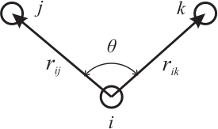
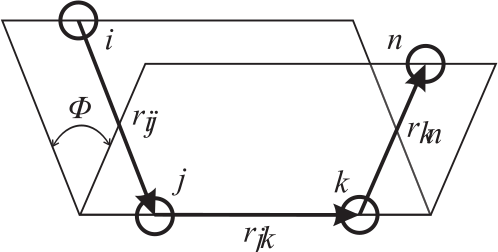
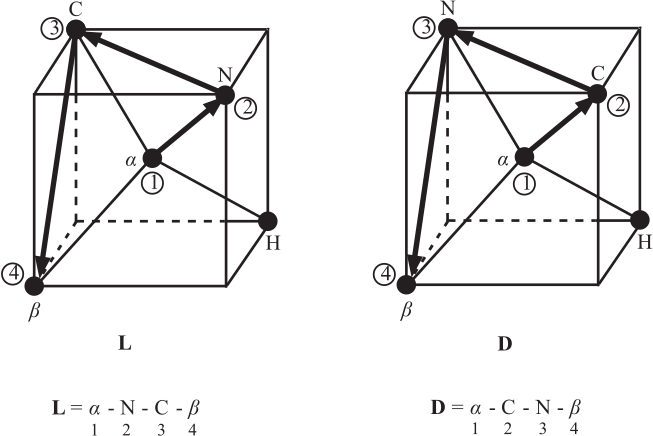
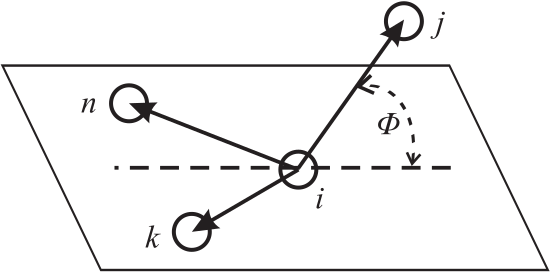

.. _intramolecular-potentials:

The Intramolecular Potential Functions
======================================

In this section we catalogue and describe the forms of potential
function available in . The **keywords** required to select potential
forms are given in brackets () before each definition. The derivations
of the atomic forces, virial and stress tensor are also outlined.

.. _bond-potentials:

.. index:: single: potential; chemical bond

Bond Potentials
---------------

   The interatomic bond vector

The bond potentials describe *explicit* chemical bonds between specified
atoms. They are all functions of the interatomic distance. Only the
coulomb potential makes an exception as it depends on the charges of the
specified atoms. The potential functions available are as follows:

#. Harmonic bond: (\ **harm**)

   .. math:: U(r_{ij}) = \frac{1}{2} k (r_{ij}-r_{o})^{2}
      :label: harm_bond_eq

#. Morse potential: (\ **mors**)

   .. math:: U(r_{ij}) = E_{o} [\{1-\exp(-k(r_{ij}-r_{o}))\}^{2}-1]
      :label: morse_bond_eq

#. 12-6 potential bond: (\ **12-6**)

   .. math:: U(r_{ij}) = \left(\frac{A}{r_{ij}^{12}}\right)-\left(\frac{B}{r_{ij}^{6}}\right)
      :label: 12-6_bond_eq

#. Lennard-Jones potential: (\ **lj**)

   .. math::
      :label: lj_bond_eq

      U(r_{ij}) = 4\epsilon\left[\left
      (\frac{\sigma}{r_{ij}}\right)^{12}-\left(\frac{\sigma}{r_{ij}}\right)^{6}\right]

#. Restrained harmonic: (\ **rhrm**)

   .. math::
      :label: restrained_harm_bond_eq

      U(r_{ij}) = \left\{ \begin{array} {l@{\quad:\quad}l}
      \frac{1}{2}k(r_{ij}-r_{o})^{2} & |r_{ij}-r_{o}|\le r_{c} \\
      \frac{1}{2}kr_{c}^{2}+kr_{c}(|r_{ij}-r_{o}|-r_{c}) & |r_{ij}-r_{o}| > r_{c}
      \end{array} \right.

#. Quartic potential: (\ **quar**)

   .. math:: U(r_{ij}) = \frac{k}{2}(r_{ij}-r_{o})^{2}+\frac{k'}{3}(r_{ij}-r_{o})^{3}+\frac{k''}{4}(r_{ij}-r_{o})^{4}
      :label: quartic_bond_eq

#. Buckingham potential: (\ **buck**)

   .. math:: U(r_{ij}) = A~\exp\left(-\frac{r_{ij}}{\rho}\right)-\frac{C}{r_{ij}^{6}}
      :label: buck_bond_eq

#. Coulomb potential: (\ **coul**)

   .. math::
      :label: coul_bond_eq

      U(r_{ij}) = k \cdot U^{\text{Electrostatics}}(r_{ij}) \;
      \left(= \frac{k}{4\pi\epsilon_{0}\epsilon}\frac{q_{i}q_{j}}{r_{ij}}\right)~~,

   where :math:`q_{\ell}` is the charge on an atom labelled
   :math:`\ell`. It is worth noting that the Coulomb potential switches
   to the particular model of Electrostatics opted in CONTROL.

#. Shifted finitely extendible non-linear elastic (FENE) potential
   :cite:`warner-72a,bird-77a,grest-86a`: (\ **fene**)

   .. math::
      :label: FENE_bond_eq

      U(r_{ij}) = \left\{ \begin{array} {l@{\quad:\quad}l}
      -0.5~k~R_{o}^{2}~ln\left[1-\left(\frac{r_{ij}-\Delta}{R_{o}}\right)^{2}\right] & |r_{ij} - \Delta| < R_{o} \\
      \infty & |r_{ij} - \Delta| \ge R_{o} \end{array} \right. \label{FENE}

   The FENE potential is used to maintain the distance between connected
   beads and to prevent chains from crossing each other. It is used in
   combination with the WCA, equation :eq:`wca_eq`, potential to
   create a potential well for the flexible bonds of a molecule, that
   maintains the topology of the molecule. This implementation allows
   for a radius shift of up to half a :math:`R_{o}` (\ :math:`|\Delta| \le0.5~R_{o}`) with a default of zero (\ :math:`\Delta_{default} = 0`).

#. MM3 bond stretch potential :cite:`allinger-89a`: (\
   **mmst**)

   .. math:: U(r_{ij}) = k~(r_{ij}-r_{o})^{2}\left[1-2.55~(r_{ij}-r_{o})+(7/12)~2.55^{2}~(r_{ij}-r_{o})^{2}\right]
      :label: MM3_bond_eq

#. Tabulated potential: (**tab**). The potential is defined numerically
   in TABBND (see Section :ref:`bonded-tables` and
   Section  :ref:`intra-tables`).

In these formulae :math:`r_{ij}` is the distance between atoms labelled
:math:`i` and :math:`j`:

.. math::

   r_{ij} = |\underline{r}_{j}-\underline{r}_{i}|,

where :math:`\underline{r}_{\ell}` is the position vector of an atom labelled
:math:`\ell`.

.. note::
   some DL_POLY_4 routines may use the convention
   that :math:`\underline{r_{ij}}=\underline{r}_{i}-\underline{r}_{j}`

.. index:: single: potential; chemical bond

The force on the atom :math:`j` arising from a bond potential is
obtained using the general formula:

.. math::
   :label: bondf_eq

   \underline{f}_{j} = -\frac{1}{{r}_{ij}} \left[ \frac{\partial }{\partial
   r_{ij}}U(r_{ij})\right] \underline{r}_{ij}~~. \label{bondf}

The force :math:`\underline{f}_{i}` acting on atom :math:`i` is the negative
of this.

.. index:: single: potential; chemical bond

The contribution to be added to the atomic virial is given by

.. math:: {\cal W} = -\underline{r}_{ij} \cdot \underline{f}_{j}~~,

with only *one* such contribution from each bond.

The contribution to be added to the atomic :index:`stress tensor` is given by

.. math:: \sigma^{\alpha \beta} = r_{ij}^{\alpha} f_{j}^{\beta}~~, \label{bonds}
   :label: ast_bonds_eq

where :math:`\alpha` and :math:`\beta` indicate the :math:`x,y,z`
components. The atomic :index:`stress tensor` derived in this way is symmetric.

In DL_POLY_4 bond forces are handled by the routine ``bonds_forces`` (and
``intra_coul`` called within).

Distance Restraints
-------------------

.. index:: 
   single: potential;chemical bond
   single: potential;electrostatics
   single: potential;van der Waals

In DL_POLY_4 distance restraints, in which the separation between two
atoms, is maintained around some preset value :math:`r_0` is handled as
a special case of bond potentials. As a consequence, distance restraints
may be applied only between atoms in the same molecule. Unlike with
application of the “pure” bond potentials, the electrostatic and van der
Waals interactions between the pair of atoms are still evaluated when
distance restraints are applied. All the potential forms of the previous
section are available as :index:`distance restraints`, although they have
different key words:

#. Harmonic potential: (\ **-hrm**)

#. Morse potential: (\ **-mrs**)

#. 12-6 potential bond: (\ **-126**)

#. Lennard-Jones potential: (\ **-lj**)

#. Restrained harmonic: (\ **-rhm**)

#. Quartic potential: (\ **-qur**)

#. Buckingham potential: (\ **-bck**)

#. Coulomb potential: (\ **-cul**)

#. FENE potential: (\ **-fne**)

#. MM3 bond stretch potential :cite:`allinger-89a`: (\
   **-m3s**)

#. Tabulated potential: (\ **-tab**). The potential is defined
   numerically in TABBND (see Section :ref:`bonded-tables` and
   Section  :ref:`intra-tables`).

In DL_POLY_4 :index:`distance restraints` are handled by the routine bonds_forces
(and ``intra_coul`` called within).

.. _angle-potentials:

Valence Angle Potentials
------------------------

   The valence angle and associated vectors

.. index:: 
   single: potential;valence angle
   single: potential;three-body

The valence angle potentials describe the bond bending terms between the
specified atoms. They should not be confused with the three-body
potentials described later, which are defined by atom types rather than
indices.

#. Harmonic: (\ **harm**)

   .. math:: U(\theta_{jik}) = {k \over 2} (\theta_{jik} - \theta_0)^{2}
      :label: harm_angle_eq

#. Quartic: (\ **quar**)

   .. math::
      :label: quartic_angle_eq

      U(\theta_{jik}) = {k \over 2}(\theta_{jik} - \theta_0)^{2} + {k' \over
      3}(\theta_{jik} - \theta_0)^{3} + {k'' \over 4}(\theta_{jik} -
      \theta_0)^{4}

#. Truncated harmonic: ( **thrm**)

   .. math::
      :label: trunc_harm_angle_eq

      U(\theta_{jik}) = {k\over 2} (\theta_{jik} - \theta_0)^{2}
      \exp[-(r_{ij}^{8} + r_{ik}^{8}) / \rho^{8}]

#. Screened harmonic: ( **shrm**)

   .. math::
      :label: screened_harm_anlge_eq

      U(\theta_{jik}) = {k\over 2} (\theta_{jik} - \theta_0)^{2}
      \exp[-(r_{ij} / \rho_1 + r_{ik} / \rho_2)]

#. Screened Vessal :cite:`vessal-94a`: ( **bvs1**)

   .. math::
      :label: scr_vessal_angle_eq

      \begin{aligned}
      U(\theta_{jik})=&{k \over 8(\theta_{0}-\pi)^{2}} \left[ (\theta_{0}
      -\pi)^{2} -(\theta_{jik}-\pi)^{2}\right]^{2} \times \nonumber \\
                    &  \exp[-(r_{ij} / \rho_{1} + r_{ik} / \rho_{2})]\end{aligned}

#. Truncated Vessal :cite:`smith-95a`: ( **bvs2** )

   .. math::
      :label: trunc_vessal_angle_eq

      \begin{aligned}
      U(\theta_{jik})=& k~(\theta_{jik}-\theta_{0})^{2}~
      \big[~\theta_{jik}^a (\theta_{jik}+\theta_{0}-2\pi)^{2} + \nonumber \\
      & {a \over 2} \pi^{a-1} (\theta_{0}-\pi)^{3}~\big]~~\exp[-(r_{ij}^{8} + r_{ik}^{8}) / \rho^{8}]\end{aligned}

#. Harmonic cosine: ( **hcos**)

   .. math::
      :label: harm_cos_angle_eq

      U(\theta_{jik}) = {k\over 2}(\cos(\theta_{jik})
      -\cos(\theta_{0}))^{2}

#. Cosine: ( **cos**)

   .. math:: U(\theta_{jik}) = A~[1 + \cos(m~\theta_{jik}-\delta)]
      :label: cos_angle_eq

#. MM3 stretch-bend :cite:`allinger-89a`: ( **mmsb**)

   .. math:: U(\theta_{jik}) = A~(\theta_{jik}-\theta_{0})~(r_{ij} - r_{ij}^{o})~(r_{ik} - r_{ik}^{o})
      :label: MM3_stretch_bond_angle_eq

#. Compass stretch-stretch :cite:`sun-98a`: ( **stst**)

   .. math:: U(\theta_{jik}) = A~(r_{ij} - r_{ij}^{o})~(r_{ik} - r_{ik}^{o})
      :label: compass_stretch-stretch_angle_eq

#. Compass stretch-bend :cite:`sun-98a`: ( **stbe**)

   .. math:: U(\theta_{jik}) = A~(\theta_{jik}-\theta_{0})~(r_{ij} - r_{ij}^{o})
      :label: compass_stretch-bend_angle_eq

#. Compass all terms :cite:`sun-98a`: ( **cmps**)

   .. math::
      :label: compass_all_angle_eq

      U(\theta_{jik}) = A~(r_{ij} - r_{ij}^{o})~(r_{ik} - r_{ik}^{o}) +
      (\theta_{jik}-\theta_{0})~[B~(r_{ij} - r_{ij}^{o})+C~(r_{ik} - r_{ik}^{o})]

#. MM3 angle bend term :cite:`allinger-89a`: ( **m3ab**)

   .. math::
      :label: MM3_angle_bend_angle_eq

      \begin{aligned}
      U(\theta_{jik}) = k~(\theta_{jik}-\theta_{0})^{2}[1 -& 1.4 \cdot 10^{-2}(\theta_{jik}-\theta_{0})^{~}+5.6 \cdot 10^{-5}(\theta_{jik}-\theta_{0})^{2} \nonumber \\
      -& 7.0 \cdot 10^{-7}(\theta_{jik}-\theta_{0})^{3}+2.2 \cdot 10^{-8}(\theta_{jik}-\theta_{0})^{4}]\end{aligned}

#. KKY :cite:`kumagai-94a`: ( **kky**)

   .. math::
      :label: KKY_angle_eq

      \begin{aligned}
      U(\theta_{jik}) =& 2~f_{k}~\sqrt{K_{ij} \cdot K_{ik}}~\sin^{2}\left[(\theta_{jik}-\theta_{0})\right] \nonumber \\
      K_{ij} =& \frac{1}{\exp\left[g_{r}(r_{ij}-r_{o})\right]+1}\end{aligned}

#. Tabulated potential: ( **tab**). The potential is defined numerically
   in TABANG (see Section :ref:`bonded-tables` and
   Section  :ref:`intra-tables`).

In these formulae :math:`\theta_{jik}` is the angle between bond vectors
:math:`\underline{r}_{ij}` and :math:`\underline{r}_{ik}`:

.. math::

   \theta_{jik}=cos^{-1}\left\{\frac{\underline{r}_{ij}\cdot\underline{r}_{ik}}
   {r_{ij}r_{ik}}\right\}~~.

In DL_POLY_4 the most general form for the valence :index:`angle<potential;valence angle>` potentials can
be written as:

.. math:: U(\theta_{jik},r_{ij},r_{ik}) = A(\theta_{jik})~S(r_{ij})~S(r_{ik})~S(r_{ik})~~,

where :math:`A(\theta)` is a purely angular function and :math:`S(r)` is
a screening or truncation function. All the function arguments are
scalars. With this reduction the force on an atom derived from the
valence :index:`angle<potential;valence angle>` potential is given by:

.. math::

   f_{\ell}^{\alpha} = -\frac{\partial}{\partial
   r_{\ell}^{\alpha}}U(\theta_{jik},r_{ij},r_{ik},r_{jk})~~,

with atomic label :math:`\ell` being one of :math:`i,j,k` and
:math:`\alpha` indicating the :math:`x,y,z` component. The derivative is

.. math::

   \begin{aligned}
   -\frac{\partial}{\partial r_{\ell}^{\alpha}}U(\theta_{jik},r_{ij},r_{ik},r_{jk})=&
   -S(r_{ij})S(r_{ik})S(r_{jk})\frac{\partial}{\partial r_{\ell}^{\alpha}}A(\theta_{jik}) \nonumber \\
   & - A(\theta_{jik})S(r_{ik})S(r_{jk})(\delta_{\ell j}-\delta_{\ell i})
   \frac{r_{ij}^{\alpha}}{r_{ij}} \frac{\partial}{\partial r_{ij}}S(r_{ij}) \nonumber \\
   & - A(\theta_{jik})S(r_{ij})S(r_{jk})(\delta_{\ell k}-\delta_{\ell i})
   \frac{r_{ik}^{\alpha}}{r_{ik}} \frac{\partial}{\partial r_{ik}}S(r_{ik}) \nonumber \\
   & - A(\theta_{jik})S(r_{ij})S(r_{ik})(\delta_{\ell k}-\delta_{\ell j})
   \frac{r_{jk}^{\alpha}}{r_{jk}} \frac{\partial}{\partial r_{jk}}S(r_{jk})~~,\end{aligned}

with :math:`\delta_{ab}=1` if :math:`a=b` and :math:`\delta_{ab}=0` if
:math:`a\ne b` . In the absence of screening terms :math:`S(r)`, this
formula reduces to:

.. math::

   -\frac{\partial}{\partial
   r_{\ell}^{\alpha}}U(\theta_{jik},r_{ij},r_{ik},r_{jk}) =
   -\frac{\partial}{\partial r_{\ell}^{\alpha}}A(\theta_{jik})~~.

The derivative of the angular function is

.. math::

   -\frac{\partial}{\partial r_{\ell}^{\alpha}}A(\theta_{jik}) =
   \left\{\frac{1}{\sin(\theta_{jik})}\right\}
   \frac{\partial}{\partial \theta_{jik}}A(\theta_{jik})
   \frac{\partial}{\partial r_{\ell}^{\alpha}}\left\{
   \frac{\underline{r}_{ij}\cdot\underline{r}_{ik}}{r_{ij}r_{ik}}\right\}~~,

with

.. math::

   \begin{aligned}
   \frac{\partial}{\partial r_{\ell}^{\alpha}}\left\{ \frac{\underline{r}_{ij}\cdot\underline{r}_{ik}}{r_{ij}r_{ik}}\right\}=&
   (\delta_{\ell j}-\delta_{\ell i})\frac{r_{ik}^{\alpha}}{r_{ij}r_{ik}}+ (\delta_{\ell k}-
   \delta_{\ell i})\frac{r_{ij}^{\alpha}}{r_{ij}r_{ik}}-\nonumber \\
   & \cos(\theta_{jik}) \left\{(\delta_{\ell j}-\delta_{\ell i})\frac{r_{ij}^{\alpha}}{r_{ij}^{2}}+
   (\delta_{\ell k}-\delta_{\ell i})\frac{r_{ik}^{\alpha}}{r_{ik}^{2}}\right\}~~.\end{aligned}

The atomic forces are then completely specified by the derivatives of
the particular functions :math:`A(\theta)` and :math:`S(r)` .

The contribution to be added to the atomic virial is given by

.. math::

   {\cal W} = -(\underline{r}_{ij} \cdot \underline{f}_{j} + \underline{r}_{ik} \cdot
   \underline{f}_{k})~~.

It is worth noting that in the absence of screening terms S(r), the
virial is zero :cite:`smith-93c`.

The contribution to be added to the :index:`atomic stress` tensor is given by

.. math:: \sigma^{\alpha \beta} = r_{ij}^{\alpha} f_{j}^{\beta} + r_{ik}^{\alpha} f_{k}^{\beta}
   :label: ast_angle_eq

and the :index:`stress tensor` is symmetric.

In DL_POLY_4 valence forces are handled by the routine ``angles_forces``.

Angular Restraints
------------------

In DL_POLY_4 angle restraints, in which the angle subtended by a triplet
of atoms, is maintained around some preset value :math:`\theta_{0}` is
handled as a special case of angle potentials. As a consequence angle
restraints may be applied only between atoms in the same molecule.
Unlike with application of the “pure” angle potentials, the
:index:`electrostatic<potential;electrostatics>` and :index:`van der Waals<potential;van der Waals>` interactions between the pair of atoms
are still evaluated when distance restraints are applied. All the
potential forms of the previous section are available as angular
restraints, although they have different key words:

#. Harmonic: (\ **-hrm**)

#. Quartic: (\ **-qur**)

#. Truncated harmonic: (\ **-thm**)

#. Screened harmonic: (\ **-shm**)

#. Screened Vessal :cite:`vessal-94a`: (\ **-bv1**)

#. Truncated Vessal :cite:`smith-95a`: (\ **-bv2**)

#. Harmonic cosine: (\ **-hcs**)

#. Cosine: (\ **-cos**)

#. MM3 stretch-bend :cite:`allinger-89a`: (\ **-msb**)

#. Compass stretch-stretch :cite:`sun-98a`: (\ **-sts**)

#. Compass stretch-bend :cite:`sun-98a`: (\ **-stb**)

#. Compass all terms :cite:`sun-98a`: (\ **-cmp**)

#. MM3 angle bend :cite:`allinger-89a`: (\ **-m3a**)

#. KKY :cite:`kumagai-94a`: (\ **-kky**)

#. Tabulated potential: ( **-tab**). The potential is defined
   numerically in TABANG (see Section :ref:`bonded-tables` and
   Section  :ref:`intra-tables`).

In DL_POLY_4 :index:`angular restraints` are handled by the routine
``angles_forces``.

.. _dihedral-potentials:

Dihedral Angle Potentials
-------------------------

   The dihedral angle and associated vectors

.. index:: single: potential;dihedral

The dihedral angle potentials describe the interaction arising from
torsional forces in molecules. (They are sometimes referred to as
torsion potentials.) They require the specification of four atomic
positions. The potential functions available in DL_POLY_4 are as
follows:

#. Cosine potential: (\ **cos**)

   .. math:: U(\phi_{ijkn}) = A~\left [ 1 + \cos(m\phi_{ijkn} - \delta)\right]
      :label: cos_dihedral_eq

#. Harmonic: (\ **harm**)

   .. math:: U(\phi_{ijkn}) = {k \over 2}~(\phi_{ijkn} - \phi_{0})^{2}
      :label: harm_dihedral_eq

#. Harmonic cosine: (\ **hcos**)

   .. math:: U(\phi_{ijkn}) = {k \over 2}~(\cos(\phi_{ijkn}) - \cos(\phi_{0}))^{2}
      :label: harm_cos_dihedral_eq

#. Triple cosine: (\ **cos3**)

   .. math:: U(\phi) = {1 \over 2}~\{A_{1}~(1+\cos(\phi)) + A_{2}~(1-\cos(2\phi)) + A_{3}~(1+\cos(3\phi))\}
      :label: trip_cos_dihedral_eq

#. Ryckaert-Bellemans :cite:`ryckaert-75a` with fixed
   constants a-f: (\ **ryck**)

   .. math:: 
      :label: ryckBell_dihedral_eq
      
      \begin{aligned}
      U(\phi) = A~\{~a~+&~b~\cos(\phi)+c~\cos^{2}(\phi)+d~\cos^{3}(\phi) \nonumber \\
      +&~e~\cos^{4}(\phi)+f~\cos^{5}(\phi)~\}
      \end{aligned}
      

#. Fluorinated Ryckaert-Bellemans :cite:`schmidt-96a` with
   fixed constants a-h: (\ **rbf**)

   .. math::
      :label: FryckBell_dihedral_eq

      \begin{aligned}
      U(\phi) = A~\{~a~+&~b~\cos(\phi)+c~\cos^{2}(\phi)+d~\cos^{3}(\phi)+e~\cos^{4}(\phi) \nonumber \\
      +&~f~\cos^{5}(\phi)+~g~\exp(-h(\phi-\pi)^{2}))~\}
      \end{aligned}

#. OPLS torsion potential: (\ **opls**)

   .. math:: U(\phi)=A_{0}+\frac{1}{2} \left\{ A_{1}~(1+\cos(\phi))+A_{2}~(1-\cos(2\phi))+A_{3}~(1+\cos(3\phi)) \right\}
      :label: OPLS_dihedral_eq

#. Tabulated potential: (\ **tab**). The potential is defined numerically
   in TABDIH (see Section :ref:`bonded-tables` and
   Section  :ref:`intra-tables`).

In these formulae :math:`\phi_{ijkn}` is the dihedral angle defined by

.. math:: \phi_{ijkn}=\cos^{-1}\{B(\underline{r}_{ij},\underline{r}_{jk},\underline{r}_{kn})\}~~,

with

.. math::

   B(\underline{r}_{ij},\underline{r}_{jk},\underline{r}_{kn})= \left\{\frac{
   (\underline{r}_{ij}\times\underline{r}_{jk})\cdot(\underline{r}_{jk}\times\underline{r}_{kn})}
   {|\underline{r}_{ij}\times\underline{r}_{jk}||\underline{r}_{jk}\times\underline{r}_{kn}|}
   \right\}~~.

With this definition, the sign of the dihedral :index:`angle<potential;dihedral>` is positive if the
vector product 

.. math::
   (\underline{r}_{ij} \times \underline{r}_{jk})
   \times (\underline{r}_{jk} \times \underline{r}_{kn})

is in the same direction as the bond vector
:math:`\underline{r}_{jk}` and negative if in the opposite direction.

.. index:: single: potential;dihedral

The force on an atom arising from the dihedral potential is given by

.. math::
   :label: dihedralf_eq

   f_{\ell}^{\alpha}=-\frac{\partial}{\partial
   r_{\ell}^{\alpha}}U(\phi_{ijkn})~~,

with :math:`\ell` being one of :math:`i,j,k,n` and :math:`\alpha` one of
:math:`x,y,z`. This may be expanded into

.. math::

   -\frac{\partial}{\partial r_{\ell}^{\alpha}}U(\phi_{ijkn})=
   \left\{\frac{1}{\sin(\phi_{ijkn})}\right\}
   \frac{\partial}{\partial \phi_{ijkn}}U(\phi_{ijkn})
   \frac{\partial}{\partial r_{\ell}^{\alpha}}
   B(\underline{r}_{ij},\underline{r}_{jk},\underline{r}_{kn})~~.

The derivative of the function
:math:`B(\underline{r}_{ij},\underline{r}_{jk},\underline{r}_{kn})` is

.. math::

   \begin{aligned}
   &\frac{\partial}{\partial r_{\ell}^{\alpha}}
   B(\underline{r}_{ij},\underline{r}_{jk},\underline{r}_{kn})~=~
   \frac{1}{|\underline{r}_{ij}\times\underline{r}_{jk}||\underline{r}_{jk}\times\underline{r}_{kn}|}
   \frac{\partial}{\partial r_{\ell}^{\alpha}}
   \{(\underline{r}_{ij}\times\underline{r}_{jk})\cdot(\underline{r}_{jk}\times\underline{r}_{kn})\}~-~\nonumber \\
   & \phantom{x} \frac{\cos(\phi_{ijkn})}{2}\left\{
   \frac{1}{|\underline{r}_{ij}\times\underline{r}_{jk}|^{2}}
   \frac{\partial}{\partial r_{\ell}^{\alpha}}
   |\underline{r}_{ij}\times\underline{r}_{jk}|^{2}+
   \frac{1}{|\underline{r}_{jk}\times\underline{r}_{kn}|^{2}}
   \frac{\partial}{\partial r_{\ell}^{\alpha}}
   |\underline{r}_{jk}\times\underline{r}_{kn}|^{2} \right\}~,
   \end{aligned}

with

.. math::

   \begin{aligned}
   \frac{\partial}{\partial r_{\ell}^{\alpha}}
   \{(\underline{r}_{ij}\times\underline{r}_{jk})\cdot(\underline{r}_{jk}\times\underline{r}_{kn})\}= &
   r_{ij}^{\alpha}([\underline{r}_{jk}\underline{r}_{jk}]_{\alpha}(\delta_{\ell k}-\delta_{\ell n})+
    [\underline{r}_{jk}\underline{r}_{kn}]_{\alpha}(\delta_{\ell k}-\delta_{\ell j}))+ \nonumber \\
   \phantom{\frac{\partial}{\partial r_{\ell}^{\alpha}}}&
   r_{jk}^{\alpha}([\underline{r}_{ij}\underline{r}_{jk}]_{\alpha}
   (\delta_{\ell n}-\delta_{\ell k})+ [\underline{r}_{jk}\underline{r}_{kn}]_{\alpha}
   (\delta_{\ell j}-\delta_{\ell i}))+ \nonumber \\
   \phantom{\frac{\partial}{\partial r_{\ell}^{\alpha}}}  &
   r_{kn}^{\alpha}([\underline{r}_{ij}\underline{r}_{jk}]_{\alpha}(\delta_{\ell k}-\delta_{\ell j})+
   [\underline{r}_{jk}\underline{r}_{jk}]_{\alpha}(\delta_{\ell i}-\delta_{\ell j}))+ \nonumber \\
   \phantom{\frac{\partial}{\partial r_{\ell}^{\alpha}}}  &
   2r_{jk}^{\alpha}[\underline{r}_{ij}\underline{r}_{kn}]_{\alpha}(\delta_{\ell j}-\delta_{\ell k})~~,\end{aligned}

.. math::

   \begin{aligned}
   \frac{\partial}{\partial r_{\ell}^{\alpha}}
   |\underline{r}_{ij}\times\underline{r}_{jk}|^{2}= &
   2r_{ij}^{\alpha}([\underline{r}_{jk}\underline{r}_{jk}]_{\alpha}(\delta_{\ell j}-\delta_{\ell i})+
   [\underline{r}_{ij}\underline{r}_{jk}]_{\alpha}(\delta_{\ell j}-\delta_{\ell k}))+\nonumber \\
    & 2r_{jk}^{\alpha}([\underline{r}_{ij}\underline{r}_{ij}]_{\alpha}
   (\delta_{\ell k}-\delta_{\ell j}) +[\underline{r}_{ij}\underline{r}_{jk}]_{\alpha}
   (\delta_{\ell i}-\delta_{\ell j}))~~,\end{aligned}

.. math::

   \begin{aligned}
   \frac{\partial}{\partial r_{\ell}^{\alpha}}
   |\underline{r}_{jk}\times\underline{r}_{kn}|^{2} = &
   2r_{kn}^{\alpha}([\underline{r}_{jk}\underline{r}_{jk}]_{\alpha}(\delta_{\ell n}-\delta_{\ell k})+
   [\underline{r}_{jk}\underline{r}_{kn}]_{\alpha}(\delta_{\ell j}-\delta_{\ell k}))+\nonumber \\
   & 2r_{jk}^{\alpha}([\underline{r}_{kn}\underline{r}_{kn}]_{\alpha}
   (\delta_{\ell k}-\delta_{\ell j})+
   [\underline{r}_{jk}\underline{r}_{kn}]_{\alpha}(\delta_{\ell k}-\delta_{\ell n}))~~.\end{aligned}

Where we have used the following definition:

.. math::

   _{\alpha} =
   \sum_{\beta}(1-\delta_{\alpha\beta})a^{\beta}b^{\beta}~~.

Formally, the contribution to be added to the atomic virial is given by

.. math:: {\cal W}=-\sum_{i=1}^{4} \underline{r}_{i} \cdot \underline{f}_{i}~~.

However, it is possible to show (by tedious algebra using the above
formulae, or more elegantly by thermodynamic arguments
:cite:`smith-93c`,) that the dihedral makes *no*
contribution to the atomic virial.

The contribution to be added to the atomic :index:`stress tensor` is given by

.. math::
   :label: ast_dihedral_eq

   \begin{aligned}
   \sigma^{\alpha \beta} = &r_{ij}^{\alpha}p_{i}^{\beta}+
   r_{jk}^{\alpha}p_{jk}^{\beta}+r_{kn}^{\alpha}p_{n}^{\beta} \\ &
   -\frac{\cos(\phi_{ijkn})}{2}\left \{r_{ij}^{\alpha}g_{i}^{\beta}+
   r_{jk}^{\alpha}g_{k}^{\beta}+r_{jk}^{\alpha}h_{j}^{\beta}+r_{kn}^{\alpha}h_{n}^{\beta}\right\}
   ~~,\nonumber\end{aligned}

with

.. math::

   \begin{aligned}
   p_{i}^{\alpha} =& (r_{jk}^{\alpha}[\underline{r}_{jk}\underline{r}_{kn}]_{\alpha}-
   r_{kn}^{\alpha}[\underline{r}_{jk}\underline{r}_{jk}]_{\alpha})/
   (|\underline{r}_{ij}\times\underline{r}_{jk}||\underline{r}_{jk}\times\underline{r}_{kn}|) \nonumber \\
   p_{n}^{\alpha} =& (r_{jk}^{\alpha}[\underline{r}_{ij}\underline{r}_{jk}]_{\alpha}-
   r_{ij}^{\alpha}[\underline{r}_{jk}\underline{r}_{jk}]_{\alpha})/
   (|\underline{r}_{ij}\times\underline{r}_{jk}||\underline{r}_{jk}\times\underline{r}_{kn}|) \nonumber \\
   p_{jk}^{\alpha} =& (r_{ij}^{\alpha}[\underline{r}_{jk}\underline{r}_{kn}]_{\alpha}+
   r_{kn}^{\alpha}[\underline{r}_{ij}\underline{r}_{jk}]_{\alpha}-
   2r_{jk}^{\alpha}[\underline{r}_{ij}\underline{r}_{kn}]_{\alpha})/
   (|\underline{r}_{ij}\times\underline{r}_{jk}||\underline{r}_{jk}\times\underline{r}_{kn}|) \nonumber \\
   g_{i}^{\alpha} =& 2(r_{ij}^{\alpha}[\underline{r}_{jk}\underline{r}_{jk}]_{\alpha}-
   r_{jk}^{\alpha}[\underline{r}_{ij}\underline{r}_{jk}]_{\alpha})/
   |\underline{r}_{ij}\times\underline{r}_{jk}|^{2} \\
   g_{k}^{\alpha} =& 2(r_{jk}^{\alpha}[\underline{r}_{ij}\underline{r}_{ij}]_{\alpha}-
   r_{ij}^{\alpha}[\underline{r}_{ij}\underline{r}_{jk}]_{\alpha})/
   |\underline{r}_{ij}\times\underline{r}_{jk}|^{2} \nonumber \\
   h_{j}^{\alpha} =& 2(r_{jk}^{\alpha}[\underline{r}_{kn}\underline{r}_{kn}]_{\alpha}-
   r_{kn}^{\alpha}[\underline{r}_{jk}\underline{r}_{kn}]_{\alpha})/
   |\underline{r}_{jk}\times\underline{r}_{kn}|^{2} \nonumber \\
   h_{n}^{\alpha} =& 2(r_{kn}^{\alpha}[\underline{r}_{kn}\underline{r}_{kn}]_{\alpha}-
   r_{jk}^{\alpha}[\underline{r}_{jk}\underline{r}_{kn}]_{\alpha})/
   |\underline{r}_{jk}\times\underline{r}_{kn}|^{2}~~. \nonumber\end{aligned}

The sum of the diagonal elements of the :index:`stress tensor` is zero (since the
virial is zero) and the matrix is symmetric.

Lastly, it should be noted that the above description does not take into
account the possible inclusion of distance-dependent 1-4 interactions,
as permitted by some :index:`force field`s. Such interactions are permissible in
DL_POLY_4 and are described in the section on pair potentials below.
DL_POLY_4 also permits scaling of the 1-4 .:index:`van der Waals<potential;van der Waals>` and :index:`Coulomb<potential;electrostatics>`
interactions by a numerical factor (see
Table :numref:`(%s) <dihedral-table>`). 

.. note::

   Scaling is abandoned when the 1-4 members are also 1-3 members in a valence
   :index:`angle<potential;valence angle>` intercation (1-4 checks are performed in dihedrals_14_check
   routine). 1-4 interactions do, of course, contribute to the atomic
   virial.

In DL_POLY_4 dihedral forces are handled by the routine dihedrals_forces
(and ``intra_coul`` and ``dihedrals_14_vdw`` called within).

.. _improper-dihedral-potentials:

Improper Dihedral Angle Potentials
----------------------------------

.. index::
   single: potential;improper dihedral
   single: potential;chemical bond
   single: potential;dihedral
   single: potential;improper dihedral

Improper dihedrals are used to restrict the geometry of molecules and as
such need not have a simple relation to conventional chemical bonding.
DL_POLY_4 makes no distinction between dihedral and improper dihedral
angle functions (both are calculated by the same subroutines) and all
the comments made in the preceding section apply.

.. index:: single: potential;improper dihedral

An important example of the use of the improper dihedral is to conserve
the structure of chiral centres in molecules modelled by united-atom
centres. For example :math:`\alpha`-amino acids such as alanine
(CH\:math:`_{3}`\ CH(NH\ :math:`_{2}`)COOH), in which it is common to
represent the CH\ :math:`_{3}` and CH groups as single centres.
Conservation of the chirality of the :math:`\alpha` carbon is achieved
by defining a harmonic improper dihedral :indeX:`angle<potential;dihedral>` potential with an
equilibrium angle of 35.264\ :math:`^{o}`. The angle is defined by
vectors :math:`\underline{r}_{12}`, :math:`\underline{r}_{23}` and
:math:`\underline{r}_{34}`, where the atoms 1,2,3 and 4 are shown in the
following figure. The figure defines the D and L enantiomers consistent
with the international (IUPAC) convention. When defining the :index:`dihedral<potential;dihedral>`,
the atom indices are entered in DL_POLY_4 in the order 1-2-3-4.

   The L and D enantiomers and defining vectors

.. index:: single: potential;improper dihedral

In DL_POLY_4 improper dihedral forces are handled by the routine
dihedrals_forces.

Torsional Restraints
--------------------

.. index:: 
   single: potential;electrostatics 
   single: potential;van der Waals

In DL_POLY_4 the torsional restraints, in which the dihedral angle as
defined by a quadruplet of atoms, is maintained around some preset value
:math:`\phi_{0}` is handled as a special case of dihedral potential. As
a consequence angle restraints may be applied only between atoms in the
same molecule. Unlike with application of the “pure” dihedral
potentials, the electrostatic and van der Waals interactions between the
pair of atoms are still evaluated when distance restraints are applied.
All the potential forms of the previous section are available as
torsional restraints, although they have different key words:

#. Cosine potential: (\ **-cos**)

#. Harmonic: (\ **-hrm**)

#. Harmonic cosine: (\ **-hcs**)

#. Triple cosine: (\ **-cs3**)

#. Ryckaert-Bellemans :cite:`ryckaert-75a` with fixed
   constants a-f: (\ **-rck**)

#. Fluorinated Ryckaert-Bellemans :cite:`schmidt-96a` with
   fixed constants a-h: (\ **-rbf**)

#. OPLS torsion potential: (\ **-opl**)

#. Tabulated potential: (\ **-tab**). The potential is defined
   numerically in TABDIH (see Section :ref:`bonded-tables` and
   Section  :ref:`intra-tables`).

In DL_POLY_4 :index:`torsional restraints` are handled by the routine
``dihedrals_forces``.

.. _inversion-potentials:

Inversion Angle Potentials
--------------------------

   The inversion angle and associated vectors

The inversion :index:`angle<potential;inversion>` potentials describe the interaction arising from a
particular geometry of three atoms around a central atom. The best known
example of this is the arrangement of hydrogen atoms around nitrogen in
ammonia to form a trigonal pyramid. The hydrogens can ‘flip’ like an
inverting umbrella to an alternative structure, which in this case is
identical, but in principle causes a change in chirality. The force
restraining the ammonia to one structure can be described as an
inversion :index:`potential<potential;inversion>` (though it is usually augmented by :index:`valence<potential;valence angle>` angle
potentials also). The inversion :index:`angle<potential;inversion>` is defined in the figure above. It resembles a :index:`dihedral<potential;dihedral>` potential in that it
requires the specification of four atomic positions.

.. note:: 

   The inversion angle potential is a sum of the three possible inversion angle terms

The potential functions available in DL_POLY_4 are as follows:

#. Harmonic: (\ **harm**)

   .. math:: U(\phi_{ijkn}) = {k \over 2}~(\phi_{ijkn} - \phi_{0})^{2}
      :label: harm_inv_eq

#. Harmonic cosine: (\ **hcos**)

   .. math:: U(\phi_{ijkn}) = {k \over 2}~(\cos(\phi_{ijkn}) - \cos(\phi_{0}))^{2}
      :label: harm_cos_inv_eq

#. Planar potential: (\ **plan**)

   .. math:: U(\phi_{ijkn}) = A~\left[ 1 - \cos(\phi_{ijkn}) \right]
      :label: planar_inv_eq

#. Extended planar potential: (\ **xpln**)

   .. math:: U(\phi_{ijkn}) = {k \over 2}~\left[ 1 - \cos(m~\phi_{ijkn} - \phi_{0}) \right]
      :label: ext_planer_inv_eq

#. Tabulated potential: (\ **tab**). The potential is defined numerically
   in TABINV (see Section :ref:`bonded-tables` and
   Section  :ref:`intra-tables`).

In these formulae :math:`\phi_{ijkn}` is the inversion :index:`angle<potential;inversion>` defined by

.. math:: \phi_{ijkn}=\cos^{-1} \left\{ \frac{\underline{r}_{ij}\cdot\underline{w}_{kn}}{r_{ij}w_{kn}} \right\}~~,

with

.. math::

   \underline{w}_{kn}=(\underline{r}_{ij}\cdot\underline{\hat{u}}_{kn})\underline{\hat{u}}_{kn}+
   (\underline{r}_{ij}\cdot\underline{\hat{v}}_{kn})\underline{\hat{v}}_{kn}

and the unit vectors

.. math::

   \begin{aligned}
   \underline{\hat{u}}_{kn}=&(\underline{\hat{r}}_{ik}+\underline{\hat{r}}_{in})/
   |\underline{\hat{r}}_{ik}+\underline{\hat{r}}_{in}| \nonumber  \\
   \underline{\hat{v}}_{kn}=&(\underline{\hat{r}}_{ik}-\underline{\hat{r}}_{in})/
   |\underline{\hat{r}}_{ik}-\underline{\hat{r}}_{in}|~~.\end{aligned}

As usual, :math:`\underline{r}_{ij}=\underline{r}_{j}-\underline{r}_{i}` *etc.* and the
hat :math:`\underline{\hat{r}}` indicates a *unit* vector in the direction of
:math:`\underline{r}`. The total inversion :index:`potential<potential;inversion>` requires the calculation
of three such angles, the formula being derived from the above using the
cyclic permutation of the indices :math:`j
\rightarrow k \rightarrow n \rightarrow j` *etc*.

Equivalently, the angle :math:`\phi_{ijkn}` may be written as

.. math::

   \phi_{ijkn} = \cos^{-1} \left\{ \frac{ [
   (\underline{r}_{ij}\cdot\underline{\hat{u}}_{kn})^{2} +
   (\underline{r}_{ij}\cdot\underline{\hat{v}}_{kn})^{2}
   ]^{1/2}}{r_{ij}} \right\}~~.

Formally, the force on an atom arising from the :index:`inversion<potential;inversion>` potential is
given by

.. math::
   :label: invAnglef_eq

   f_{\ell}^{\alpha} = -\frac{\partial}{\partial
   r_{\ell}^{\alpha}}U(\phi_{ijkn})~~,

with :math:`\ell` being one of :math:`i,j,k,n` and :math:`\alpha` one of
:math:`x,y,z`. This may be expanded into

.. math::

   \begin{aligned}
   -\frac{\partial}{\partial r_{\ell}^{\alpha}}U(\phi_{ijkn})=&
   \left\{ \frac{1}{\sin(\phi_{ijkn})} \right\}
   \frac{\partial}{\partial \phi_{ijkn}}U(\phi_{ijkn})\times \nonumber \\
    & \frac{\partial}{\partial r_{\ell}^{\alpha}} \left\{
   \frac{[(\underline{r}_{ij}\cdot\underline{\hat{u}}_{kn})^{2}
   +(\underline{r}_{ij}\cdot\underline{\hat{v}}_{kn})^{2}]^{1/2}} {r_{ij}}
   \right\}~~.\end{aligned}

Following through, the (extremely tedious!) differentiation gives the
result:

.. math::

   \begin{aligned}
   f_{\ell}^{\alpha} =&
   \left\{\frac{1}{\sin(\phi_{ijkn})}\right\}
   \frac{\partial}{\partial \phi_{ijkn}}U(\phi_{ijkn})\times \\
    &
   \left\{-(\delta_{\ell j}-\delta_{\ell i})\frac{\cos(\phi_{ijkn})}
   {r_{ij}^{2}}r_{ij}^{\alpha} +\frac{1}{r_{ij}w_{kn}}\left [
   (\delta_{\ell j}-\delta_{\ell i})
   \{(\underline{r}_{ij}\cdot\underline{\hat{u}}_{kn})\hat{u}_{kn}^{\alpha}+
   (\underline{r}_{ij}\cdot\underline{\hat{v}}_{kn})\hat{v}_{kn}^{\alpha}\}
   \phantom{\left\{\frac{a_{a}^{a}}{a_{a}^{a}}\right\}}
   \right. \right. \nonumber \\
    & + (\delta_{\ell k}-\delta_{\ell i})
   \frac{\underline{r}_{ij}\cdot\underline{\hat{u}}_{kn}}{u_{kn}r_{ik}}\left \{
   r_{ij}^{\alpha}-(\underline{r}_{ij}\cdot\underline{\hat{u}}_{kn})\hat{u}_{kn}^{\alpha}
   -(\underline{r}_{ij}\cdot\underline{r}_{ik}-(\underline{r}_{ij}\cdot\underline{\hat{u}}_{kn})
   (\underline{r}_{ik}\cdot\underline{\hat{u}}_{kn}))\frac{r_{ik}^{\alpha}}{r_{ik}^{2}}
   \right \} \nonumber \\
    & + (\delta_{\ell k}-\delta_{\ell i})
   \frac{\underline{r}_{ij}\cdot\underline{\hat{v}}_{kn}}{v_{kn}r_{ik}}\left \{
   r_{ij}^{\alpha}-(\underline{r}_{ij}\cdot\underline{\hat{v}}_{kn})\hat{v}_{kn}^{\alpha}
   -(\underline{r}_{ij}\cdot\underline{r}_{ik}-(\underline{r}_{ij}\cdot\underline{\hat{v}}_{kn})
   (\underline{r}_{ik}\cdot\underline{\hat{v}}_{kn}))\frac{r_{ik}^{\alpha}}{r_{ik}^{2}}
   \right \} \nonumber \\
    &+ (\delta_{\ell n}-\delta_{\ell i})
   \frac{\underline{r}_{ij}\cdot\underline{\hat{u}}_{kn}}{u_{kn}r_{in}}\left \{
   r_{ij}^{\alpha}-(\underline{r}_{ij}\cdot\underline{\hat{u}}_{kn})\hat{u}_{kn}^{\alpha}
   -(\underline{r}_{ij}\cdot\underline{r}_{in}-(\underline{r}_{ij}\cdot\underline{\hat{u}}_{kn})
   (\underline{r}_{in}\cdot\underline{\hat{u}}_{kn}))\frac{r_{in}^{\alpha}}{r_{in}^{2}}
   \right \} \nonumber \\
    & \left . \left .- (\delta_{\ell n}-\delta_{\ell i})
   \frac{\underline{r}_{ij}\cdot\underline{\hat{v}}_{kn}}{v_{kn}r_{in}}\left \{
   r_{ij}^{\alpha}-(\underline{r}_{ij}\cdot\underline{\hat{v}}_{kn})\hat{v}_{kn}^{\alpha}
   -(\underline{r}_{ij}\cdot\underline{r}_{in}-(\underline{r}_{ij}\cdot\underline{\hat{v}}_{kn})
   (\underline{r}_{in}\cdot\underline{\hat{v}}_{kn}))\frac{r_{in}^{\alpha}}{r_{in}^{2}}
   \right \} \right ] \right \}~~. \nonumber\end{aligned}

This general formula applies to all atoms :math:`\ell=i,j,k,n`. It must
be remembered however, that these formulae apply to just one of the
three contributing terms (i.e. one angle :math:`\phi`) of the full
:index:`inversion<potential;inversion>` potential: specifically the :index:`inversion<potential;inversion>` angle pertaining to the
out-of-plane vector :math:`\underline{r}_{ij}` . The contributions arising
from the other vectors :math:`\underline{r}_{ik}` and :math:`\underline{r}_{in}` are
obtained by the cyclic permutation of the indices in the manner
described above. All these force contributions must be added to the
final atomic forces.

Formally, the contribution to be added to the atomic virial is given by

.. math:: {\cal W} = -\sum_{i=1}^{4}\underline{r}_{i} \cdot \underline{f}_{i}~~.

However, it is possible to show by thermodynamic arguments ( *cf*
:cite:`smith-93c`,) or simply from the fact that the sum of
forces on atoms j,k and n is equal and opposite to the force on atom i,
that the :index:`inversion<potential;inversion>` potential makes *no* contribution to the atomic
virial.

If the force components :math:`f_{\ell}^{\alpha}` for atoms
:math:`\ell=i,j,k,n` are calculated using the above formulae, it is
easily seen that the contribution to be added to the atomic 
:index:`stress tensor`` is given by

.. math::
   :label: ast_invAnlge_eq

   \sigma^{\alpha \beta} = r_{ij}^{\alpha} f_{j}^{\beta} +
   r_{ik}^{\alpha} f_{k}^{\beta}+r_{in}^{\alpha}f_{n}^{\beta}~~.

The sum of the diagonal elements of the :index:`stress tensor` is zero (since the
virial is zero) and the matrix is symmetric.

In DL_POLY_4 :index:`inversion<potential;inversion>` forces are handled by the routine
``inversions_forces``.

.. _calcite:

The Calcite Four-Body Potential
-------------------------------

.. figure:: ../Images/calcite.svg
   :alt: The vectors of the calcite potential
   :name: calcfig
   :width: 60% 
   :class: vector-diagram
   :figclass: centre-fig

   The vectors of the calcite potential

.. index:: single: potential;calcite

This potential :cite:`rohl-03a,raiteri-10a` is designed to
help maintain the planar structure of the carbonate anion
:math:`[CO_{3}]^{2-}` in a similar manner to the planar inversion
potential described above. However, it is *not* an angular potential. It
is dependent on the perpendicular displacement (:math:`u`) of an atom
:math:`a` from a plane defined by three other atoms :math:`b`,
:math:`c`, and :math:`d` (see Figure :numref:`%s<calcfig>`) and has the
form:

.. math:: U_{abcd}(u)=Au^{2}+Bu^{4}~~, \label{calcite1}
   :label: calcite1_eq

where the displacement :math:`u` is given by

.. math:: u=\frac{\underline{r}_{ab}\cdot\underline{r}_{bc}\times\underline{r}_{bd}}{|\underline{r}_{bc}\times\underline{r}_{bd}|}~~. \label{calcite2}
   :label: calcite2_eq

Vectors :math:`\underline{r}_{ab}`,\ :math:`\underline{r}_{ac}` and
:math:`\underline{r}_{ad}` define bonds between the central atom :math:`a` and
the peripheral atoms :math:`b`, :math:`c` and :math:`d`. Vectors
:math:`\underline{r}_{bc}` and :math:`\underline{r}_{bd}` define the plane and are
related to the bond vectors by

.. math::

   \begin{aligned}
   \underline{r}_{bc}=&\underline{r}_{ac}-\underline{r}_{ab} \nonumber \\
   \underline{r}_{bd}=&\underline{r}_{ad}-\underline{r}_{ab}~~.\end{aligned}

In what follows it is convenient to define the vector product appearing
in both the numerator and denominator of
equation :eq:`calcite2_eq` as the vector
:math:`\underline{w}_{cd}` *vis.*

.. math:: \underline{w}_{cd}=\underline{r}_{bc}\times\underline{r}_{bd}~~.

We also define the quantity :math:`\gamma(u)` as

.. math:: \gamma(u)=-(2Au+4Bu^{3})~~.

The forces on the individual atoms due to the calcite potential are then
given by

.. math::

   \begin{aligned}
   \underline{f}_{a}=&-\gamma(u)~\hat{\underline{w}}_{cd} \nonumber \\
   \underline{f}_{c}=&\phantom{+}\underline{r}_{bd}\times(\underline{r}_{ab}-u\hat{\underline{w}}_{cd})~\gamma(u)/w_{cd} \nonumber \\
   \underline{f}_{d}=&-\underline{r}_{bc}\times(\underline{r}_{ab}- u\hat{\underline{w}}_{cd})~\gamma(u)/w_{cd} \\
   \underline{f}_{b}=&-(\underline{f}_{a}+\underline{f}_{c}+\underline{f}_{d})~~,\nonumber\end{aligned}

where :math:`w_{cd}=|\underline{w}_{cd}|` and
:math:`\hat{\underline{w}}_{cd}=\underline{w}_{cd}/w_{cd}`. The virial contribution
:math:`\psi_{abcd}(u)` is given by

.. math:: \psi_{abcd}(u)=2Au^{2}+4Bu^{4}

and the stress tensor contribution
:math:`\sigma_{abcd}^{\alpha\beta}(u)` by

.. math:: \sigma_{abcd}^{\alpha\beta}(u)=\frac{u~\gamma(u)}{w_{cd}^{2}}~w_{cd}^{\alpha}~w_{cd}^{\beta}~.

.. index:: single: potential;calcite

In DL_POLY_4 the calcite forces are handled by the routine
``inversions_forces``, which is a convenient *intramolecular* four-body
force routine. However, it is manifestly *not* an inversion potential as
such.

Inversional Restraints
----------------------

In DL_POLY_4 the inversional restraints, in which the inversion angle,
as defined by a quadruplet of atoms, is maintained around some preset
value :math:`\phi_{0}`, is handled as a special case of inversion
potential. As a consequence angle restraints may be applied only between
atoms in the same molecule. Unlike with application of the “pure”
dihedral potentials, the :index:`electrostatic<potential;electrostatics>` and :index:`van der Waals<potential;van der Waals>` interactions
between the pair of atoms are still evaluated when distance restraints
are applied. All the potential forms of the previous section are
available as torsional restraints, although they have different key
words:

#. Harmonic: (\ **-hrm**)

#. Harmonic cosine: (\ **-hcs**)

#. Planar potential: (\ **-pln**)

#. Extended planar potential: (\ **-xpl**)

#. Tabulated potential: (\ **-tab**). The potential is defined
   numerically in TABINV (see Section :ref:`bonded-tables` and
   Section  :ref:`intra-tables`).

In DL_POLY_4 :index:`inversional restraints` are handled by the routine
``inversions_forces``.

Tethering Forces
----------------

.. index:: single: potential;tether

DL_POLY_4 also allows atomic sites to be tethered to a fixed point in
space, :math:`\vec{r_{0}}`, taken as their position at the beginning of
the simulation (t = 0). This is also known as position restraining. The
specification, which comes as part of the molecular description,
requires a tether potential type and the associated interaction
parameters.

.. note::
   
   Firstly, that application of tethering potentials means that
   the momentum will no longer be a conserved quantity of the simulation.
   Secondly, in constant pressure simulations, where the MD cell changes
   size or shape, the tethers’ reference positions are scaled with the cell
   vectors.

The tethering potential functions available in DL_POLY_4 are as follows:

#. Harmonic: (\ **harm**)

   .. math:: U(r_{ij}) = \frac{1}{2}k(r_{i0})^{2}
      :label: harm_tether_eq

#. Restrained harmonic: ( **rhrm**)

   .. math::
      :label: restrained_harm_tether_eq

      U(r_{ij}) = \left\{ \begin{array} {l@{\quad:\quad}l}
      \frac{1}{2}k(r_{i0})^{2} & |r_{i0}| \le r_{c} \\
      \frac{1}{2}kr_{c}^{2} + kr_{c}(r_{i0}-r_{c}) & |r_{i0}| > r_{c}
      \end{array} \right.

#. Quartic potential: (\ **quar**)

   .. math::
      :label: quartic_tether_eq

      U(r_{ij}) =
      \frac{k}{2}(r_{i0})^{2}+\frac{k'}{3}(r_{i0})^{3}+\frac{k''}{4}(r_{i0})^{4}

as in each case :math:`r_{io}` is the distance between the atom
positions at moment :math:`t~=~t1` and :math:`t~=~0`.

.. index:: single: potential;tether

The force on the atom :math:`i` arising from a tether potential
potential is obtained using the general formula:

.. math::

   \underline{f}_{i} = -\frac{1}{{r}_{i0}}\left[ \frac{\partial }{\partial
   r_{i0}}U(r_{i0})\right]\underline{r}_{i0}~~.

The contribution to be added to the atomic virial is given by

.. math:: {\cal W} = \underline{r}_{i0} \cdot \underline{f}_{i}~~.

The contribution to be added to the atomic :index:`stress tensor` is given by

.. math:: \sigma^{\alpha \beta} = -r_{i0}^{\alpha} f_{i}^{\beta}~~,
   :label: ast_tether_eq

where :math:`\alpha` and :math:`\beta` indicate the :math:`x,y,z`
components. The atomic :index:`stress tensor` derived in this way is symmetric.

In DL_POLY_4 tether forces are handled by the routine ``tethers_forces``.