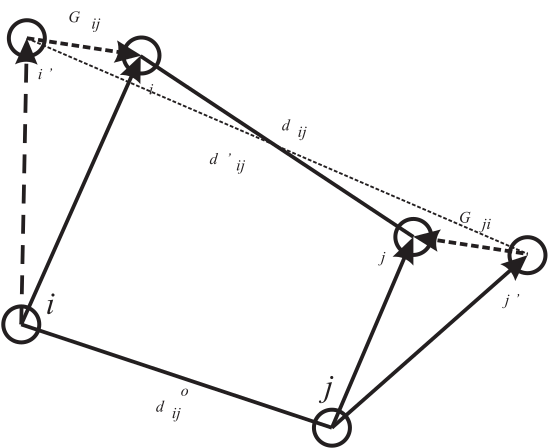

.. _shake-rattle:

Bond Constraints
================

The :index:`SHAKE<algorithm;SHAKE>` algorithm for bond constraints was devised by Ryckaert *et
al.* :cite:`ryckaert-77a` and is widely used in molecular
simulation. It is a two stage algorithm based on the leapfrog :index:`Verlet<algorithm;Verlet>`
integration scheme :cite:`allen-89a`. In the first stage the
LFV algorithm calculates the motion of the atoms in the system assuming
a complete absence of the :index:`rigid bond` :index:`forces<see: constraints;bond>`. The positions of the atoms
at the end of this stage do not conserve the distance constraint
required by the :index:`rigid bond<constraints;bond>` and a correction is necessary. In the second
stage the deviation in the length of a given :index:`rigid bond<constraints;bond>` is used
retrospectively to compute the constraint force needed to conserve the
bondlength. It is relatively simple to show that the constraint force
has the form:

.. math::
   :label: g12_eq

   \underline{G}_{ij} \approx\ {1 \over 2} {\mu_{ij} \over \Delta t^{2}} \;
   {(d_{ij}^{2} - d_{ij}'^{2}) \over \underline{d}_{ij}^{o} \cdot
   \underline{d}_{ij}'} \; \underline{d}_{ij}^{o}~~, \label{g12}

where: :math:`\mu_{ij}` is the reduced mass of the two atoms connected
by the bond; :math:`\underline{d}_{ij}^{o}` and :math:`\underline{d}_{ij}'` are the
original and intermediate bond vectors; :math:`d_{ij}` is the
constrained bondlength; and :math:`\Delta t` is the :index:`Verlet<algorithm;Verlet>` integration
time step. It should be noted that this formula is an approximation
only.

   The SHAKE (RATTLE_VV1) schematics and associated vectors. The
   algorithm calculates the constraint force
   :math:`\underline{G}_{ij}=-\underline{G}_{ji}` that conserves the bondlength
   :math:`d_{ij}` between atoms :math:`i` and :math:`j`, following the
   initial movement to positions :math:`i\prime` and :math:`j\prime`
   under the unconstrained forces :math:`\underline{F}_{i}` and
   :math:`\underline{F}_{j}` and velocities :math:`\underline{v}_{i}` and
   :math:`\underline{v}_{j}`.

The :index:`RATTLE<algorithm;RATTLE>` algorithm was devised by Andersen
:cite:`andersen-83a` and it is the SHAKE algorithm used with
Velocity :index:`Verlet<algorithm;Verlet>` integration scheme. It consists of two parts RATTLE_VV1
and RATTLE_VV2 applied respectively in stages one and two of Velocity
Verlet algorithm. RATTLE_VV1 is similar to the SHAKE algorithm as
described above and handles the bond length constraint. However, due to
the difference in the velocity update between VV (VV1) and LFV schemes,
the constraint force generated to conserve the bondlength in RATTLE_VV1
has the form as in :eq:`g12_eq` but missing the factor of a half:

.. math::
   :label: g121_eq

   \underline{G}_{ij} \approx\ {\mu_{ij} \over \Delta t^{2}} \;
   {(d_{ij}^{2} - d_{ij}'^{2}) \over \underline{d}_{ij}^{o} \cdot
   \underline{d}_{ij}'} \; \underline{d}_{ij}^{o}~~. \label{g121}

.. index:: 
   single: rigid bond 
   see: constraints;bond

The constraint force in RATTLE_VV2 imposes a new condition of rigidity
on constraint bonded atom velocities. RATTLE_VV2 is also a two stage
algorithm. In the first stage, the VV2 algorithm calculates the
velocities of the atoms in the system assuming a complete absence of the
rigid bond forces (since forces have just been recalculated afresh after
VV1). The relative velocity of atom i with respect to atom j (or vice
versa) constituting the rigid bond ij may not be perpendicular to the
bond - i.e. may have a non-zero component along the bond. However, by
the stricter definition of rigidity this is is required to be zero as it
will otherwise lead to a change in the rigid bond length during the
consequent timestepping. In the second stage the deviation from zero of
the scalar product
:math:`\underline{d}_{ij}~\cdot~(\underline{v}_{j}~-~\underline{v}_{i})` is used
retrospectively to compute the constraint force needed to keep the bond
rigid over the length of the timestep :math:`\Delta t`. It is relatively
simple to show that the constraint force has the form:

.. math::
   :label: b12_eq

   \underline{B}_{ij} \approx\ {\mu_{ij} \over \Delta t} \;
   {\underline{d}_{ij} \cdot (\underline{v}_{j}-\underline{v}_{i}) \over
   d_{ij}^{2}} \; \underline{d}_{ij}~~. \label{b12}

The velocity corrections can therefore be written as

.. math::

   \underline{v}^{corr}_{i} = \Delta t \; {\underline{B}_{ij} \over m_{i}} =
   {\mu_{ij} \over m_{i}} {\underline{d}_{ij} \cdot (\underline{v}_{j}-\underline{v}_{i}) \over
   d_{ij}^{2}} \; \underline{d}_{ij}~~.

For a system of simple diatomic molecules, computation of the constraint
force will, in principle, allow the correct atomic positions to be
calculated in one pass. However, in the general polyatomic case this
correction is merely an interim adjustment, not only because the above
formula is approximate, but the successive correction of other bonds in
a molecule has the effect of perturbing previously corrected bonds.
Either part of the RATTLE algorithm is therefore iterative, with the
correction cycle being repeated for all bonds until: each has converged
to the correct length, within a given tolerance for RATTLE_VV1 (SHAKE)
and the relative bond velocities are perpendicular to their respective
bonds within a given tolerance for RATTLE_VV2 (RATTLE). The tolerance
may be of the order :math:`10^{-4}` Å to :math:`10^{-8}` Å depending on
the precision desired.

The SHAKE procedure may be summarised as follows:

#. All atoms in the system are moved using the :index:`LFV<algorithm;Verlet>` algorithm, assuming
   an absence of :index:`rigid bonds<constraints;bond>` (constraint forces). (This is stage 1 of
   the SHAKE algorithm.)

#. The deviation in each bondlength is used to calculate the
   corresponding constraint force, equation :eq:`g12_eq`, that
   (retrospectively) ‘corrects’ the bond length.

#. After the correction, equation :eq:`g12_eq`, has been applied
   to all bonds, every bondlength is checked. If the largest deviation
   found exceeds the desired tolerance, the correction calculation is
   repeated.

#. Steps 2 and 3 are repeated until all bondlengths satisfy the
   convergence criterion (this iteration constitutes stage 2 of the
   SHAKE algorithm).

.. index:: 
   single: algorithm;RATTLE

The RATTLE procedures may be summarised as follows:

#. RATTLE stage 1:

   #. All atoms in the system are moved using the :index:`VV<algorithm;Verlet>` algorithm, assuming
      an absence of :index:`rigid bonds<constraints;bond>` (constraint forces). (This is stage 1 of
      the RATTLE_VV1 algorithm.)

   #. The deviation in each bondlength is used to calculate the
      corresponding constraint force, equation :eq:`g121_eq`,
      that (retrospectively) ‘corrects’ the bond length.

   #. After the correction, equation :eq:`g121_eq`, has been
      applied to all bonds, every bondlength is checked. If the largest
      deviation found exceeds the desired tolerance, the correction
      calculation is repeated.

   #. Steps (b) and (c) are repeated until all bondlengths satisfy the
      convergence criterion (this iteration constitutes stage 2 of the
      RATTLE_VV1 algorithm).

#. Forces calculated afresh.

#. :index:`RATTLE<algorithm;Verlet>` stage 2:

   #. All atom velocities are updated to a full step, assuming an
      absence of rigid bonds. (This is stage 1 of the RATTLE_VV2
      algorithm.)

   #. The deviation of
      :math:`\underline{d}_{ij} \cdot (\underline{v}_{j}-\underline{d}_{i})` in each bond
      is used to calculate the corresponding constraint force that
      (retrospectively) ‘corrects’ the bond velocities.

   #. After the correction, equation :eq:`b12_eq`, has been
      applied to all bonds, every bond velocity is checked against the
      above condition. If the largest deviation found exceeds the
      desired tolerance, the correction calculation is repeated.

   #. Steps (b) and (c) are repeated until all bonds satisfy the
      convergence criterion (this iteration constitutes stage 2 of the
      RATTLE_VV2 algorithm).

The parallel version of the RATTLE algorithm, as implemented in , is
derived from the :index:`RD_SHAKE<algorithm;SHAKE>` algorithm :cite:`smith-94b`
although its implementation in the Domain Decomposition framework
requires no *global merging* operations and is consequently
significantly more efficient. The routine ``constraints_shake`` is
called to apply corrections to the atomic positions and the routine
``constraints_rattle`` to apply corrections to the atomic velocities of
constrained particles.

It should be noted that the fully converged constraint forces
:math:`G_{ij}` make a contribution to the system virial and the 
:index:`stress tensor`.

The contribution to be added to the atomic virial (for each constrained
bond) is

.. math:: {\cal W} = -\underline{d}_{ij} \cdot \underline{G}_{ij}~~.

The contribution to be added to the atomic :index:`stress tensor` (for each
constrained bond) is given by

.. math:: \sigma^{\alpha \beta} = d_{ij}^{\alpha} G_{ij}^{\beta}~~,

where :math:`\alpha` and :math:`\beta` indicate the :math:`x,y,z`
components. The atomic stress tensor derived from the pair forces is
symmetric.
