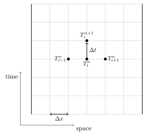
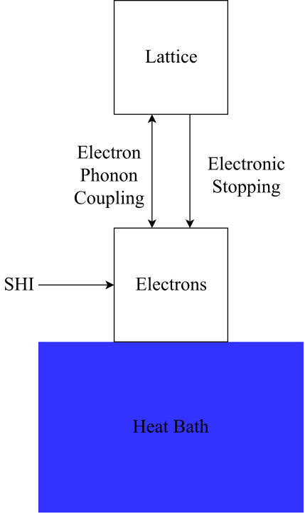
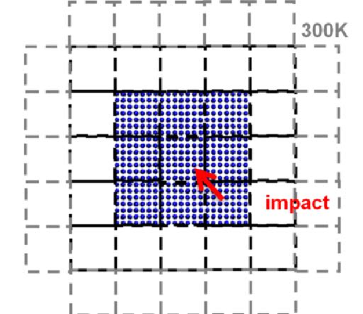
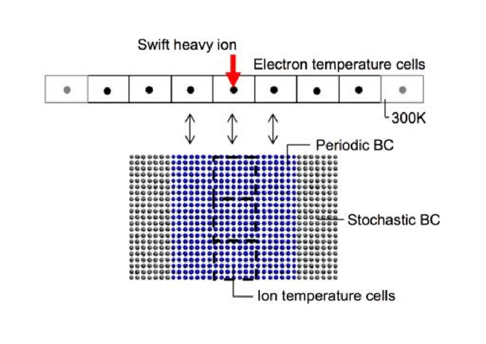
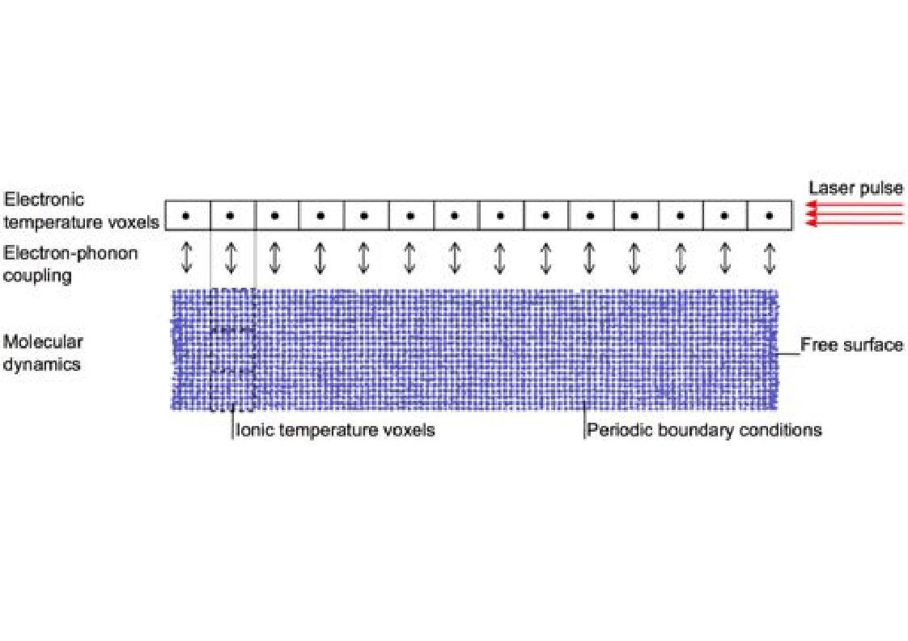

Two-Temperature Model
=====================

Introduction
------------

Traditionally, the modelling of radiation damage has been confined to
cases in which the radiation (i.e. a projectile) collides elastically
with the nuclei of the target material. Collisions of this type are said
to be dominated by nuclear stopping (energy transfer from the projectile
to the nuclei). However, there are a broad range of scenarios (high
energy collision cascades, swift heavy ion irradiation, and laser
excitation) in which a significant portion (high energy collision
cascades) or all (lasers and swift heavy ions) of the energy is
transferred to the electrons in the target material. These cases, in
which electronic stopping cannot be neglected, are impossible to account
for using traditional molecular dynamics simulations (which assume
equilibrium conditions between the target nuclei and electrons). This
chapter describes the implementation of a hybrid continuum-atomistic
implementation within DL_POLY_4 that incorporates these electronic
excitations.

The model is based on the traditional two-temperature model
(TTM) :cite:`lifshits-60a`. This model splits the nuclei and
electrons into two separate but interacting subsystems, each evolving
according to a modified version of Fourier’s heat equation. The
continuum implementation of the nuclei (assumed to be in a lattice) in
this form of the model is unable to track individual atomistic
trajectories, thus information on superheating, recrystallisation, and
pressure waves is lost. These limitations were overcome by Duffy and
Rutherford :cite:`duffy-07a, duffy-09a`, by replacing the
continuum representation of the nuclei with an MD cell (the details of
which will be described in this chapter). This hybrid
continuum-atomistic model, a combination of TTM and MD known as the
two-temperature molecular dynamics (2T-MD) model, has been successfully
used to model high energy cascades in
iron :cite:`zarkadoula-14a`, ultrafast laser irradiation of
gold nanofilms :cite:`daraszewicz-13a`, and swift heavy ion
irradiation of silicon :cite:`khara-16a`.

Methodology
-----------

Electronic subsystem
~~~~~~~~~~~~~~~~~~~~

The electronic temperature is treated as a continuum system, and evolves
according to Fourier’s law of heat conduction:

.. math::
   :label: electronic_system_eq

   \label{eq:electronic_system}
   C_e(T_e) \frac{\partial T_e}{\partial t} - \nabla . [\kappa_e \nabla T_e ] = -G_{ep}(T_e - T_a) + G_s T^{\prime}_a + A(r,t),

where :math:`C_e(T_e)` is the electronic volumetric heat capacity (equal
to the product of specific heat capacity and density), :math:`\kappa_e`
is the electronic thermal conductivity, :math:`G_{ep}(T_e)` the
electron-phonon coupling, :math:`G_s` the electronic stopping term
(which is significant for atomistic/ionic temperatures
:math:`T^{\prime}_a` greater than a velocity cutoff, as defined later),
and :math:`A(r,t)` the temporal and spatial dependent source term. This
equation describes how energy evolves in the electronic system as
follows: energy is dumped into the electronic system via the source term
(for swift heavy ions and laser excitation), :math:`A(r,t)`, the
electronic volume-specific heat determines the electronic temperature
(:math:`T_e`) rise due to this deposition, the thermal conductivity
describes how energy dissipates throughout the electronic subsystem, and
the electron-phonon coupling determines energy transfer from the
electrons to the MD cell (and is proportional to the temperature
difference between :math:`T_e` and the atomistic temperature,
:math:`T_a`).
Equation :eq:`electronic_system_eq` can be
equated to the more general heat diffusion :index:`equation<Two-Temperature Model;Heat diffusion>`,

.. math::
   :label: heatdiffusion_eq

   \label{eq:heatdiffusion}
   \frac{\partial T}{\partial t} - \alpha \nabla^2 T = \frac{\dot{q}}{C},

:math:`T` is temperature, :math:`t` is time, :math:`\dot{q}` is a heat
source or sink, :math:`C` is heat capacity, and :math:`\alpha` is
thermal diffusivity. This partial differential equation is solved using
Euler’s method, which is a space-centred, forward-in-time integration
algorithm. For a temperature :math:`T_{i}^{n}` (at time step :math:`n`
and grid point :math:`i`), the forward-in-time implementation can be
Taylor-expanded and rearranged to:

.. math:: \bigg(\frac{\partial T}{\partial t}\bigg)_i = \frac{T_{i}^{n+1} - T_{i}^{n}}{\Delta t} - \frac{\Delta t}{2}\bigg(\frac{\partial^2 T}{\partial t^2}\bigg)_i  - \frac{\Delta t^2}{6}\bigg(\frac{\partial^3 T}{\partial t^3}\bigg)_i - \dots \approx \frac{T_{i}^{n+1} - T_{i}^{n}}{\Delta t} ,

for equally-spaced timesteps :math:`\Delta t`, and leads to a truncation
error :math:`O(\Delta t)`. The one-dimensional space-centred integration
is

.. math::

   \begin{aligned}
   \bigg(\frac{\partial T}{\partial x}\bigg)_n &= \frac{T_{i+1}^{n} - T_{i-1}^{n}}{\Delta x} - \frac{\Delta x^2}{6}\bigg(\frac{\partial^3 T}{\partial x^3}\bigg)_i - ... \approx \frac{T_{i+1}^{n} - T_{i-1}^{n}}{\Delta x}\end{aligned}

for equally spaced grid lengths :math:`\Delta x`, and leads to a
truncation error of :math:`O(\Delta x^2)`. The second derivative can be
calculated as follows:

.. math::

   \begin{aligned}
   \bigg(\frac{\partial^2 T}{\partial x^2}\bigg)_n =& \bigg[ \frac{\partial}{\partial x} \frac{\partial T}{\partial x}\bigg]_n \nonumber \\
    =& \lim\limits_{\Delta x \to 0} \left(\frac{\text{forward difference - backwards difference}}{\Delta x}\right) \nonumber \\
   \approx& \frac{\frac{T_{i+1}^{n} - T_{i}^n}{\Delta x} - \frac{T_{i}^{n} - T_{i-1}^{n}}{\Delta x} }{\Delta x} \nonumber \\
   =& \frac{T_{i+1}^{n} - 2T_{i}^n + T_{i-1}^{n}}{\Delta x^2}\end{aligned}

Inserting these numerical solutions into Equation
:eq:`heatdiffusion_eq`, the one-dimensional heat
diffusion equation can be expressed via a finite-difference scheme 
:index:`as<Two-Temperature Model;Explicit finite-difference scheme>`

.. math:: \frac{T_{i}^{n+1} - T_{i}^n}{\Delta t} - \alpha \left(\frac{T_{i+1}^{n} - 2T_{i}^n + T_{i-1}^{n}}{\Delta x^2}\right) = \frac{\dot{q}}{C}.

Rearranging for :math:`T_{i}^{n+1}` gives

.. math:: T_{i}^{n+1}  = T_{i}^n + \Delta t \bigg[  \alpha \left(\frac{T_{i+1}^{n} - 2T_{i}^n + T_{i-1}^n}{\Delta x^2}\right) + \frac{\dot{q}}{C}  \bigg],

which is also known as the one-dimensional explicit finite-difference
solution to Fourier’s law of heat conduction. This scheme is illustrated
in Figure :numref:`(%s)<1DFD_fig>`: it is explicit as the temperature at
time :math:`n+1` *explicitly* depends on the temperature at time
:math:`n`, and is evidently forward-in-time and space-centred.

   One-dimensional finite-difference schematic (boundary nodes indicated
   by dark vertical lines)

The timestep and lattice spacing, :math:`\Delta t` and :math:`\Delta x`
respectively, must be chosen carefully to ensure the stability of this
algorithm, and this is provided by defining the Fourier mesh number,
:math:`F`, as

.. math:: F = \alpha \frac{\Delta t}{\Delta x^2}

This can be thought of as the ratio of timestep to the time it takes to
equilibrate a region of length :math:`\Delta x`. In this one-dimensional
case, the value of :math:`F` must satisfy :math:`0 < F < \frac{1}{2}`,
or else the algorithm becomes unstable and oscillates wildly.

In three-dimensions, if :math:`\Delta x = \Delta y = \Delta z`, the
finite-difference solution becomes

.. math::
   :label: finite_solver_1_eq

   \begin{aligned}
   T_{i,j,k}^{n+1}  =& T_{i,j,k}^n + \Delta t \bigg[  \alpha \left(\frac{T_{i+1,j,k}^n + T_{i-1,j,k}^{n} + T_{i,j+1,k}^n + T_{i,j-1,k}^{n} + T_{i,j,k+1}^n + T_{i-1,j,k-1}^{n} - 6T_{i,j,k}^n}{\Delta x^2}\right) + \frac{\dot{q}}{C}  \bigg] \nonumber \\
   =& T_{i,j,k}^n + F [T_{i+1,j,k}^n + T_{i-1,j,k}^{n} + T_{i,j+1,k}^n + T_{i,j-1,k}^{n} + T_{i,j,k+1}^n + T_{i-1,j,k-1}^{n} - 6T_{i,j,k}^n] +  \Delta t  \frac{\dot{q}}{C} \label{eq:finite_solver_1},\end{aligned}

with a new stability criteria of :math:`0 < F < \frac{1}{6}`. Thus, the
size of the timestep must satisfy
:math:`\Delta t < \frac{\Delta x^2}{6 \alpha}`. Equation
:eq:`finite_solver_1_eq` applies under the
assumption that the thermal diffusivity :math:`\alpha` is a constant
value, i.e. :math:`\nabla . [\alpha \nabla T ] = \alpha \nabla^2 T`, but
the more general (and hence more complicated) case, where :math:`\alpha`
can vary spatially, takes the form

.. math::
   :label: finite_solver_2_eq

   \begin{aligned}
   T_{i,j,k}^{n+1}  =& \frac{\Delta t}{\Delta x^2} \left( \frac{\kappa \big[ \frac{1}{2} (T^n_{i+1,j,k} + T^n_{i,j,k})  \big]}{C(T^n_{i,j,k})} (T^n_{i+1,j,k} - T^n_{i,j,k}) +  \frac{\kappa \big[ \frac{1}{2} (T^n_{i-1,j,k} + T^n_{i,j,k})  \big]}{C(T^n_{i,j,k})} (T^n_{i-1,j,k} - T^n_{i,j,k}) \right) \nonumber \\
   +& \frac{\Delta t}{\Delta y^2} \left( \frac{\kappa \big[ \frac{1}{2} (T^n_{i,j+1,k} + T^n_{i,j,k})  \big]}{C(T^n_{i,j,k})} (T^n_{i,j+1,k} - T^n_{i,j,k}) +  \frac{\kappa \big[ \frac{1}{2} (T^n_{i,j-1,k} + T^n_{i,j,k})  \big]}{C(T^n_{i,j,k})} (T^n_{i,j-1,k} - T^n_{i,j,k}) \right) \nonumber \\
   +& \frac{\Delta t}{\Delta z^2} \left( \frac{\kappa \big[ \frac{1}{2} (T^n_{i,j,k+1} + T^n_{i,j,k})  \big]}{C(T^n_{i,j,k})} (T^n_{i,j,k+1} - T^n_{i,j,k}) + \frac{\kappa \big[ \frac{1}{2} (T^n_{i,j,k-1} + T^n_{i,j,k})  \big]}{C(T^n_{i,j,k})} (T^n_{i,j,k-1} - T^n_{i,j,k}) \right) \nonumber \\
   +& \Delta t \frac{\dot{q^n_{i,j,k}}}{C^n_{i,j,k}} \label{eq:finite_solver_2}.\end{aligned}

Here the electronic thermal conductivity has an explicit spatial
dependence. To simplify this relationship, :math:`\kappa` can be assumed
to be constant locally, and is taken to be the average value between the
current and neighbouring cells. An adaptive timestep is also utilised,
so at each timestep a fraction of the ’worst case scenario’ for the
Fourier mesh number, :math:`F`, is chosen, ensuring the stability of the
electronic subsystem.

.. index::
   single: Two-Temperature Model;boundary conditions

Various boundary condition choices are available for the edge cells in
Figure :numref:`(%s)<1DFD_fig>`, which surround the simulation in all three
dimensions. These are:

-  *Dirichlet Boundary Conditions*: Also known as infinite-flux boundary
   conditions, the edge cell is fixed at a finite temperature,
   :math:`T = T_0`, where :math:`T_0` is the target (system) emperature.
   Dirichlet BCs are usually chosen for cascade simulations.

-  *Neumann Boundary Conditions*: Also known as zero-flux boundary
   conditions, the temperature of the edge cell is taken to be the value
   of its corresponding neighbour, thus :math:`\frac{dT}{dx} = 0` in
   this region.

-  *Robin Boundary Conditions*: Also known as partial or variable flux
   boundary conditions, the temperature of the edge cell is taken to be
   a fixed proportion of the neighbouring cell’s temperature. Thus
   :math:`\frac{dT}{dx} = -k (T-T_0)`, where :math:`k` is the fraction
   of the neighbouring temperature that is ’targeted’.

The electronic energy contained in a voxel representing an electronic
temperature grid point can be calculated by integrating the volumetric
heat capacity between a datum temperature (e.g. system temperature) and
the local electronic temperature, i.e.

.. math:: E_{e}^{j} = \int_{T_{0}}^{T_{e}^{j}} C_{e} dT.

A quantity of electronic energy can be added to a voxel by setting the
local electronic temperature to a new value, such that the integral of
volumetric heat capacity between the original and new temperatures gives
the required energy.

The atomic temperatures :math:`T_a` and :math:`T_a^{\prime}` can be
calculated from kinetic energies of atoms in each voxel, i.e. for cell
:math:`j`:

.. math::

   \begin{aligned}
   T_{a}^{j}          &= \frac{\sum_{p \in \vec{x}^j} m_p v_p^2}{3 k_B N} \\
   T_{a}^{\prime j} &= \frac{\sum_{p \in \vec{x}^j, |v_p | > v_{cut}} m_p v_p^2}{3 k_B N^{\prime}}\end{aligned}

where :math:`v_{cut}` is the cut-off velocity beyond which electronic
stopping is significant, :math:`N` is the total number of atoms in the
voxel and :math:`N^{\prime}` is the number of atoms in the voxel with
velocities greater than :math:`v_{cut}`. To account for centre-of-mass
drift, the atomic velocities :math:`\underline{v}_p` should be corrected
by the voxel’s velocity, calculated by
:math:`\underline{v}^j_{com} = \frac{\sum_{p \in \vec{x}^j} m_p \underline{v}_p}{\sum_{p \in \vec{x}^j} m_p}`.

If there are too few (or no) atoms in a voxel, it is considered to be
*inactive* as no definable ionic temperatures can be calculated.
Equation :eq:`finite_solver_2_eq` does not have
to be applied to inactive voxels (setting electronic temperatures to the
datum value :math:`T_0` and source terms to zero), while temperature
gradient terms involving inactive voxels in the same equation can be
omitted for their neighbours.

MD system
~~~~~~~~~

The principal idea is to modify the MD equations of motion according to
Langevin dynamics, which describes the movement of particles in a
viscous medium. This viscous medium will represent the electronic
subsystem, and the modified equation of motion takes the form

.. math::
   :label: modifiedlang_eq

   \label{eq:modifiedlang}
   {d \underline{v}_{p}(t) \over d t} = {\underline{{f}_{p}(t)+\underline{R}_{p}(t)} \over
   m_{p}} - \chi_{p} \; \underline{v}_{p}(t),

where :math:`m_p` and :math:`\vec{v}_p` are the mass and velocity of
atom :math:`p` at time :math:`t`, :math:`\underline{f}_{p}` is the
deterministic force on atom :math:`p` due to the interatomic potential,
:math:`\underline{R}_{p}(t)` is a stochastic force with random magnitude
and orientation and :math:`m_{p} \chi_{p} \underline{v}_{p}(t)` is the
frictional force due to the electrons. These last two terms in Equation
:eq:`modifiedlang_eq` are the Langevin
modifications to Newton’s second law, which allow energy to be lost and
gained by the MD system.

The stochastic force :math:`\underline{R}_{p}(t)` returns energy from
the electrons to the ions and is formulated as
:math:`\underline{R}_{p}(t) = \sqrt{\Gamma} \vec{A}_{p}(t)`, where
:math:`\vec{A}_{p}(t)` is a three-dimensional vector with components
randomly distributed in :math:`[-1,1]`, and :math:`\Gamma` is the
stochastic friction coefficient. :math:`\underline{R}_{p}(t)` must
satisfy two important time-averaged conditions:

.. math::
   :label: flucdissip_eq

   \begin{aligned}
   \langle \underline{R}_{p}(t) \rangle =& 0, \\
   \langle \underline{R}_{p}(t) \cdot \underline{R}_{q}(t^{\prime}) \rangle &\propto& \delta_{pq} \delta (t-t^{\prime}) \label{eq:flucdissip}\end{aligned}

The first condition states that over a significant period of time,
:math:`\underline{R}_{p}(t)` must not behave as a net source or sink.
Equation :eq:`flucdissip_eq` is known as the
fluctuation-dissipation theorem, which describes how the drag felt by a
particle as it moves through a viscous medium can give rise to Brownian
motion. In the standard homogeneous Langevin thermostat, every atom in
the MD simulation is thermostatted to a target temperature. The
inhomogeneous case allows for each atom to be thermostatted to the
electronic temperature of the corresponding continuum electronic cell.
This leads to the stochastic friction 
:index:`term<Two-Temperature Model;electron-phonon coupling>`

.. math:: \Gamma = \frac{6 m_{p} \chi_{ep}^j k_B T_e^j}{\Delta t},

where :math:`\chi_{ep}^j` is the electron-phonon friction of the
:math:`j^{th}` electronic finite-element cell, :math:`T_e^j` is the
electronic temperature of the corresponding cell, :math:`k_B` is the
Boltzmann constant, and :math:`\Delta t` is the timestep. The
electron-phonon friction term is thus calculated at each point in the
finite electronic temperature grid:

.. math::
   :label: chiep_eq

   \label{eq:chiep}
   \chi_{ep} = \frac{G_{ep} \Delta V}{3 k_B N},

where :math:`\Delta V` is the volume of the cell
(:math:`\Delta x \Delta y \Delta z`), :math:`G_{ep}` is the
electron-phonon coupling constant of the material, and :math:`N` is the
number of atoms in the cell.

The friction term in Equation :eq:`modifiedlang_eq`
is made up of two forms of energy loss: the previous discussed
electron-phonon friction, and electronic stopping, which is inelastic
electron scattering of ballistic atoms. The total electron friction
coefficient :math:`\chi_p` for atom :math:`p` is given by

.. math::

   \chi_{p} = \left\{ \begin{array} {l@{\quad:\quad}l}
   \chi_{ep} + \chi_{es} & | v_p | > v_{cut} \\
   \chi_{ep} & | v_p | \le v_{cut}
   \end{array} \right. ,

where :math:`\chi_{es}` is the electronic stopping friction,
:math:`\underline{v}_{p}` is the velocity of atom :math:`p`, and
:math:`v_{cut}` is the cut-off velocity for which electronic stopping
becomes significant. The electronic stopping friction term can be
calculated in a similar fashion to the electron-phonon 
:index:`term<Two-Temperature Model;electronic stopping>`:

.. math::
   :label: chies_eq

   \label{eq:chies}
   \chi_{es} = \frac{G_{s} \Delta V}{3 k_B N^{\prime}}

where :math:`N^{\prime}` is the number of atoms in the cell with
velocities greater than :math:`v_{cut}`. Note that this term is set to
zero when :math:`N^{\prime} = 0`.

From Equations :eq:`modifiedlang_eq`,
:eq:`chiep_eq` and :eq:`chies_eq`, the
differences between the contributions from electron-phonon coupling and
electronic stopping are evident. Electron-phonon coupling allows energy
to flow to and from the lattice (depending on the temperature gradient
between ions and electrons), whereas electronic stopping acts solely as
an energy loss mechanism for the lattice.

   Schematic of thermodynamic coupling and processes in 2T-MD model

Figure :numref:`(%s)<heatbath_fig>` illustrates these processes
for swift heavy ion simulations, and highlights how the MD cell is now
thermostatted to a heat bath. The lattice will reach local equilibrium
with the electron gas, which is thermostatted to the heat bath, thus
eventually driving both subsystems to the chosen ambient temperature.
Energy can only be removed from the system via the electron gas; this is
justified due to how slow lattice heat diffusion is in comparison to
electronic heat diffusion.

.. index:: single: ensemble;Inhomogeneous Langevin NVT

It is possible to use the inhomogeneous Langevin thermostat (Equation
:eq:`modifiedlang_eq`) on its own without coupling
it to the electronic temperature grid, but still enhancing the total
Langevin friction term for atoms with velocities greater than a cut-off
value:cite:`zarkadoula-13a`. In this case, the stochastic
friction coefficient :math:`\Gamma` is modified to use the system
temperature :math:`T_0` instead of a local electronic temperature and to
take advantage of the enhanced friction coefficient when electronic
stopping applies, i.e.

.. math:: \Gamma = \frac{6 m_{p} \chi_{p} k_B T_0}{\Delta t}.

Simulation setup
----------------

There are three distinct types of irradiation that can be simulated
using the TTM (2T-MD) implementation in : swift heavy ions, laser
excitation, and high-energy cascades. These are conducted by splitting
the MD cell into discrete coarse-grained lattice ionic temperature (CIT)
voxels, and discretising the electronic system into coarse-grained
electronic temperature (CET) voxels. Energy can thus be exchanged
between the voxels and subsequently passed to or from the atoms within
each respective CIT. The volume of each CIT voxel must contain a
sufficient number of atoms so that thermal fluctuations of ions are
negligible and an ionic temperature can be defined: a good general
choice is a cube of length 10 Å in each direction. There is more
flexibility in choosing the number of CET voxels, as long as an integer
number of these overlap with the CIT grid: to simplify the connections
between the CET and CIT grids, equal-sized voxels for both systems will
be assumed from here on.

Cascades
~~~~~~~~

   
   Schematic of cascade simulation setup

High-energy cascades require no initial energy deposition into the
electronic system (i.e. :math:`\frac{dE}{dx} = 0`): instead, an ion is
initialised with a very high velocity. The electronic temperature (CET)
voxels extend further than the ionic temperature (CIT) voxels in all
directions, with open (Dirichlet) or semi-open (Robin) boundary
conditions in all dimensions to represent thermal electronic conduction
into the bulk, allowing the electronic temperature to converge towards
the initial system temperature :math:`T_0`.
(Figure :numref:`(%s)<cascades_fig>` gives an example schematic of
this simulation setup.) Stochastic boundary conditions can be applied in
the ionic system to dampen the shock wave generated by the displacement
spike.

.. index:: single: Two-Temperature Model;swift heavy ions

Swift heavy ions
~~~~~~~~~~~~~~~~

   Simulation setup for swift heavy ion impact.

Swift heavy ion systems can be modelled using an initial Gaussian
spatial energy deposition into the electronic system (i.e.
:math:`\frac{dE}{dx} > 0`) with either Gaussian or exponentially
decaying temporal distribution in electronic temperature. The size of
the electronic temperature (CET) grid in the z-direction is set equal to
the size of the ionic temperature (CIT) grid in the same dimension,
while the CET voxels are extended over the corresponding CIT voxels in
the x- and y-directions. Boundary conditions can be set with no energy
flux in the z-direction and open or semi-open boundary conditions in x-
and y-directions. (Figure :numref:`(%s)<SHI_fig>` gives a schematic of
this simulation setup.) Stochastic boundary conditions can be applied to
the lattice system in lateral directions only to represent
non-negligible phononic thermal conductivity in semiconductors into the
builk. Similarly, while electronic thermal conduction in the lateral
directions is allowed, conduction parallel to impact is not. This
reflects the fact that the simulation represents a small cross-section
of the evolution of a micron-sized track.

.. index:: single: Two-Temperature Model;laser excitation
   
Laser excitation
~~~~~~~~~~~~~~~~

   Simulation setup for laser irradiation.

Laser excitation systems can be modelled with an initial homogeneous
spatial energy deposition into the electronic system (either in all
three directions or in x- and y-directions with exponential decay in the
z-direction) with either Gaussian or exponentially decaying temporal
distribution in electronic temperature. (The energy deposition can be
specified for the fully homogeneous case either by setting
:math:`\frac{dE}{dx} > 0` or by giving values for the absorbed fluence
and penetration depth from the laser.) The size of the electronic
temperature (CET) grid is set to the same size as the ionic temperature
(CIT) grid, with zero-flux (Neumann) boundary conditions in all
directions. This setup (shown in Figure :numref:`laser_fig`)
represents a homogeneous laser excitation with the simulated part as a
small section of a larger photoexcited sample.

It is possible in such simulations for voxels to become empty due to
displacement of atoms from the laser source. These voxels are omitted
from electronic heat diffusion calculations, setting their electronic
temperatures to the background value :math:`T_0` and their source terms
to zero. Their associated spatial gradients in Equation
:eq:`finite_solver_2_eq` are also omitted for
neighbouring voxels.

Implementation
--------------

TTM with MD (2T-MD) has been implemented in DL_POLY_4 to take advantage
of the domain decomposition scheme used by the code, by dividing up the
coarse-grained ionic (CIT) and electronic (CET) temperature voxels as
evenly as possible among the processors based on location. This avoids
the need for each processor to hold copies of the entire CIT and CET
grids and provides good to excellent parallel scalability for larger
scale problems.

Coarse-grained ionic temperature (CIT) voxels are divided among
processors with overlapping voxels between two or more processors
assigned to the first processor in each direction. A boundary halo of
voxels is also included to allow communication of contributions to voxel
momenta, kinetic energies and atom counters between processors for
calculations of ionic temperatures. Since ionic temperatures are only
needed for finite-difference calculations of Equation
:eq:`electronic_system_eq`, some of these
communications only need to be applied in one direction for each
dimension.

The coarse-grained electronic temperature (CET) grid is considered as
integer multiples of the ionic temperature grid, with equal numbers in
both directions of each dimension. While this may provide more CET
voxels than requested by the user, the application of boundary
conditions in the correct places means that the finite-difference
calculations can be carried out in superfluous voxels without affecting
the result. The centre of the CET grid is located at the same place as
the CIT grid, matching the two up precisely: the electron-phonon,
electronic stopping and energy deposition source terms are only applied
in these CET voxels. Communications of electronic temperature can be
carried out both within each ‘copy’ of the ionic temperature grid and
between them: these need to be applied for each iteration (timestep) of
the finite-difference solver.

Communications to and from boundary halos for both CIT and CET grids
make use of MPI derived data types, which allow for single MPI send and
receive calls for grid values without needing to pack and unpack data.
This is the same communication technique used in DL_MESO for its lattice
Boltzmann equation code:cite:`seaton-13a` and has been shown
to give near-perfect parallel scaling to thousands of processors.

Functionality and directives
~~~~~~~~~~~~~~~~~~~~~~~~~~~~

The CONTROL file direction **ttm_calculate** can be used to switch on
the two-temperature model (2T-MD) as described above. If no other
information is provided, DL_POLY_4 will use default values for certain
required properties, but some information *must* be provided: if this
information is unavailable, DL_POLY_4 will terminate. The list of TTM
directives is given as part of Section
:ref:`control_options`: more details about these
directives are given below.

The inhomogeneous Langevin thermostat can be activated using the
directive **ensemble_method** with the **ttm** option in the CONTROL
file, specifying the electron-phonon friction term (:math:`\chi_{ep}`,
in ps\ :math:`^{-1}` using **ttm_e-phonon_friction**), electronic
stopping friction term (:math:`\chi_{es}`, in ps\ :math:`^{-1}` using
**ttm_e-stopping_friction**) and the cutoff atomic velocity for
electronic stopping (:math:`v_{cut}`, in Å ps\ :math:`^{-1}` using
**ttm_e-stopping_velocity**). This thermostat is required for 2T-MD
calculations but can also be used independently: these CONTROL file
directives therefore do not automatically switch on the two-temperature
model, but DL_POLY_4 will quit with an error message if TTM is selected
and the ensemble is not NVT or the ensemble method is not **ttm**.

By default, the inhomogeneous Langevin thermostat will be applied only
to particle thermal velocities, i.e. velocities that have been corrected
to remove the centre-of-mass flow calculated from its coarse-grained
ionic temperature (CIT) voxel. The directive **ttm_com_correction**
directive can be set to **full** for this default behaviour, **zdir** to
only correct the z-direction velocity component and use total velocity
components in the x- and y-directions, or **off** to omit all velocity
corrections and use total particle velocities. A warning message will
also be printed if the **fixed_com** option is switched on, as removal
of total centre-of-mass motion may affect the dynamics of systems with
electronic stopping effects.

The number of coarse-grained electronic temperature (CET) voxels is
specified in the CONTROL file with the directive
**ttm_num_elec_cellst**: by default, a grid of
:math:`50 \times 50 \times 50` will be used if this information is not
supplied by the user. The number of coarse-grained ionic temperature
(CIT) voxels in the z-direction is specified in CONTROL using the
directive **ttm_num_ion_cells**: the default number is 10, and the
number of voxels in x- and y-directions will be determined automatically
based on system size. The number of CET voxels must be at least the same
as CIT or larger: too few CET voxels will cause DL_POLY_4 to terminate.

.. index:: single: Two-Temperature Model;heat capacity

The volumetric heat capacity :math:`C_e` can be obtained for TTM
calculations in four different forms with their corresponding options
for the CONTROL file directive **ttm_heat_cap_model**:

-  A temperature-independent constant value (**constant**)\ 

   .. math:: C_e = C_0 \rho

-  A linear function of temperature up to a maximum at the Fermi
   temperature :math:`T_{f}` (**linear**)

   .. math:: C_e (T) = C_0 \rho \max \left(T/T_{f}, 1\right)

-  A hyperbolic tangent function of temperature (**tanh**)

   .. math:: C_e (T) = A \rho \tanh \left(10^{-4} B T\right)

-  A tabulated function of temperature supplied in a Ce.dat file
   (**tabulated**).

Note that the values given for the first three options are specific heat
capacities (:math:`C_0` and :math:`A` given in :math:`k_B` per atom by
the **ttm_heat_cap** directive), which are converted to volumetric heat
capacities by multiplying by the atomic density
:math:`\rho = \frac{N}{\Delta V}`. The atomic density is assumed to be
constant throughout the system, and this value can be set in one of
three ways: (1) a value can be calculated from the provided
configuration at the start (assuming all ionic temperature cells are
active), (2) the user can specifiy a value using the **ttm_dens**
directive in the CONTROL file and apply it using the **constant** option
for the **ttm_dens_model** directive, or (3) after energy deposition to
the electronic temperature grid, the value can be calculated dynamically
from active CITs when using the **dynamic** option for the
**ttm_dens_model** directive. In the latter case, the system or
user-specified atomic density is used during energy deposition.
Tabulated volumetric heat capacities are given in the Ce.dat file as
J m\ :math:`^{-3}` K:math:`^{-1}`, which are converted to
:math:`k_B` Å:math:`^{-3}`. If no heat capacity information is supplied,
DL_POLY_4 will assume a constant volumetric heat capacity of 1
:math:`k_B` per atom by default. In all cases, the electronic energy of
a given voxel can be determined from the product of cell volume and the
integral of the volumetric heat capacity between the system temperature
:math:`T_0` and its current electronic temperature :math:`T_e`.

.. index:: single: Two-Temperature Model;thermal conductivity

If the system is metallic (specified by the CONTROL directive
**ttm_metal** as on), a thermal conductivity needs to be supplied: no
default value is provided by . Four options are available with their
corresponding keywords for the CONTROL file directive
**ttm_elec_cond_model**:

-  An infinitely large value (**infinite**)

   .. math:: K_e = \infty

-  A temperature-independent constant value (**constant**)

   .. math:: K_e = K_0

-  A Drude-model (linear) function of temperature (**drude**)

   .. math:: K_e (T) = K_0 \frac{T}{T_0}

-  A tabulated function of temperature supplied in a Ke.dat file
   (**tabulated**).

All values (constants or tabulated) are supplied in
W m\ :math:`^{-1}` K:math:`^{-1}`. In the case of infinitely large
conductivity, all heat diffusion in the electronic subsystem is
instantaneous and all active CET voxels without source terms will be at
the same mean electronic temperature. The Drude model uses the
electronic temperature for a given voxel, while the tabulated function
will use either the ionic temperature for overlapping cells or the
system temperature for CET voxels beyond the CIT system.

.. index:: singe: Two-Temperature Model;thermal diffusivity

If the system is non-metallic (specified by **ttm_metal** as off in
CONTROL), a thermal diffusivity needs to be supplied: no default value
is provided by . Three options are available with their corresponding
options for the CONTROL file directive **ttm_diff_model**:

-  A temperature-independent constant value (**constant**)

   .. math:: D_e = D_0

-  A reciprocal function of temperature up to the Fermi temperature
   :math:`T_{f}` (**recip** or **reciprocal**)

   .. math:: D_e (T) = D_0 \frac{T_0}{\min \left(T, T_{f}\right)}

-  A tabulated function of temperature supplied in a De.dat file
   (**ttm detab**).

All values (constant and tabulated) are supplied in
m\ :math:`^2` s:math:`^{-1}` and subsequently converted to
Å\ :math:`^2` ps:math:`^{-1}`.

.. index:: single: Two-Temperature Model;electron-phonon coupling

The electron-phonon coupling friction term :math:`\chi_{ep}` can either
be held at the constant value given in **ensemble nvt ttm**, or it can
be dynamically varied according to electronic temperature. The CONTROL
file directive **ttm_variable_ep** can be used to specify that the
electron-phonon coupling constant :math:`G_{ep}` is supplied in
tabulated form from a g.dat file, with values of :math:`G_{ep}` given in
W m\ :math:`^{-3}` K:math:`^{-1}` and converted to :math:`\chi_{ep}`
values (using Equation (`[eq:chiep] <#eq:chiep>`__) with the mean value
for the number of atoms per voxel, :math:`N = \rho \Delta V`) in
ps\ :math:`^{-1}`. Two variants of dynamic coupling are available:
homogeneous coupling uses the mean electronic temperature to calculate a
system-wide value of :math:`chi_{ep}`, while heterogeneous coupling uses
local values of electronic temperature (based on values in CET voxels)
to calculate :math:`chi_{ep}` for each atom.

.. index:: single: Two-Temperature Model;boundary conditions

Boundary conditions to the electronic temperature system are applied
using the **ttm_boundary_condition** directive in the CONTROL file:

-  **dirichlet**

-  **neumann**

-  **robin**

-  **periodic**

with the **ttm_boundary_xy** switch available to apply the Dirichlet or
Robin boundary conditions in x- and y-directions with Neumann boundary
conditions in the z-direction. These boundary conditions have no direct
connection to any boundary conditions used for the MD system: conditions
for the latter should be chosen carefully by the user to give the
desired effects. In the case of Robin boundary conditions, the
**ttm_boundary_heat_flux** directive can be used to indicate the
proportion of energy flux (given as a percentage) leaving the electronic
system at the boundaries.

.. index:: single: Two-Temperature Model;energy deposition

An energy deposition (:math:`A(r,t) = f(r,z) g(t) \Delta V`) can be
applied using the CONTROL file directive **ttm_spatial_dist**, which can
use the following types:

-  **gaussian**: specifies a Gaussian distribution in x- and
   y-directions from the centre of the system (applied homogeneously in
   the z-direction), i.e.\ 

   .. math:: f(r) = \frac{dE}{dx} \frac{1}{2 \pi \sigma^2} e^{-\frac{r^2}{2\sigma^2}}

   \ with standard deviation :math:`\sigma` (**ttm_spatial_sigma**),
   extending up to a cut-off distance given in multiples of
   :math:`\sigma` (**ttm_spatial_cutoff**);

-  **flat**: specifies a homogeneous distribution in x-, y- and
   z-directions

   .. math:: f(r) = \frac{dE}{dV} = \frac{dE}{dx} \frac{1}{L_{x} L_{y}}

   \ where :math:`L_{x}` and :math:`L_{y}` are the MD system dimensions
   in x- and y-directions;

-  **laser**: specifies a homogeneous distribution in x- and
   y-directions with either a homogeneous distribution or exponential
   decay in the z-direction (from the centre of the system), originating
   from a laser.

In the case of the Gaussian or flat distributions, the stopping power
for the depositions are given as :math:`\frac{dE}{dx}`
(**ttm_stopping_power**) in eV/nm. For lasers this quantity is obtained
from the fluence :math:`F` (**ttm_fluence**) in mJ cm\ :math:`^2` and
penetration depth :math:`l_p` (**ttm_penetration_depth**) in nm. The
directive **ttm_laser_type** enables the type of laser (**flat**,
**exponential**) to be selected: the flat type is similar to the
equivalent non-laser option with :math:`\frac{F}{l_p} = \frac{dE}{dV}`,
while the exponential function

.. math:: f(r,z) = \frac{F}{l_p} \exp\left(-\frac{|z|}{l_p}\right)

uses the penetration depth :math:`l_p` as the exponential scaling
factor. The depositions can be applied temporally in one of four ways
with the **ttm_temporal_dist** option:

-  **delta**: specifies a Dirac delta function in time

   .. math:: g(t) = \delta (t - t_0)

   \ which is approximated as an energy injection during a single
   diffusion timestep;

-  **square**: specifies a square pulse function in time

   .. math:: g(t) = \left\{\begin{array}{lr} \frac{1}{\tau}, & t - t_0 < \tau\\ 0, & t<t_0 \text{ and } t - t_0 \ge \tau \end{array} \right.

   \ over a period :math:`\tau`;

-  **gaussian**: specifies a Gaussian function in time

   .. math:: g(t) = \frac{1}{\sigma\sqrt{2\pi}}e^{-\left(\frac{t-t_0}{\sigma}\right)^2}

   \ over a period of a multiple of standard deviations :math:`\sigma`;

-  **exponential**: specifies a decaying exponential function in time

   .. math:: g(t) = e^{-\frac{t-t_0}{\tau}}

   \ over a period of a multiple of :math:`\tau`.

with the **ttm_temporal_duration** giving the time duration of the pulse
in ps and **ttm_temporal_cutoff** gives the deposition duration as
multiples of the duration. The exponential function is scaled to ensure
the correct total energy (within a tolerance of :math:`\pm 1`\ %) is
deposited to the electronic system. Energy depositions are achieved by
determining the required increases in electronic temperature to add the
required energy to the CET voxel.

To calculate ionic temperatures in CIT voxels, a minimum number of atoms
is required: this can be specified by the CONTROL file directive
**ttm_min_atoms**, although a default value of 1 is used if this is not
supplied by the user. Any CIT voxel that includes this number of atoms
will be considered as active and an ionic temperature can be calculated
from the mean kinetic energy of atoms in the voxel (after centre-of-mass
motion is removed). If the voxel does not contain enough atoms, it is
considered inactive: no electron-phonon coupling is applied to the
corresponding electronic temperature cell, although thermal diffusion is
still applied as normal. All voxels within the CIT grid are checked at
each MD timestep and can be reactivated once the minimum number of atoms
can be found. If the **dynamic** option for the **ttm_dens_model** is
also specified, the average cell density (number of atoms per unit
volume) will be recalculated after energy deposition by only considering
active CIT voxels: note that the system-based or user-specified atomic
density (the latter given by **ttm_dens**) will be used before and
during energy deposition.

If the **ttm_redistribute** option is in use, any recently deactivated
voxels have their electronic energy transferred to neighbouring active
voxels by increasing their electronic temperatures: these are used for
localised Dirichlet (constant temperature) boundary conditions during
thermal diffusion in the single MD timestep. The corresponding
electronic temperature cell is also deactivated: its electronic
temperature is set to the system temperature and the voxel is excluded
from thermal diffusion calculations by setting the electronic
temperature gradient between itself and any neighbours to zero. This
option requires at least one electronic temperature cell beyond the
ionic system in each direction to ensure electronic energy from
deactivated cells is not lost: if this condition does not hold, the
energy transfer option is switched off.

To equilibrate the electronic system prior to any energy deposition, the
CONTROL file directive **ttm_time_offset** can be used to allow the
electronic and ionic systems to settle: this switches off the
electron-phonon terms in both electronic heat diffusion calculations and
the inhomogeneous Langevin thermostat, only applying electronic stopping
effects. The **ttm_oneway** directive restricts electron-phonon coupling
to coarse-grained ionic temperature (CIT) voxels and their atoms when
the electronic temperature is higher than the ionic temperature: both
the electron-phonon coupling term in the thermal diffusion equation and
the inhomogeneous Langevin thermostat are switched off if this condition
is not met.

The CONTROL file directives **ttm_stats_frequency** and
**ttm_traj_frequency** switches on outputs of statistical information
and limited temperature trajectory snapshots of the two-temperature
model simulation. Ionic temperatures (minimum, maximum, mean and sum)
are supplied at user-defined intervals in the file PEAK_I, while
electronic temperatures and energies are supplied in the PEAK_E file.
Ionic and electronic temperature profiles along the y-direction at the
centre of the xz plane are given in the LATS_I and LATS_E respectively
at user-defined intervals.
